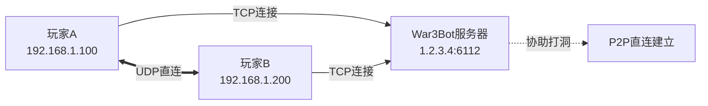

# War3Bot

**War3Bot** 是一个专为《魔兽争霸 III》设计的游戏会话代理服务器，基于 C++ 和 Qt 框架开发。它通过建立 P2P 连接，优化玩家之间的网络通信质量。

**网络拓扑示意：**



## ✨ 功能特性

*   🛡️ **协议支持**：完整的 W3GS 协议支持
*   🔄 **双向转发**：支持 C->S 和 S->C 的数据转发
*   🧵 **多路复用**：高效的多会话管理
*   📊 **状态追踪**：实时跟踪玩家在线状态
*   🚀 **高性能**：基于 Qt 异步网络模型的高性能处理

---

## 🛠️ 快速安装 (Ubuntu)

### 1. 环境准备与编译

```bash
# 1. 更新软件源并安装基础构建工具
sudo apt update
sudo apt install -y build-essential cmake

# 2. 安装 Qt5 依赖库
sudo apt install -y qtbase5-dev qt5-qmake libqt5core5a libqt5network5

# 3. 安装其他依赖
sudo apt install -y libgmp-dev zlib1g-dev libbz2-dev

# 4. 克隆项目代码
git clone https://github.com/wuxiancong/War3Bot.git
cd War3Bot

# 5. 编译与安装
# 注意：配置安装前缀为 /usr/local，并将配置文件自动部署到 /etc/War3Bot
mkdir build && cd build
cmake -DCMAKE_INSTALL_PREFIX=/usr/local/War3Bot ..
make -j$(nproc)

# 执行安装 (需要 sudo 权限)
# 这将把二进制放入 /usr/local/bin，配置放入 /etc/War3Bot
sudo make install

# 6. 验证安装结果
War3Bot --help
```

### 2. 更新代码与重新编译

```bash
cd ~/War3Bot
git pull
cd build
make -j$(nproc)
sudo make install
sudo systemctl restart war3bot
```

---

## ⚙️ 系统服务配置

为了让 War3Bot 在后台稳定运行，并符合 Linux 安全规范，请按以下步骤配置 Systemd 服务。

### 1. 创建专用用户和权限

建议使用非 root 用户 (`war3bot`) 运行服务，以提高安全性。

```bash
# 1. 创建系统用户 War3Bot (无登录权限)
sudo useradd -r -s /bin/false -d /etc/War3Bot war3bot

# 2. 创建日志目录
sudo mkdir -p /var/log/War3Bot

# 3. 设置权限
# 确保 war3bot 用户能读写配置文件和日志
sudo chown -R war3bot:war3bot /etc/War3Bot
sudo chown -R war3bot:war3bot /var/log/War3Bot

# 如果 war3files 需要写入权限（通常只需要读取），也需设置
sudo chmod -R 755 /etc/War3Bot/war3files
```

### 2. 配置 Systemd 服务

创建服务文件：
`sudo nano /etc/systemd/system/war3bot.service`

**复制以下内容：**

```ini
[Unit]
Description=War3Bot Warcraft III Proxy
After=network.target

[Service]
Type=simple

# 运行用户与组
User=war3bot
Group=war3bot

# 工作目录 (配置文件和 war3files 所在位置)
WorkingDirectory=/etc/War3Bot

# 启动命令 (指向安装后的路径)
ExecStart=/usr/local/War3Bot/bin/War3Bot -p

# 重启策略
Restart=always
RestartSec=5

# 日志输出
StandardOutput=journal
StandardError=journal
PrivateTmp=false

[Install]
WantedBy=multi-user.target
```

### 3. 编辑配置文件

安装脚本已将默认配置复制到 `/etc/War3Bot/config/war3bot.ini`（假设源码中有），请根据需要修改：

`sudo nano /etc/War3Bot/config/war3bot.ini`

```ini
[server]
broadcast_port=6112
enable_broadcast=false

[log]
log_file=/var/log/War3Bot/war3bot.log
```

### 4. 启动服务

```bash
# 重载 Systemd 配置
sudo systemctl daemon-reload

# 启用开机自启
sudo systemctl enable war3bot

# 启动服务
sudo systemctl start war3bot

# 查看状态
sudo systemctl status war3bot
```

---

## 💻 使用与管理

### 1. 常用管理命令

```bash
# 查看实时日志
alias wlog="sudo timeout 1h journalctl -u war3bot -f"
wlog

# 停止/重启服务
sudo systemctl stop war3bot
sudo systemctl restart war3bot
```

### 2. 发送控制指令 (CLI)

War3Bot 支持通过 `-x` 参数直接向程序传递指令。

**创建游戏：**
```bash
# 注意：如果参数包含空格，请使用引号
sudo War3Bot -x "create Dota"
sudo War3Bot -x "create 'Dota 6.83' bot1"
```

**取消游戏：**
```bash
sudo War3Bot -x "cancel Dota"
```

**连接服务器：**
```bash
# connect [username] [password] [ip] [port]
sudo War3Bot -x "connect bot1 123456 127.0.0.1"
```

**停止广播：**
```bash
sudo War3Bot -x "stop"
```

---

## 🛡️ 防火墙配置

War3Bot 需要同时开放 TCP 和 UDP 的 6112 端口 (以及可能的动态范围)。

```bash
# 1. 开放主端口
sudo ufw allow 6112/tcp
sudo ufw allow 6112/udp

# 2. 开放 P2P 动态端口范围 (根据实际配置调整)
sudo ufw allow 6113:7113/tcp
sudo ufw allow 6113:7113/udp

# 3. 重载并检查
sudo ufw reload
sudo ufw status
```

---

## 📂 安装后的目录结构

遵循 Linux FHS 标准，安装后的文件分布如下：

| 路径 | 类型 | 说明 |
| :--- | :--- | :--- |
| `/usr/local/bin/War3Bot` | **二进制** | 可执行程序，已加入 PATH |
| `/etc/War3Bot/` | **配置目录** | 存放 `war3files` 和 `config` |
| `/etc/War3Bot/config/` | **配置文件** | `war3bot.ini` 等 |
| `/etc/War3Bot/war3files/` | **资源文件** | `War3.exe`, `Storm.dll`, `Game.dll` |
| `/var/log/War3Bot/` | **日志** | 运行日志文件 |
| `/etc/systemd/system/` | **服务** | `war3bot.service` |

---

## 🧪 故障排查

**Q: 启动失败，提示 "Permissions denied"**
*   检查 `/etc/War3Bot` 和 `/var/log/War3Bot` 的所有权是否为 `war3bot` 用户。
    ```bash
    sudo chown -R war3bot:war3bot /etc/War3Bot /var/log/War3Bot
    ```

**Q: 提示找不到 War3files**
*   确保 `War3.exe`, `Storm.dll`, `Game.dll` 存在于 `/etc/War3Bot/war3files` 目录下。

**Q: SSH断开后进程退出**
*   如果你是手动运行而不是使用 systemd，请检查 `logind.conf`。
    ```bash
    sudo nano /etc/systemd/logind.conf
    # 设置 KillUserProcesses=no (虽不推荐，但对手动运行有效)
    ```
    **推荐做法**：始终使用 `systemctl start war3bot` 来管理后台进程。