# War3Bot

**War3Bot** 是一个专为《魔兽争霸 III》设计的游戏会话代理服务器，基于 C++ 和 Qt 框架开发。它通过建立 P2P 连接，优化玩家之间的网络通信质量。

**网络拓扑示意：**



## ✨ 功能特性

*   🛡️ **协议支持**：完整的 W3GS 协议支持
*   🔄 **双向转发**：支持 C->S 和 S->C 的数据转发
*   🧵 **多路复用**：高效的多会话管理
*   📊 **状态追踪**：实时跟踪玩家在线状态
*   🚀 **高性能**：基于 Qt 异步网络模型的高性能处理

---

## 🛠️ 快速安装 (Ubuntu)

### 1. 环境准备与编译

```bash
# 1. 更新软件源并安装基础构建工具
sudo apt update
sudo apt install -y build-essential cmake

# 2. 安装 Qt5 依赖库
sudo apt install -y qtbase5-dev qt5-qmake libqt5core5a libqt5network5

# 3. 安装其他依赖
sudo apt install -y libgmp-dev zlib1g-dev libbz2-dev libgmp-dev

# 4. 克隆项目代码
git clone https://github.com/wuxiancong/War3Bot.git
cd War3Bot

# 5. 编译项目
mkdir build && cd build
cmake ..
make -j$(nproc)

# 6. 验证编译结果
./War3Bot --help
```

### 2. 重新编译 (更新代码后)

```bash
# 清理旧构建并重新编译
cd ~/War3Bot/build
rm -rf *
cmake ..
make -j$(nproc)
```

---

## ⚙️ 系统服务配置

为了让 War3Bot 在后台稳定运行，建议配置 Systemd 服务。

### 1. 创建专用用户和目录

为了安全起见，建议使用非 root 用户运行服务。

```bash
# 创建系统用户 War3Bot
sudo useradd -r -s /bin/false -d /opt/War3Bot War3Bot

# 创建日志与配置目录
sudo mkdir -p /var/log/War3Bot /etc/War3Bot

# 设置目录权限
sudo chown -R War3Bot:War3Bot /var/log/War3Bot
sudo chown -R War3Bot:War3Bot /etc/War3Bot
sudo chmod -R 755 /root/War3Bot/build/war3files/
```

### 2. 安装配置文件

创建配置文件 `/etc/War3Bot/War3Bot.ini`：

```ini
[server]
broadcast_port=6112
enable_broadcast=false
peer_timeout=300000
cleanup_interval=60000
broadcast_interval=30000

[log]
level=info
enable_console=true
log_file=/var/log/war3bot/war3bot.log
max_size=10485760
backup_count=5

[bnet]
server=your_server_ip
port=your_server_port
username=your_bot_username
password=your_bot_password

```

### 3. 配置 Systemd 服务

创建服务文件 `sudo nano /etc/systemd/system/war3bot.service`：

> **注意**：请确保 `ExecStart` 指向您实际编译生成的二进制文件路径。如果遵循上述安装步骤且未移动文件，路径可能为 `/root/War3Bot/build/War3Bot`（需 root 权限）或建议将其移动到 `/usr/local/bin/`。

以下配置假设您已将编译好的 `War3Bot` 移动到了 `/usr/local/bin/War3Bot`，并使用 root 运行（简易模式）：

```ini
[Unit]
Description=War3Bot Warcraft III Proxy
After=network.target

[Service]
Type=simple
# 若需使用专用用户，请取消注释并修改 ExecStart 路径权限
# User=War3Bot 
WorkingDirectory=/etc/War3Bot
# 请根据实际二进制文件位置修改此处
ExecStart=/root/War3Bot/build/War3Bot -p
Restart=always
RestartSec=5
StandardOutput=journal
StandardError=journal
PrivateTmp=false

[Install]
WantedBy=multi-user.target
```

### 4. 启动服务

```bash
# 重载配置
sudo systemctl daemon-reload

# 启用开机自启
sudo systemctl enable war3bot

# 启动服务
sudo systemctl start war3bot

# 停止服务
sudo systemctl stop war3bot
```

### 4. 编辑 logind 配置
sudo nano /etc/systemd/logind.conf

KillUserProcesses=yes

sudo systemctl restart systemd-logind

sudo timeout 30m journalctl -u war3bot -f

alias wlog="sudo pkill -f 'journalctl -u war3bot'; sudo timeout 1h journalctl -u war3bot -f"
---

## 💻 使用与管理

### 1. 常用后台管理命令

```bash
# 命令行运行1
sudo /root/War3Bot/build/War3Bot -a create bot

# 命令行运行2
sudo /root/War3Bot/build/War3Bot -a

# 查看服务状态
sudo systemctl status war3bot

# 查看实时日志
sudo journalctl -u war3bot -f

# 杀死所有相关进程
pkill -f War3Bot

# 强制杀死所有相关进程
pkill -9 -f War3Bot
```

### 2. 🎮 交互式控制台模式 (手动发送指令)

Systemd 后台服务无法接收键盘输入。如果您需要使用 **`connect`**、**`create`** 或 **`stop`** 等控制台命令，必须停止后台服务并在前台手动运行程序。

**操作步骤：**

1.  **停止后台服务** (必须执行，否则端口会被占用)：
    ```bash
    sudo systemctl stop war3bot
    ```

2.  **进入编译目录**：
    ```bash
    cd ~/War3Bot/build
    ```

3.  **前台启动程序**：
    ```bash
    ./War3Bot
    ```

4.  **输入指令**：
    等待出现 `[INFO] === 服务器启动完成，开始监听 ===` 后，直接在终端输入命令并回车。

    *   **连接战网**：
        ```text
        connect
        # 或手动指定参数
        connect 127.0.0.1 6112 myuser mypass
        ```
    *   **创建游戏**：
        ```text
        create Dota_6.83_CN
        # 或带密码
        create Dota_VIP 123
        ```
    *   **停止游戏**：
        ```text
        stop
        ```

### 3. 进程与端口监控

```bash
# 查看进程详情
ps -ef | grep War3Bot

# 查看端口监听状态 (6112)
ss -tulpn | grep :6112
# 或者
netstat -tulpn | grep 6112
```

# 开放 TCP 范围
sudo ufw allow 6113:7113/tcp

# 开放 UDP 范围
sudo ufw allow 6113:7113/udp

# 重新加载让配置生效
sudo ufw reload

# 检查一下
sudo ufw status

# 查看所有正在监听的 TCP 和 UDP 端口，并显示进程名
sudo ss -tulnp
---

## 🛡️ 防火墙配置

War3Bot 需要同时开放 TCP 和 UDP 的 6112 端口。

### 使用 UFW (Ubuntu 默认)

```bash
sudo ufw allow 6112/tcp
sudo ufw allow 6112/udp
sudo ufw status
```

### 使用 Firewalld (CentOS/RHEL)

```bash
# 永久开放端口
sudo firewall-cmd --add-port=6112/tcp --permanent
sudo firewall-cmd --add-port=6112/udp --permanent
sudo firewall-cmd --reload

# 验证配置
sudo firewall-cmd --list-ports
```

---

## 🧪 测试与验证

### 1. 基础连通性测试 (Linux)

```bash
# 检查本地端口是否监听
sudo netstat -tulpn | grep 6112

# 发送 UDP 测试包
echo "test" | nc -u localhost 6112

# 抓包监控流量
sudo tcpdump -i any -n udp port 6112
```

### 2. 远程连接测试 (Windows Client)

在 Windows 客户端机器上验证到服务器的连接。

```powershell
# 使用 PowerShell 测试 TCP 连接
Test-NetConnection <服务器IP> -Port 6112

# CMD: 跟踪路由
tracert <服务器IP>

# CMD: 查看本地 6112 端口占用
netstat -ano | findstr 6112
```

### 3. Python 模拟测试脚本

保存为 `test_bot.py` 并运行：

```python
#!/usr/bin/env python3
import socket
import struct

def test_War3Bot():
    sock = socket.socket(socket.AF_INET, socket.SOCK_DGRAM)
    # 请修改为实际服务器地址
    War3Bot_addr = ('localhost', 6112)
    
    # 创建 W3GS PING 数据包 (Header: 0xF7)
    # 结构: Header(1B) + Length(2B) + Type(1B) + Data
    header = struct.pack('<BHHB', 0xF7, 8, 0x01, 0)
    
    try:
        sock.sendto(header, War3Bot_addr)
        print(f"测试数据包已发送至 {War3Bot_addr}")
    except Exception as e:
        print(f"发送失败: {e}")
    finally:
        sock.close()

if __name__ == "__main__":
    test_War3Bot()
```

---

## 📂 项目结构

```text
War3Bot/
├── CMakeLists.txt          # CMake 构建配置
|── bncsutil/               # bncsutil 目录
|── war3files/              # war3 文件目录
├── include/                # 头文件目录
│   ├── client.h            # 连接战网
│   ├── logger.h            # 日志系统
│   ├── p2pserver.h         # P2P连接
│   |── botmanager.h        # 机器人管理
│   |── bnetsrp3.h          # srp3
│   ├── war3bot.h           # 机器人
│   └── war3map.h
├── src/                    # 源代码目录
│   ├── main.cpp            # 入口文件
│   ├── client.cpp          # 连接战网
│   ├── logger.cpp          # 日志系统
│   ├── p2pserver.cpp       # P2P连接
│   |── botmanager.cpp      # 机器人管理
│   |── bnetsrp3.cpp        # srp3
│   ├── war3bot.cpp         # 机器人
│   └── war3map.cpp
|── lib/                    # 库目录
└── config/                 # 配置相关
    ├── war3bot.ini         # 配置文件模板
    └── war3bot.service     # Systemd 服务文件
```

---

## 📚 协议与内部命令

### 支持的命令行 (CMD)

**创建游戏：**
```bash
# 注意：如果参数包含空格，请使用引号
create Dota
create "Dota 6.83"
sudo ./war3bot -x "create 'Dota 6.83' bot1"
```

**取消游戏：**
```bash
# 注意：如果参数包含空格，请使用引号
cancel Dota
cancel "Dota 6.83"
sudo ./war3bot -x "cancel 'Dota 6.83' bot1"
```

**连接服务器：**
```bash
# 注意：如果留空则是用默认配置
connect username [default] [default] [default]
connect username password ip port
sudo ./war3bot -x "connect bot1 123456 127.0.0.1"
```

**停止广播：**
```bash
stop
sudo ./war3bot -x "stop"
```

### 支持的数据包 (W3GS)

**Client -> Server (C->S):**

| ID | 描述 |
| :--- | :--- |
| `0x00` | SID_NULL |
| `0x0A` | SID_ENTERCHAT |
| `0x0F` | SID_CHATEVENT |
| `0x1C` | SID_STARTADVEX3 |
| `0x25` | SID_PING |
| `0x29` | SID_LOGONRESPONSE |
| `0x3A` | SID_LOGONRESPONSE2 |
| `0x4C` | SID_REQUIREDWORK |
| `0x50` | SID_AUTH_INFO |
| `0x51` | SID_AUTH_CHECK |
| `0x53` | SID_AUTH_ACCOUNTLOGON |
| `0x54` | SID_AUTH_ACCOUNTLOGONPROOF |

**Server -> Client (S->C):**

| ID | 描述 |
| :--- | :--- |
| `0x02` | PONG_TO_HOST |
| `0x03` | REJECT |
| `0x08` | SLOT_INFO |
| `0x18` | PLAYER_LEFT |
| `0x0E` | CHAT_FROM_HOST |

---

## 🗑️ 卸载指南 (Ubuntu)

如果需要移除开发环境和 War3Bot：

```bash
# 1. 停止服务
sudo systemctl stop war3bot
sudo systemctl disable war3bot
sudo rm /etc/systemd/system/war3bot.service
sudo systemctl daemon-reload

# 2. 删除文件
sudo rm -rf /etc/War3Bot /var/log/War3Bot /opt/War3Bot

# 3. 移除依赖库 (可选)
sudo apt remove qtbase5-dev qt5-qmake libqt5core5a libqt5network5
sudo apt autoremove
```
