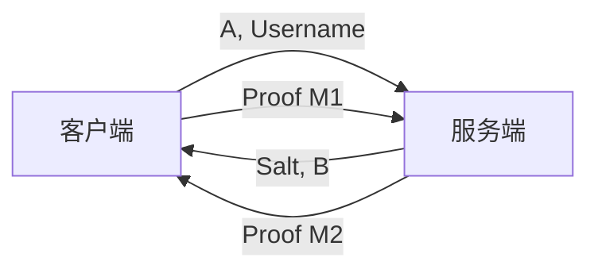

这是一个详细的 Battle.net (Warcraft 3 / PvPGN) **SRP3 协议登录流程**文档。

该流程涵盖了从建立连接到验证通过的所有数学计算和网络交互细节。

---

# Battle.net SRP3 登录流程详解

**协议 ID**: `Protocol 0x53` (SRP NLS)
**核心机制**: 零知识证明 (Zero-Knowledge Proof)，即客户端向服务端证明它知道密码，而无需在网络上发送密码本身。

## 0. 核心常量定义

所有大数计算均在模 $N$ 下进行。

*   **N (Modulus)**: 32字节 (256位) 的大素数。
    ```text
    F8 FF 1A 8B 61 99 18 03 21 86 B6 8C A0 92 B5 55
    7E 97 6C 78 C7 32 12 D9 12 16 F6 65 85 23 C7 87
    ```
*   **g (Generator)**: 生成元，值为 `0x2F` (十进制 47)。
*   **I (Initial Hash)**: 预计算常量，$I = H(g) \oplus H(N)$。

---

## 第一阶段：初始化与公钥交换

### 1. 客户端：发起请求 (Client Hello)
客户端生成临时密钥对，并向服务端表明身份。

1.  **生成私钥 $a$**:
    *   生成一个随机的 32 字节大数。
    *   计算 $a = \text{random()} \mod N$。
2.  **计算公钥 $A$**:
    *   $A = g^a \mod N$。
3.  **发送包 `SID_AUTH_ACCOUNTLOGON` (0x53)**:
    *   `A` (32字节, Little Endian)
    *   `Username` (字符串)

### 2. 服务端：下发挑战 (Server Challenge)
服务端查找用户记录，生成服务端临时公钥。

1.  **查找用户**:
    *   获取存储的 **Salt ($s$)**。
    *   获取存储的 **Verifier ($v$)** (其中 $v = g^x \mod N$)。
2.  **生成私钥 $b$**:
    *   生成一个随机的 32 字节大数。
3.  **计算公钥 $B$**:
    *   $B = (v + g^b) \mod N$。
4.  **发送包 `SID_AUTH_ACCOUNTLOGON` (0x53) 响应**:
    *   `Status` (0 = 成功)
    *   `Salt` ($s$, 32字节, Little Endian)
    *   `Server Key` ($B$, 32字节, Little Endian)

---

## 第二阶段：计算会话密钥 (The Hard Part)

此阶段完全在客户端内部进行，不发送网络包。

### 3. 客户端：核心计算

客户端收到 $s$ 和 $B$ 后，执行以下步骤：

#### 3.1 计算扰码 $u$
*   对服务端公钥 $B$ 的**原始字节流** (Little Endian) 进行 SHA1 哈希。
*   取哈希结果的前 4 个字节，转换为整数。
*   **公式**: $u = \text{SHA1}(B)[0..3]$

#### 3.2 计算私钥 $x$ (关键步骤)
这是最容易出错的地方，涉及字节序转换。
1.  计算用户名密码哈希: $H_P = \text{SHA1}(\text{"USER:PASS"})$。
2.  拼接数据: `Buffer = Salt (LE) + H_P (LE)`。
3.  计算最终哈希: $H_{final} = \text{SHA1}(\text{Buffer})$。
4.  **转换**: 将 $H_{final}$ (通常 SHA1 是 Big Endian) 视为数值 $x$。
    *   *注：PvPGN 服务端逻辑中，这里会将 SHA1 的结果进行字节翻转后，再视为 Little Endian 数值加载。*

#### 3.3 计算预主密钥 $S$ (Pre-Master Secret)
*   **公式**: $S = (B - g^x)^{(a + u \cdot x)} \mod N$
*   *注意*: 如果 $B < g^x$，需处理负数，即 $S = (N + B - g^x) \cdots$。

#### 3.4 计算会话密钥 $K$ (Session Key)
SRP3 使用一种奇偶交错哈希法生成 $K$。
1.  将 $S$ 转换为 32 字节数组 (Little Endian)。
2.  拆分数组:
    *   `Odd`: 取第 0, 2, 4... 字节。
    *   `Even`: 取第 1, 3, 5... 字节。
3.  哈希:
    *   $H_{odd} = \text{SHA1}(Odd)$
    *   $H_{even} = \text{SHA1}(Even)$
4.  合并: 交错拼接 $H_{odd}$ 和 $H_{even}$ 的字节生成 40 字节的 $K$。
    *   $K = [O_0, E_0, O_1, E_1, \dots, O_{19}, E_{19}]$

---

## 第三阶段：生成并验证证明 (Proof)

### 4. 客户端：生成 M1 并发送
客户端生成证据 $M1$ 证明自己计算出了正确的 $K$。

1.  **准备数据 (顺序拼接)**:
    *   `I` (20 bytes)
    *   `H(Username)` (20 bytes)
    *   `Salt` (32 bytes)
    *   `A` (32 bytes)
    *   `B` (32 bytes)
    *   `K` (40 bytes)
2.  **计算 M1**:
    *   $M1 = \text{SHA1}(\text{Data})$。
3.  **发送包 `SID_AUTH_ACCOUNTLOGONPROOF` (0x54)**:
    *   `M1` (20字节)

### 5. 服务端：验证并回复 M2
服务端使用同样的逻辑计算 $u, S, K$ 和 $M1_{expected}$。

1.  **验证**:
    *   比较客户端发的 $M1$ 与 服务端算的 $M1_{expected}$。
    *   如果不一致 -> **登录失败** (错误码 0x02)。
2.  **生成 M2 (如果成功)**:
    *   准备数据: `A + M1 + K`。
    *   $M2 = \text{SHA1}(A + M1 + K)$。
3.  **发送包 `SID_AUTH_ACCOUNTLOGONPROOF` (0x54) 响应**:
    *   `Status` (0 = 成功)
    *   `M2` (20字节)

### 6. 客户端：验证服务端 (可选)
客户端计算本地的 $M2$ 并与服务端发来的进行比对。如果一致，说明服务端也是合法的（防止中间人攻击）。

---

## 总结：数据流向图



**最常见的错误点**:
1.  **$x$ 的计算**: SHA1 结果的字节序翻转问题。
2.  **$S$ 的计算**: 没有处理 $(B - g^x)$ 结果为负数的情况。
3.  **字节序**: 网络传输几乎全用 Little Endian，但内存中 BigInt 运算需要正确加载。