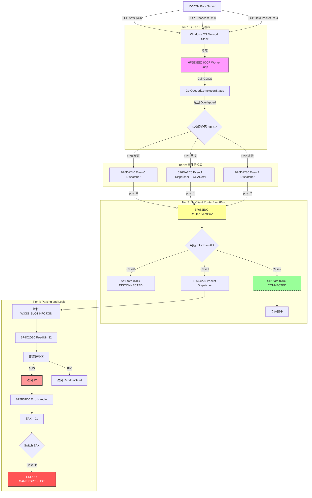

# War3 创建房间后点击列表选项弹出找不到游戏的对话框调试日志


## 问题描述 (Issue Description)

**现象:**
在使用自定义 C++ 编写的 War3Bot 创建房间后：
1.  **列表可见**: 房间可以正常显示在魔兽争霸 III 的局域网游戏列表中（说明 UDP 广播正常）。
2.  **加入失败**: 当点击列表中的游戏尝试加入时，客户端立刻弹出错误提示。
3.  **错误文本**: 尝试点击“加入游戏”时，客户端弹出错误提示：**"The game you attempted to join could not be found./n/nYou may have entered the name incorrectly or the game creator may have canceled the game."** (您尝试加入的游戏未找到。/n/您输入的名称可能不正确，或者游戏创建者可能已取消了该游戏。)。

**环境 (Environment):**
- **客户端:** Warcraft III (1.26a / Game.dll)
- **服务端:** PVPGN (C++)
- **调试工具:** x64dbg
- **基地址:** 6F000000
- **关键函数地址:** 
    - 字符处理逻辑: `Game.dll + 5C9650`
    - 错误分发逻辑: `Game.dll + 5B51D0`
    - 列表选中逻辑: `Game.dll + 5B51D0`
    - 状态解析逻辑: `Game.dll + 5BE710`

---

## 2. 逆向分析过程 (Reverse Engineering)

### 2.1 字符处理：追踪处理字符的函数
通过搜索字符串 "The game you attempted to join could not be found"，定位到 `Storm.dll` 中的字符处理函数。

**地址**: `6F5C9650` (字符处理逻辑)
**偏移**: `game.dll + 5C9650`
**关键发现**: 命中 Storm.dll Ordinal#501 导入表序号，由此追踪上一级函数。


```assembly
6F5C9650 | 53                       | push ebx                              	 |
6F5C9651 | 56                       | push esi                              	 |
6F5C9652 | 8BF1                     | mov esi,ecx                           	 |
6F5C9654 | 85F6                     | test esi,esi                          	 |
6F5C9656 | 57                       | push edi                              	 |
6F5C9657 | 8BFA                     | mov edi,edx                           	 |
6F5C9659 | 74 52                    | je game.6F5C96AD                      	 |
6F5C965B | 803E 00                  | cmp byte ptr ds:[esi],0               	 |
6F5C965E | 74 4D                    | je game.6F5C96AD                      	 |
6F5C9660 | 85FF                     | test edi,edi                          	 |
6F5C9662 | 74 49                    | je game.6F5C96AD                      	 |
6F5C9664 | 8B5C24 10                | mov ebx,dword ptr ss:[esp+10]         	 |
6F5C9668 | 85DB                     | test ebx,ebx                          	 |
6F5C966A | 74 41                    | je game.6F5C96AD                      	 |
6F5C966C | 56                       | push esi                              	 |
6F5C966D | B9 3CD2AC6F              | mov ecx,game.6FACD23C                 	 |
6F5C9672 | C607 00                  | mov byte ptr ds:[edi],0               	 |
6F5C9675 | E8 56F8FFFF              | call game.6F5C8ED0                    	 |
6F5C967A | 85C0                     | test eax,eax                          	 |
6F5C967C | 74 06                    | je game.6F5C9684                      	 |
6F5C967E | 8378 1C 00               | cmp dword ptr ds:[eax+1C],0           	 |
6F5C9682 | 75 0B                    | jne game.6F5C968F                     	 |
6F5C9684 | 56                       | push esi                              	 |
6F5C9685 | B9 14D2AC6F              | mov ecx,game.6FACD214                 	 |
6F5C968A | E8 41F8FFFF              | call game.6F5C8ED0                    	 |
6F5C968F | 85C0                     | test eax,eax                          	 |
6F5C9691 | 74 1A                    | je game.6F5C96AD                      	 |
6F5C9693 | 8B40 1C                  | mov eax,dword ptr ds:[eax+1C]         	 |
6F5C9696 | 85C0                     | test eax,eax                          	 |
6F5C9698 | 74 13                    | je game.6F5C96AD                      	 |
6F5C969A | 53                       | push ebx                              	 |
6F5C969B | 50                       | push eax                              	 |
6F5C969C | 57                       | push edi                              	 |
6F5C969D | E8 221F1200              | call <JMP.&Ordinal#501>               	 |
6F5C96A2 | 5F                       | pop edi                               	 |
6F5C96A3 | 5E                       | pop esi                               	 |
6F5C96A4 | B8 01000000              | mov eax,1                             	 |
6F5C96A9 | 5B                       | pop ebx                               	 |
6F5C96AA | C2 0400                  | ret 4                                 	 |
6F5C96AD | 5F                       | pop edi                               	 |
6F5C96AE | 5E                       | pop esi                               	 |
6F5C96AF | 33C0                     | xor eax,eax                           	 |
6F5C96B1 | 5B                       | pop ebx                               	 |
6F5C96B2 | C2 0400                  | ret 4                                 	 |
```

### 2.2 错误分发：定位错误弹窗来源

**地址**: `6F5B51D0` (错误分发逻辑)
**偏移**: `game.dll + 5B51D0`
**关键发现**: 程序根据错误代码（Error ID）查表跳转。本案中的错误码导致跳转到 `NETERROR_JOINGAMENOTFOUND`。

```assembly
6F5B51D0 | 81EC 04020000            | sub esp,204                           	 |
6F5B51D6 | A1 40E1AA6F              | mov eax,dword ptr ds:[6FAAE140]       	 |
6F5B51DB | 33C4                     | xor eax,esp                           	 |
6F5B51DD | 898424 00020000          | mov dword ptr ss:[esp+200],eax        	 |
6F5B51E4 | 56                       | push esi                              	 |
6F5B51E5 | 8BF1                     | mov esi,ecx                           	 |
6F5B51E7 | 57                       | push edi                              	 |
6F5B51E8 | 6A 00                    | push 0                                	 |
6F5B51EA | 8BD6                     | mov edx,esi                           	 |
6F5B51EC | B9 78000940              | mov ecx,40090078                      	 |
6F5B51F1 | C786 70010000 00000000   | mov dword ptr ds:[esi+170],0          	 |
6F5B51FB | E8 90A1F8FF              | call game.6F53F390                    	 |
6F5B5200 | 6A 01                    | push 1                                	 |
6F5B5202 | 8BD6                     | mov edx,esi                           	 |
6F5B5204 | B9 78000940              | mov ecx,40090078                      	 |
6F5B5209 | E8 82A1F8FF              | call game.6F53F390                    	 |
6F5B520E | 8B8424 10020000          | mov eax,dword ptr ss:[esp+210]        	 | <--- 在此处断点 跟踪栈
6F5B5215 | 8B78 14                  | mov edi,dword ptr ds:[eax+14]         	 | <--- 在此处断点 跟踪栈 到返回地址上面（game.dll + 546996）
6F5B5218 | 8D47 FF                  | lea eax,dword ptr ds:[edi-1]          	 | <--- 在函数头 game.dll + 5468A0 处断点，等待断点触发 F8 步进并观察[eax+14]处的内存值何时变为C
;================================================================================| <--- 最终在 game.dll + 546941 处找到了返回这个 C 的函数（game.dll + 652710）
;================================================================================| <--- 我们只需要追踪谁在写入栈指针 0019F770
6F5B521B | 83F8 2A                  | cmp eax,2A                            	 | <--- 在此处断点可以找到突破口（正常情况为eax=0，异常情况为B，C-1=B）
6F5B521E | 77 75                    | ja game.6F5B5295                      	 | <--- 为 B 会跳转到 NETERROR_JOINGAMENOTFOUND 分支
6F5B5220 | 0FB688 34535B6F          | movzx ecx,byte ptr ds:[eax+6F5B5334]  	 |
6F5B5227 | FF248D 08535B6F          | jmp dword ptr ds:[ecx*4+6F5B5308]     	 |
6F5B522E | E8 8D62FFFF              | call game.6F5AB4C0                    	 |
6F5B5233 | B9 01000000              | mov ecx,1                             	 |
6F5B5238 | C740 18 00000000         | mov dword ptr ds:[eax+18],0           	 |
6F5B523F | C740 14 01000000         | mov dword ptr ds:[eax+14],1           	 |
6F5B5246 | E8 F59FF8FF              | call game.6F53F240                    	 |
6F5B524B | 6A FE                    | push FFFFFFFE                         	 |
6F5B524D | 8BCE                     | mov ecx,esi                           	 |
6F5B524F | E8 4CCDFDFF              | call game.6F591FA0                    	 |
6F5B5254 | EB 52                    | jmp game.6F5B52A8                     	 |
6F5B5256 | B9 6491966F              | mov ecx,game.6F969164                 	 | <--- "NETERROR_JOINGAMENOTFOUND"
6F5B525B | EB 3D                    | jmp game.6F5B529A                     	 | <--- 
6F5B525D | B9 188B966F              | mov ecx,game.6F968B18                 	 | <--- "ERROR_ID_GAMEPORTINUSE"
6F5B5262 | EB 36                    | jmp game.6F5B529A                     	 | <--- 
6F5B5264 | B9 7C05966F              | mov ecx,game.6F96057C                 	 | <--- "ERROR_ID_AUTOCANCEL"
6F5B5269 | EB 2F                    | jmp game.6F5B529A                     	 | <--- 
6F5B526B | B9 381A966F              | mov ecx,game.6F961A38                 	 | <--- "ERROR_ID_BADPASSWORD"
6F5B5270 | EB 28                    | jmp game.6F5B529A                     	 | <--- 
6F5B5272 | B9 3491966F              | mov ecx,game.6F969134                 	 | <--- "ERROR_ID_GAMEUNJOINABLE"
6F5B5277 | EB 21                    | jmp game.6F5B529A                     	 | <--- 
6F5B5279 | B9 8C61966F              | mov ecx,game.6F96618C                 	 | <--- "ERROR_ID_GAMEFULL"
6F5B527E | EB 1A                    | jmp game.6F5B529A                     	 | <--- 
6F5B5280 | B9 048B966F              | mov ecx,game.6F968B04                 	 | <--- "ERROR_ID_GAMECLOSED"
6F5B5285 | EB 13                    | jmp game.6F5B529A                     	 | <--- 
6F5B5287 | B9 8091966F              | mov ecx,game.6F969180                 	 | <--- "ERROR_ID_BADCDKEY"
6F5B528C | EB 0C                    | jmp game.6F5B529A                     	 | <--- 
6F5B528E | B9 4C91966F              | mov ecx,game.6F96914C                 	 | <--- "ERROR_ID_REQUESTDENIED"
6F5B5293 | EB 05                    | jmp game.6F5B529A                     	 | <--- 
6F5B5295 | B9 7461966F              | mov ecx,game.6F966174                 	 | <--- "NETERROR_JOINGAMEFAILED"
6F5B529A | 68 00020000              | push 200                              	 |
6F5B529F | 8D5424 0C                | lea edx,dword ptr ss:[esp+C]          	 |
6F5B52A3 | E8 A8430100              | call game.6F5C9650                    	 |
6F5B52A8 | 83FF 01                  | cmp edi,1                             	 |
6F5B52AB | 74 3C                    | je game.6F5B52E9                      	 |
6F5B52AD | 6A 03                    | push 3                                	 |
6F5B52AF | 8D8E 74010000            | lea ecx,dword ptr ds:[esi+174]        	 |
6F5B52B5 | E8 96230600              | call game.6F617650                    	 |
6F5B52BA | 6A 01                    | push 1                                	 |
6F5B52BC | 6A 04                    | push 4                                	 |
6F5B52BE | 6A 00                    | push 0                                	 |
6F5B52C0 | 56                       | push esi                              	 |
6F5B52C1 | 6A 09                    | push 9                                	 |
6F5B52C3 | 8D5424 1C                | lea edx,dword ptr ss:[esp+1C]         	 |
6F5B52C7 | B9 01000000              | mov ecx,1                             	 |
6F5B52CC | E8 DF7BFAFF              | call game.6F55CEB0                    	 |
6F5B52D1 | 8B96 04020000            | mov edx,dword ptr ds:[esi+204]        	 |
6F5B52D7 | 8996 FC010000            | mov dword ptr ds:[esi+1FC],edx        	 |
6F5B52DD | 33D2                     | xor edx,edx                           	 |
6F5B52DF | 6A 00                    | push 0                                	 |
6F5B52E1 | 8D4A 07                  | lea ecx,dword ptr ds:[edx+7]          	 |
6F5B52E4 | E8 F774F9FF              | call game.6F54C7E0                    	 |
6F5B52E9 | 8B8C24 08020000          | mov ecx,dword ptr ss:[esp+208]        	 |
6F5B52F0 | 5F                       | pop edi                               	 |
6F5B52F1 | 5E                       | pop esi                               	 |
6F5B52F2 | 33CC                     | xor ecx,esp                           	 |
6F5B52F4 | B8 01000000              | mov eax,1                             	 |
6F5B52F9 | E8 5BBD2200              | call game.6F7E1059                    	 |
6F5B52FE | 81C4 04020000            | add esp,204                           	 |
6F5B5304 | C2 0400                  | ret 4                                 	 |
6F5B5307 | 90                       | nop                                   	 |
6F5B5308 | 2E:52                    | push edx                              	 |
6F5B530A | 5B                       | pop ebx                               	 |
6F5B530B | 6F                       | outsd                                 	 |
6F5B530C | 64:52                    | push edx                              	 |
6F5B530E | 5B                       | pop ebx                               	 |
6F5B530F | 6F                       | outsd                                 	 |
6F5B5310 | 56                       | push esi                              	 |
6F5B5311 | 52                       | push edx                              	 |
6F5B5312 | 5B                       | pop ebx                               	 |
6F5B5313 | 6F                       | outsd                                 	 |
6F5B5314 | 72 52                    | jb game.6F5B5368                      	 |
6F5B5316 | 5B                       | pop ebx                               	 |
6F5B5317 | 6F                       | outsd                                 	 |
6F5B5318 | 79 52                    | jns game.6F5B536C                     	 |
6F5B531A | 5B                       | pop ebx                               	 |
6F5B531B | 6F                       | outsd                                 	 |
6F5B531C | 8052 5B 6F               | adc byte ptr ds:[edx+5B],6F           	 |
6F5B5320 | 5D                       | pop ebp                               	 |
6F5B5321 | 52                       | push edx                              	 |
6F5B5322 | 5B                       | pop ebx                               	 |
6F5B5323 | 6F                       | outsd                                 	 |
6F5B5324 | 6B52 5B 6F               | imul edx,dword ptr ds:[edx+5B],6F     	 |
6F5B5328 | 8752 5B                  | xchg dword ptr ds:[edx+5B],edx        	 |
6F5B532B | 6F                       | outsd                                 	 |
6F5B532C | 8E52 5B                  | mov ss,word ptr ds:[edx+5B]           	 |
6F5B532F | 6F                       | outsd                                 	 |
6F5B5330 | 95                       | xchg ebp,eax                          	 |
6F5B5331 | 52                       | push edx                              	 |
6F5B5332 | 5B                       | pop ebx                               	 |
6F5B5333 | 6F                       | outsd                                 	 |
6F5B5334 | 0001                     | add byte ptr ds:[ecx],al              	 |
6F5B5336 | 0A0A                     | or cl,byte ptr ds:[edx]               	 |
6F5B5338 | 0A0A                     | or cl,byte ptr ds:[edx]               	 |
6F5B533A | 0203                     | add al,byte ptr ds:[ebx]              	 |
6F5B533C | 04 05                    | add al,5                              	 |
6F5B533E | 0202                     | add al,byte ptr ds:[edx]              	 |
6F5B5340 | 06                       | push es                               	 |
6F5B5341 | 0A0A                     | or cl,byte ptr ds:[edx]               	 |
6F5B5343 | 0A0A                     | or cl,byte ptr ds:[edx]               	 |
6F5B5345 | 0A0A                     | or cl,byte ptr ds:[edx]               	 |
6F5B5347 | 0A0A                     | or cl,byte ptr ds:[edx]               	 |
6F5B5349 | 0A0A                     | or cl,byte ptr ds:[edx]               	 |
6F5B534B | 0A0A                     | or cl,byte ptr ds:[edx]               	 |
6F5B534D | 0A07                     | or al,byte ptr ds:[edi]               	 |
6F5B534F | 080A                     | or byte ptr ds:[edx],cl               	 |
6F5B5351 | 0A0A                     | or cl,byte ptr ds:[edx]               	 |
6F5B5353 | 0A0A                     | or cl,byte ptr ds:[edx]               	 |
6F5B5355 | 0A0A                     | or cl,byte ptr ds:[edx]               	 |
6F5B5357 | 0A0A                     | or cl,byte ptr ds:[edx]               	 |
6F5B5359 | 0A0A                     | or cl,byte ptr ds:[edx]               	 |
6F5B535B | 0A0A                     | or cl,byte ptr ds:[edx]               	 |
6F5B535D | 0A09                     | or cl,byte ptr ds:[ecx]               	 |
```

### 核心逻辑流程
1.  **输入计算**：`eax = 原始返回值 (edi) - 1`
2.  **查索引表**：`ecx = Map[eax]` (地址 `02C75334`)
3.  **跳转执行**：`Target = JumpTable[ecx]` (地址 `02C75308`)

---

### a. 跳转目标定义 (Jump Table Targets)
`ecx` 的值决定了最终跳转到哪个错误处理分支。

| 索引 (ecx) | 错误标识符 (Symbol) | 中文含义 |
| :---: | :--- | :--- |
| **00** | `NETERROR_JOINGAMEFAILED` | 加入失败 (未知原因) |
| **01** | `NETERROR_JOINGAMENOTFOUND` | **找不到游戏** |
| **02** | `ERROR_ID_GAMEPORTINUSE` | **游戏端口被占用** |
| **03** | `ERROR_ID_AUTOCANCEL` | 自动取消 |
| **04** | `ERROR_ID_BADPASSWORD` | 密码错误 |
| **05** | `ERROR_ID_GAMEUNJOINABLE` | 无法加入 (通用) |
| **06** | `ERROR_ID_GAMEFULL` | **游戏已满** |
| **07** | `ERROR_ID_GAMECLOSED` | 游戏已关闭/开始 |
| **08** | `ERROR_ID_BADCDKEY` | CDKey 无效/占用 |
| **09** | `ERROR_ID_REQUESTDENIED` | 请求被拒绝 (被踢) |
| **0A** | `NETERROR_JOINGAMEFAILED` | 加入失败 (默认兜底) |

---

### b. 完整映射表 (Index Map)
根据 `eax` 的值查找对应的 `ecx` 索引。

| eax (Hex) | 原始返回值 | 映射索引 (ecx) | 最终错误结果 | 备注 |
| :---: | :---: | :---: | :--- | :--- |
| **00** | 1 | **00** | 加入失败 | 正常应跳转成功逻辑，此处为异常分支 |
| **01** | 2 | **01** | **找不到游戏** | **常见错误: 错误的 EntryKey** |
| **02** | 3 | **0A** | 加入失败 | |
| **03** | 4 | **0A** | 加入失败 | |
| **04** | 5 | **0A** | 加入失败 | |
| **05** | 6 | **0A** | 加入失败 | |
| **06** | 7 | **02** | 端口被占用 | |
| **07** | 8 | **03** | 自动取消 | |
| **08** | 9 | **04** | 密码错误 | |
| **09** | 10 | **05** | 无法加入 | |
| **0A** | 11 | **02** | **端口被占用** | |
| **0B** | 12 | **02** | **端口被占用** | **最初提到的位置 (B)** |
| **0C** | 13 | **06** | **游戏已满** | **如果读到槽位 12 的偏移结果** |
| ... | ... | ... | ... | ... |
| **2A** | 43 | **09** | 请求被拒绝 | 最大边界值 |

---

### c. 关键值速查

根据内存错位分析，如果读取函数 `6F4C2D30` 错误地读取了槽位数量：

*   **如果读到了 11 (0xB)**:
    *   `eax = A`
    *   结果：**游戏端口被占用** (`ERROR_ID_GAMEPORTINUSE`)

*   **如果读到了 12 (0xC)**:
    *   `eax = B`
    *   结果：**游戏端口被占用** (`ERROR_ID_GAMEPORTINUSE`)
    *   *(注意：在第一版提问中可能混淆了 B 和 C 的映射，根据字节流 `02 02 06`，B 确实映射到 02)*

*   **如果读到了 13 (0xD)**:
    *   `eax = C`
    *   结果：**游戏已满** (`ERROR_ID_GAMEFULL`)

*   **如果读到了 2 (0x2)**:
    *   `eax = 1`
    *   结果：**找不到游戏** (`NETERROR_JOINGAMENOTFOUND`)
    *   *(这是最符合目前遇到的“找不到游戏”错误的数值)*

通过对上面反汇编的分析，得到生成 错误码 `C` 的函数在 `game.dll + 652710` ，现在我们分析此函数。
	
```assembly
6F652710 | 56                       	 | push esi                              |
6F652711 | 57                       	 | push edi                              |
6F652712 | 8BFA                     	 | mov edi,edx                           |
6F652714 | 57                       	 | push edi                              |
6F652715 | 8BF1                     	 | mov esi,ecx                           | <--- eax = CNetEventGameJoin
6F652717 | E8 1406E7FF              	 | call game.6F4C2D30                    | <--- game.dll + 4C2D30 关键函数：栈指针 0019F770 生成错误码 C
6F65271C | 8D47 04                  	 | lea eax,dword ptr ds:[edi+4]          |
6F65271F | 50                       	 | push eax                              |
6F652720 | 8BCE                     	 | mov ecx,esi                           |
6F652722 | E8 E904E7FF              	 | call game.6F4C2C10                    | <--- game.dll + 4C2C10
6F652727 | 8D57 05                  	 | lea edx,dword ptr ds:[edi+5]          |
6F65272A | 8BCE                     	 | mov ecx,esi                           |
6F65272C | E8 6FFBFFFF              	 | call game.6F6522A0                    |
6F652731 | 8D57 20                  	 | lea edx,dword ptr ds:[edi+20]         | <--- game.dll + 6522A0
6F652734 | 8BCE                     	 | mov ecx,esi                           |
6F652736 | E8 75FAFFFF              	 | call game.6F6521B0                    | <--- game.dll + 6521B0 创建房间的房主名称有关
6F65273B | 81C7 D8000000            	 | add edi,D8                            |
6F652741 | 57                       	 | push edi                              |
6F652742 | 8BCE                     	 | mov ecx,esi                           |
6F652744 | E8 E705E7FF              	 | call game.6F4C2D30                    | <--- game.dll + 4C2D30
6F652749 | 5F                       	 | pop edi                               |
6F65274A | 8BC6                     	 | mov eax,esi                           |
6F65274C | 5E                       	 | pop esi                               |
6F65274D | C3                       	 | ret                                   |
```

现在分析下面的函数，是玩家加入有关的逻辑（CNetEventGameJoin）

```assembly
6F4C2D30 | 56                       	 | push esi                              |
6F4C2D31 | 8BF1                     	 | mov esi,ecx                           |
6F4C2D33 | 8B46 14                  	 | mov eax,dword ptr ds:[esi+14]         |
6F4C2D36 | 6A 04                    	 | push 4                                |
6F4C2D38 | 50                       	 | push eax                              |
6F4C2D39 | E8 F2FDFFFF              	 | call game.6F4C2B30                    | <--- game.dll + 4C2B30
6F4C2D3E | 85C0                     	 | test eax,eax                          |
6F4C2D40 | 74 16                    	 | je game.29C2D58                       |
6F4C2D42 | 8B4E 04                  	 | mov ecx,dword ptr ds:[esi+4]          |
6F4C2D45 | 2B4E 08                  	 | sub ecx,dword ptr ds:[esi+8]          | <--- 计算 缓冲区的基址
6F4C2D48 | 8B56 14                  	 | mov edx,dword ptr ds:[esi+14]         |
6F4C2D4B | 8B0411                   	 | mov eax,dword ptr ds:[ecx+edx]        | <--- ecx=EngineNet#Recycled#Event#Data对象 edx是索引
6F4C2D4E | 8B4C24 08                	 | mov ecx,dword ptr ss:[esp+8]          |
6F4C2D52 | 8901                     	 | mov dword ptr ds:[ecx],eax            | <--- 暂停条件(ecx==0019F770)
6F4C2D54 | 8346 14 04               	 | add dword ptr ds:[esi+14],4           | <--- 更新读取进度（移动游标）
6F4C2D58 | 8BC6                     	 | mov eax,esi                           |
6F4C2D5A | 5E                       	 | pop esi                               |
6F4C2D5B | C2 0400                  	 | ret 4                                 |
```

经过 x64dbg 观察，错误码 C 的值是由 6F4C2D52（game.dll + 4C2D52）处赋值的，ecx 是一个指针，在不断变化，明显这个函数是循环执行的！

我截取了一段内存观察，读取到了 03A002A8 处的 C 这个值 - 1 刚好是B ,这个值在槽位信息中是什么？

观察别的平台的值此处不是C而是1，所以只要把C变为1，问题就可以解决！

```
03A00068  FFFFFFFD  ýÿÿÿ
03A0006C  69676E45  Engi
03A00070  654E656E  neNe
03A00074  65522374  t#Re
03A00078  6C637963  cycl
03A0007C  45236465  ed#E
03A00080  746E6576  vent
03A00084  74614423  #Dat
03A00088  00000061  a...
03A0008C  00000000  ....
03A00090  00000108  ....
03A00094  6F6D03A0   .mo
03A00098  00000004  ....
03A0009C  00000001  ....
03A000A0  0000000A  ....
03A000A4  694F53AD  .SOi
03A000A8  00746F62  bot.
03A000AC  49030100  ...I
03A000B0  77010107  ...w
03A000B4  0179A901  .©y.
03A000B8  3BEBCFF3  óÏë;
03A000BC  7161CB4D  MËaq
03A000C0  6F455D73  s]Eo
03A000C4  6D6F1977  w.om
03A000C8  5D65616F  oae]
03A000CC  756F0B45  E.ou
03A000D0  37772141  A!w7
03A000D4  3339652F  /e93
03A000D8  33772F65  e/w3
03A000DC  63010979  y..c
03A000E0  0101756F  ou..
03A000E4  A52FF72F  /÷/¥
03A000E8  FF9B370B  .7.ÿ
03A000EC  5753F5E3  ãõSW
03A000F0  F545E74D  MçEõ
03A000F4  1BA72BB9  ¹+§.
03A000F8  005FA5DF  ߥ_.
03A000FC  0000000A  ....
03A00100  00000000  ....
03A00104  00000000  ....
03A00108  00000000  ....
03A0010C  00000000  ....
03A00110  00000000  ....
03A00114  00000000  ....
03A00118  00000000  ....
03A0011C  00000000  ....
03A00120  00000000  ....
03A00124  00000000  ....
03A00128  00000000  ....
03A0012C  00000000  ....
03A00130  00000000  ....
03A00134  00000000  ....
03A00138  00000000  ....
03A0013C  00000000  ....
03A00140  00000000  ....
03A00144  00000000  ....
03A00148  00000000  ....
03A0014C  00000000  ....
03A00150  00000000  ....
03A00154  00000000  ....
03A00158  00000000  ....
03A0015C  00000000  ....
03A00160  00000000  ....
03A00164  00000000  ....
03A00168  00000000  ....
03A0016C  00000000  ....
03A00170  00000000  ....
03A00174  00000000  ....
03A00178  00000000  ....
03A0017C  00000000  ....
03A00180  00000000  ....
03A00184  00000000  ....
03A00188  00000000  ....
03A0018C  00000000  ....
03A00190  00000000  ....
03A00194  00000000  ....
03A00198  00000108  ....
03A0019C  6F6D03A0   .mo
03A001A0  0000000A  ....
03A001A4  6D646100  .adm
03A001A8  01006E69  in..
03A001AC  746F6200  .bot
03A001B0  03010000  ....
03A001B4  01010749  I...
03A001B8  79A90177  w.©y
03A001BC  EBCFF301  .óÏë
03A001C0  61CB4D3B  ;MËa
03A001C4  455D7371  qs]E
03A001C8  6F19776F  ow.o
03A001CC  65616F6D  moae
03A001D0  6F0B455D  ]E.o
03A001D4  77214175  uA!w
03A001D8  39652F37  7/e9
03A001DC  772F6533  3e/w
03A001E0  01097933  3y..
03A001E4  01756F63  cou.
03A001E8  2FF72F01  ./÷/
03A001EC  9B370BA5  ¥.7.
03A001F0  53F5E3FF  ÿãõS
03A001F4  45E74D57  WMçE
03A001F8  A72BB9F5  õ¹+§
03A001FC  5FA5DF1B  .ߥ_
03A00200  00000A00  ....
03A00204  00000000  ....
03A00208  00000500  ....
03A0020C  00000000  ....
03A00210  00000000  ....
03A00214  00000000  ....
03A00218  00000000  ....
03A0021C  00000000  ....
03A00220  00000000  ....
03A00224  00000000  ....
03A00228  00000000  ....
03A0022C  00000000  ....
03A00230  00000000  ....
03A00234  00000000  ....
03A00238  00000000  ....
03A0023C  00000000  ....
03A00240  00000000  ....
03A00244  00000000  ....
03A00248  00000000  ....
03A0024C  00000000  ....
03A00250  00000000  ....
03A00254  00000000  ....
03A00258  00000000  ....
03A0025C  00000000  ....
03A00260  00000000  ....
03A00264  00000000  ....
03A00268  00000000  ....
03A0026C  00000000  ....
03A00270  00000000  ....
03A00274  00000000  ....
03A00278  00000000  ....
03A0027C  00000000  ....
03A00280  00000000  ....
03A00284  00000000  ....
03A00288  00000000  ....
03A0028C  00000000  ....
03A00290  00000000  ....
03A00294  00000000  ....
03A00298  00000000  ....
03A0029C  00000000  ....
03A002A0  00000108  ....
03A002A4  6F6D03A0   .mo
03A002A8  0000000C  .... <--- 错误码来源（C-1=B） 在此硬件写入断点
03A002AC  6D646100  .adm
03A002B0  01006E69  in..
03A002B4  746F6200  .bot
03A002B8  03010000  ....
03A002BC  01010749  I...
03A002C0  79A90177  w.©y
03A002C4  EBCFF301  .óÏë
03A002C8  61CB4D3B  ;MËa
03A002CC  455D7371  qs]E
03A002D0  6F19776F  ow.o
03A002D4  65616F6D  moae
03A002D8  6F0B455D  ]E.o
03A002DC  77214175  uA!w
03A002E0  39652F37  7/e9
03A002E4  772F6533  3e/w
03A002E8  01097933  3y..
03A002EC  01756F63  cou.
03A002F0  2FF72F01  ./÷/
03A002F4  9B370BA5  ¥.7.
03A002F8  53F5E3FF  ÿãõS
03A002FC  45E74D57  WMçE
03A00300  A72BB9F5  õ¹+§
03A00304  5FA5DF1B  .ߥ_
03A00308  00000A00  ....
03A0030C  00000000  ....
03A00310  00000800  ....
03A00314  00000000  ....
03A00318  00000000  ....

```

下面这些函数是 **`CDataStore` (或 `BitStream`) 类的一组成员函数**，专门用于**从二进制流中读取不同长度的基础数据类型**。

注意到的 1, 2, 4, 8 正是字节长度（Byte Size）。
这是 C++ 模板或重载函数（Overloading）编译后的典型结果。虽然它们读取的数据长度不同，但逻辑完全一致。

```assembly
6F4C2BE0 | 56                       	 | push esi                              |
6F4C2BE1 | 8BF1                     	 | mov esi,ecx                           |
6F4C2BE3 | 8B46 14                  	 | mov eax,dword ptr ds:[esi+14]         |
6F4C2BE6 | 6A 01                    	 | push 1                                |
6F4C2BE8 | 50                       	 | push eax                              |
6F4C2BE9 | E8 42FFFFFF              	 | call game.6F4C2B30                    |
6F4C2BEE | 85C0                     	 | test eax,eax                          |
6F4C2BF0 | 74 16                    	 | je game.6F4C2C08                      |
6F4C2BF2 | 8B4E 04                  	 | mov ecx,dword ptr ds:[esi+4]          |
6F4C2BF5 | 2B4E 08                  	 | sub ecx,dword ptr ds:[esi+8]          |
6F4C2BF8 | 8B56 14                  	 | mov edx,dword ptr ds:[esi+14]         |
6F4C2BFB | 8A0411                   	 | mov al,byte ptr ds:[ecx+edx]          |
6F4C2BFE | 8B4C24 08                	 | mov ecx,dword ptr ss:[esp+8]          |
6F4C2C02 | 8801                     	 | mov byte ptr ds:[ecx],al              |
6F4C2C04 | 8346 14 01               	 | add dword ptr ds:[esi+14],1           |
6F4C2C08 | 8BC6                     	 | mov eax,esi                           |
6F4C2C0A | 5E                       	 | pop esi                               |
6F4C2C0B | C2 0400                  	 | ret 4                                 |
6F4C2C0E | CC                       	 | int3                                  |
6F4C2C0F | CC                       	 | int3                                  |
6F4C2C10 | 56                       	 | push esi                              |
6F4C2C11 | 8BF1                     	 | mov esi,ecx                           |
6F4C2C13 | 8B46 14                  	 | mov eax,dword ptr ds:[esi+14]         |
6F4C2C16 | 6A 01                    	 | push 1                                |
6F4C2C18 | 50                       	 | push eax                              |
6F4C2C19 | E8 12FFFFFF              	 | call game.6F4C2B30                    |
6F4C2C1E | 85C0                     	 | test eax,eax                          |
6F4C2C20 | 74 16                    	 | je game.6F4C2C38                      |
6F4C2C22 | 8B4E 04                  	 | mov ecx,dword ptr ds:[esi+4]          |
6F4C2C25 | 2B4E 08                  	 | sub ecx,dword ptr ds:[esi+8]          |
6F4C2C28 | 8B56 14                  	 | mov edx,dword ptr ds:[esi+14]         |
6F4C2C2B | 8A0411                   	 | mov al,byte ptr ds:[ecx+edx]          |
6F4C2C2E | 8B4C24 08                	 | mov ecx,dword ptr ss:[esp+8]          |
6F4C2C32 | 8801                     	 | mov byte ptr ds:[ecx],al              |
6F4C2C34 | 8346 14 01               	 | add dword ptr ds:[esi+14],1           |
6F4C2C38 | 8BC6                     	 | mov eax,esi                           |
6F4C2C3A | 5E                       	 | pop esi                               |
6F4C2C3B | C2 0400                  	 | ret 4                                 |
6F4C2C3E | CC                       	 | int3                                  |
6F4C2C3F | CC                       	 | int3                                  |
6F4C2C40 | 56                       	 | push esi                              |
6F4C2C41 | 8BF1                     	 | mov esi,ecx                           |
6F4C2C43 | 8B46 14                  	 | mov eax,dword ptr ds:[esi+14]         |
6F4C2C46 | 6A 02                    	 | push 2                                |
6F4C2C48 | 50                       	 | push eax                              |
6F4C2C49 | E8 E2FEFFFF              	 | call game.6F4C2B30                    |
6F4C2C4E | 85C0                     	 | test eax,eax                          |
6F4C2C50 | 74 18                    	 | je game.6F4C2C6A                      |
6F4C2C52 | 8B4E 04                  	 | mov ecx,dword ptr ds:[esi+4]          |
6F4C2C55 | 2B4E 08                  	 | sub ecx,dword ptr ds:[esi+8]          |
6F4C2C58 | 8B56 14                  	 | mov edx,dword ptr ds:[esi+14]         |
6F4C2C5B | 66:8B0411                	 | mov ax,word ptr ds:[ecx+edx]          |
6F4C2C5F | 8B4C24 08                	 | mov ecx,dword ptr ss:[esp+8]          |
6F4C2C63 | 66:8901                  	 | mov word ptr ds:[ecx],ax              |
6F4C2C66 | 8346 14 02               	 | add dword ptr ds:[esi+14],2           |
6F4C2C6A | 8BC6                     	 | mov eax,esi                           |
6F4C2C6C | 5E                       	 | pop esi                               |
6F4C2C6D | C2 0400                  	 | ret 4                                 |
6F4C2C70 | 56                       	 | push esi                              |
6F4C2C71 | 8BF1                     	 | mov esi,ecx                           |
6F4C2C73 | 8B46 14                  	 | mov eax,dword ptr ds:[esi+14]         |
6F4C2C76 | 6A 02                    	 | push 2                                |
6F4C2C78 | 50                       	 | push eax                              |
6F4C2C79 | E8 B2FEFFFF              	 | call game.6F4C2B30                    |
6F4C2C7E | 85C0                     	 | test eax,eax                          |
6F4C2C80 | 74 18                    	 | je game.6F4C2C9A                      |
6F4C2C82 | 8B4E 04                  	 | mov ecx,dword ptr ds:[esi+4]          |
6F4C2C85 | 2B4E 08                  	 | sub ecx,dword ptr ds:[esi+8]          |
6F4C2C88 | 8B56 14                  	 | mov edx,dword ptr ds:[esi+14]         |
6F4C2C8B | 66:8B0411                	 | mov ax,word ptr ds:[ecx+edx]          |
6F4C2C8F | 8B4C24 08                	 | mov ecx,dword ptr ss:[esp+8]          |
6F4C2C93 | 66:8901                  	 | mov word ptr ds:[ecx],ax              |
6F4C2C96 | 8346 14 02               	 | add dword ptr ds:[esi+14],2           |
6F4C2C9A | 8BC6                     	 | mov eax,esi                           |
6F4C2C9C | 5E                       	 | pop esi                               |
6F4C2C9D | C2 0400                  	 | ret 4                                 |
6F4C2CA0 | 56                       	 | push esi                              |
6F4C2CA1 | 8BF1                     	 | mov esi,ecx                           |
6F4C2CA3 | 8B46 14                  	 | mov eax,dword ptr ds:[esi+14]         |
6F4C2CA6 | 6A 04                    	 | push 4                                |
6F4C2CA8 | 50                       	 | push eax                              |
6F4C2CA9 | E8 82FEFFFF              	 | call game.6F4C2B30                    |
6F4C2CAE | 85C0                     	 | test eax,eax                          |
6F4C2CB0 | 74 16                    	 | je game.6F4C2CC8                      |
6F4C2CB2 | 8B4E 04                  	 | mov ecx,dword ptr ds:[esi+4]          |
6F4C2CB5 | 2B4E 08                  	 | sub ecx,dword ptr ds:[esi+8]          |
6F4C2CB8 | 8B56 14                  	 | mov edx,dword ptr ds:[esi+14]         |
6F4C2CBB | 8B0411                   	 | mov eax,dword ptr ds:[ecx+edx]        |
6F4C2CBE | 8B4C24 08                	 | mov ecx,dword ptr ss:[esp+8]          |
6F4C2CC2 | 8901                     	 | mov dword ptr ds:[ecx],eax            |
6F4C2CC4 | 8346 14 04               	 | add dword ptr ds:[esi+14],4           |
6F4C2CC8 | 8BC6                     	 | mov eax,esi                           |
6F4C2CCA | 5E                       	 | pop esi                               |
6F4C2CCB | C2 0400                  	 | ret 4                                 |
6F4C2CCE | CC                       	 | int3                                  |
6F4C2CCF | CC                       	 | int3                                  |
6F4C2CD0 | 56                       	 | push esi                              |
6F4C2CD1 | 8BF1                     	 | mov esi,ecx                           |
6F4C2CD3 | 8B46 14                  	 | mov eax,dword ptr ds:[esi+14]         |
6F4C2CD6 | 6A 04                    	 | push 4                                |
6F4C2CD8 | 50                       	 | push eax                              |
6F4C2CD9 | E8 52FEFFFF              	 | call game.6F4C2B30                    |
6F4C2CDE | 85C0                     	 | test eax,eax                          |
6F4C2CE0 | 74 16                    	 | je game.6F4C2CF8                      |
6F4C2CE2 | 8B4E 04                  	 | mov ecx,dword ptr ds:[esi+4]          |
6F4C2CE5 | 2B4E 08                  	 | sub ecx,dword ptr ds:[esi+8]          |
6F4C2CE8 | 8B56 14                  	 | mov edx,dword ptr ds:[esi+14]         |
6F4C2CEB | 8B0411                   	 | mov eax,dword ptr ds:[ecx+edx]        |
6F4C2CEE | 8B4C24 08                	 | mov ecx,dword ptr ss:[esp+8]          |
6F4C2CF2 | 8901                     	 | mov dword ptr ds:[ecx],eax            |
6F4C2CF4 | 8346 14 04               	 | add dword ptr ds:[esi+14],4           |
6F4C2CF8 | 8BC6                     	 | mov eax,esi                           |
6F4C2CFA | 5E                       	 | pop esi                               |
6F4C2CFB | C2 0400                  	 | ret 4                                 |
6F4C2CFE | CC                       	 | int3                                  |
6F4C2CFF | CC                       	 | int3                                  |
6F4C2D00 | 56                       	 | push esi                              |
6F4C2D01 | 8BF1                     	 | mov esi,ecx                           |
6F4C2D03 | 8B46 14                  	 | mov eax,dword ptr ds:[esi+14]         |
6F4C2D06 | 6A 04                    	 | push 4                                |
6F4C2D08 | 50                       	 | push eax                              |
6F4C2D09 | E8 22FEFFFF              	 | call game.6F4C2B30                    |
6F4C2D0E | 85C0                     	 | test eax,eax                          |
6F4C2D10 | 74 16                    	 | je game.6F4C2D28                      |
6F4C2D12 | 8B4E 04                  	 | mov ecx,dword ptr ds:[esi+4]          |
6F4C2D15 | 2B4E 08                  	 | sub ecx,dword ptr ds:[esi+8]          |
6F4C2D18 | 8B56 14                  	 | mov edx,dword ptr ds:[esi+14]         |
6F4C2D1B | 8B0411                   	 | mov eax,dword ptr ds:[ecx+edx]        |
6F4C2D1E | 8B4C24 08                	 | mov ecx,dword ptr ss:[esp+8]          |
6F4C2D22 | 8901                     	 | mov dword ptr ds:[ecx],eax            |
6F4C2D24 | 8346 14 04               	 | add dword ptr ds:[esi+14],4           |
6F4C2D28 | 8BC6                     	 | mov eax,esi                           |
6F4C2D2A | 5E                       	 | pop esi                               |
6F4C2D2B | C2 0400                  	 | ret 4                                 |
6F4C2D2E | CC                       	 | int3                                  |
6F4C2D2F | CC                       	 | int3                                  |
6F4C2D30 | 56                       	 | push esi                              |
6F4C2D31 | 8BF1                     	 | mov esi,ecx                           |
6F4C2D33 | 8B46 14                  	 | mov eax,dword ptr ds:[esi+14]         |
6F4C2D36 | 6A 04                    	 | push 4                                |
6F4C2D38 | 50                       	 | push eax                              |
6F4C2D39 | E8 F2FDFFFF              	 | call game.6F4C2B30                    |
6F4C2D3E | 85C0                     	 | test eax,eax                          |
6F4C2D40 | 74 16                    	 | je game.6F4C2D58                      |
6F4C2D42 | 8B4E 04                  	 | mov ecx,dword ptr ds:[esi+4]          |
6F4C2D45 | 2B4E 08                  	 | sub ecx,dword ptr ds:[esi+8]          |
6F4C2D48 | 8B56 14                  	 | mov edx,dword ptr ds:[esi+14]         |
6F4C2D4B | 8B0411                   	 | mov eax,dword ptr ds:[ecx+edx]        |
6F4C2D4E | 8B4C24 08                	 | mov ecx,dword ptr ss:[esp+8]          |
6F4C2D52 | 8901                     	 | mov dword ptr ds:[ecx],eax            | 暂停条件(ecx==19F770)
6F4C2D54 | 8346 14 04               	 | add dword ptr ds:[esi+14],4           |
6F4C2D58 | 8BC6                     	 | mov eax,esi                           |
6F4C2D5A | 5E                       	 | pop esi                               |
6F4C2D5B | C2 0400                  	 | ret 4                                 |
6F4C2D5E | CC                       	 | int3                                  |
6F4C2D5F | CC                       	 | int3                                  |
6F4C2D60 | 56                       	 | push esi                              |
6F4C2D61 | 8BF1                     	 | mov esi,ecx                           |
6F4C2D63 | 8B46 14                  	 | mov eax,dword ptr ds:[esi+14]         |
6F4C2D66 | 6A 08                    	 | push 8                                |
6F4C2D68 | 50                       	 | push eax                              |
6F4C2D69 | E8 C2FDFFFF              	 | call game.6F4C2B30                    |
6F4C2D6E | 85C0                     	 | test eax,eax                          |
6F4C2D70 | 74 1F                    	 | je game.6F4C2D91                      |
6F4C2D72 | 8B46 04                  	 | mov eax,dword ptr ds:[esi+4]          |
6F4C2D75 | 2B46 08                  	 | sub eax,dword ptr ds:[esi+8]          |
6F4C2D78 | 8B4E 14                  	 | mov ecx,dword ptr ds:[esi+14]         |
6F4C2D7B | 8B5424 08                	 | mov edx,dword ptr ss:[esp+8]          |
6F4C2D7F | 57                       	 | push edi                              |
6F4C2D80 | 8B3C08                   	 | mov edi,dword ptr ds:[eax+ecx]        |
6F4C2D83 | 893A                     	 | mov dword ptr ds:[edx],edi            |
6F4C2D85 | 8B4C08 04                	 | mov ecx,dword ptr ds:[eax+ecx+4]      |
6F4C2D89 | 894A 04                  	 | mov dword ptr ds:[edx+4],ecx          |
6F4C2D8C | 8346 14 08               	 | add dword ptr ds:[esi+14],8           |
6F4C2D90 | 5F                       	 | pop edi                               |
6F4C2D91 | 8BC6                     	 | mov eax,esi                           |
6F4C2D93 | 5E                       	 | pop esi                               |
6F4C2D94 | C2 0400                  	 | ret 4                                 |
6F4C2D97 | CC                       	 | int3                                  |
6F4C2D98 | CC                       	 | int3                                  |
6F4C2D99 | CC                       	 | int3                                  |
6F4C2D9A | CC                       	 | int3                                  |
6F4C2D9B | CC                       	 | int3                                  |
6F4C2D9C | CC                       	 | int3                                  |
6F4C2D9D | CC                       	 | int3                                  |
6F4C2D9E | CC                       	 | int3                                  |
6F4C2D9F | CC                       	 | int3                                  |
6F4C2DA0 | 56                       	 | push esi                              |
6F4C2DA1 | 8BF1                     	 | mov esi,ecx                           |
6F4C2DA3 | 8B46 14                  	 | mov eax,dword ptr ds:[esi+14]         |
6F4C2DA6 | 6A 08                    	 | push 8                                |
6F4C2DA8 | 50                       	 | push eax                              |
6F4C2DA9 | E8 82FDFFFF              	 | call game.6F4C2B30                    |
6F4C2DAE | 85C0                     	 | test eax,eax                          |
6F4C2DB0 | 74 1F                    	 | je game.6F4C2DD1                      |
6F4C2DB2 | 8B46 04                  	 | mov eax,dword ptr ds:[esi+4]          |
6F4C2DB5 | 2B46 08                  	 | sub eax,dword ptr ds:[esi+8]          |
6F4C2DB8 | 8B4E 14                  	 | mov ecx,dword ptr ds:[esi+14]         |
6F4C2DBB | 8B5424 08                	 | mov edx,dword ptr ss:[esp+8]          |
6F4C2DBF | 57                       	 | push edi                              |
6F4C2DC0 | 8B3C08                   	 | mov edi,dword ptr ds:[eax+ecx]        |
6F4C2DC3 | 893A                     	 | mov dword ptr ds:[edx],edi            |
6F4C2DC5 | 8B4C08 04                	 | mov ecx,dword ptr ds:[eax+ecx+4]      |
6F4C2DC9 | 894A 04                  	 | mov dword ptr ds:[edx+4],ecx          |
6F4C2DCC | 8346 14 08               	 | add dword ptr ds:[esi+14],8           |
6F4C2DD0 | 5F                       	 | pop edi                               |
6F4C2DD1 | 8BC6                     	 | mov eax,esi                           |
6F4C2DD3 | 5E                       	 | pop esi                               |
6F4C2DD4 | C2 0400                  	 | ret 4                                 |
6F4C2E0E | CC                       	 | int3                                  |
6F4C2E0F | CC                       	 | int3                                  |
6F4C2E10 | 837C24 04 00             	 | cmp dword ptr ss:[esp+4],0            |  Packet::ReadString()
6F4C2E15 | 55                       	 | push ebp                              |
6F4C2E16 | 8B6C24 0C                	 | mov ebp,dword ptr ss:[esp+C]          |
6F4C2E1A | 56                       	 | push esi                              |
6F4C2E1B | 8BF1                     	 | mov esi,ecx                           |
6F4C2E1D | 75 08                    	 | jne game.6F4C2E27                     |
6F4C2E1F | 85ED                     	 | test ebp,ebp                          |
6F4C2E21 | 74 04                    	 | je game.6F4C2E27                      |
6F4C2E23 | 33C0                     	 | xor eax,eax                           |
6F4C2E25 | EB 03                    	 | jmp game.6F4C2E2A                     |
6F4C2E27 | 83C8 FF                  	 | or eax,FFFFFFFF                       |
6F4C2E2A | 85C0                     	 | test eax,eax                          |
6F4C2E2C | 75 0E                    	 | jne game.6F4C2E3C                     |
6F4C2E2E | 6A 57                    	 | push 57                               |
6F4C2E30 | E8 77872200              	 | call <JMP.&Ordinal#465>               |
6F4C2E35 | 8BC6                     	 | mov eax,esi                           |
6F4C2E37 | 5E                       	 | pop esi                               |
6F4C2E38 | 5D                       	 | pop ebp                               |
6F4C2E39 | C2 0800                  	 | ret 8                                 |
6F4C2E3C | 85ED                     	 | test ebp,ebp                          |
6F4C2E3E | 0F84 A1000000            	 | je game.6F4C2EE5                      |
6F4C2E44 | 8B46 14                  	 | mov eax,dword ptr ds:[esi+14]         |
6F4C2E47 | 3B46 10                  	 | cmp eax,dword ptr ds:[esi+10]         |
6F4C2E4A | 0F87 86000000            	 | ja game.6F4C2ED6                      |
6F4C2E50 | 57                       	 | push edi                              |
6F4C2E51 | 6A 01                    	 | push 1                                |
6F4C2E53 | 50                       	 | push eax                              |
6F4C2E54 | 33FF                     	 | xor edi,edi                           |
6F4C2E56 | E8 D5FCFFFF              	 | call game.6F4C2B30                    |
6F4C2E5B | 85C0                     	 | test eax,eax                          |
6F4C2E5D | 74 76                    	 | je game.6F4C2ED5                      |
6F4C2E5F | 53                       	 | push ebx                              |
6F4C2E60 | 8B56 08                  	 | mov edx,dword ptr ds:[esi+8]          |
6F4C2E63 | 8B46 0C                  	 | mov eax,dword ptr ds:[esi+C]          |
6F4C2E66 | 8B4E 10                  	 | mov ecx,dword ptr ds:[esi+10]         |
6F4C2E69 | 03C2                     	 | add eax,edx                           |
6F4C2E6B | 3BC1                     	 | cmp eax,ecx                           |
6F4C2E6D | 73 02                    	 | jae game.6F4C2E71                     |
6F4C2E6F | 8BC8                     	 | mov ecx,eax                           |
6F4C2E71 | 8B46 14                  	 | mov eax,dword ptr ds:[esi+14]         |
6F4C2E74 | 2BC8                     	 | sub ecx,eax                           |
6F4C2E76 | 8BD9                     	 | mov ebx,ecx                           |
6F4C2E78 | 8BCD                     	 | mov ecx,ebp                           |
6F4C2E7A | 2BCF                     	 | sub ecx,edi                           |
6F4C2E7C | 3BD9                     	 | cmp ebx,ecx                           |
6F4C2E7E | 72 02                    	 | jb game.6F4C2E82                      |
6F4C2E80 | 8BD9                     	 | mov ebx,ecx                           |
6F4C2E82 | 2BC2                     	 | sub eax,edx                           |
6F4C2E84 | 0346 04                  	 | add eax,dword ptr ds:[esi+4]          |
6F4C2E87 | 33D2                     	 | xor edx,edx                           |
6F4C2E89 | 85DB                     	 | test ebx,ebx                          |
6F4C2E8B | 74 20                    	 | je game.6F4C2EAD                      |
6F4C2E8D | 8D49 00                  	 | lea ecx,dword ptr ds:[ecx]            |
6F4C2E90 | 8A0C02                   	 | mov cl,byte ptr ds:[edx+eax]          |
6F4C2E93 | 8B6C24 14                	 | mov ebp,dword ptr ss:[esp+14]         |
6F4C2E97 | 880C2F                   	 | mov byte ptr ds:[edi+ebp],cl          |
6F4C2E9A | 83C7 01                  	 | add edi,1                             |
6F4C2E9D | 83C2 01                  	 | add edx,1                             |
6F4C2EA0 | 84C9                     	 | test cl,cl                            |
6F4C2EA2 | 74 05                    	 | je game.6F4C2EA9                      |
6F4C2EA4 | 83EB 01                  	 | sub ebx,1                             |
6F4C2EA7 | 75 E7                    	 | jne game.6F4C2E90                     |
6F4C2EA9 | 8B6C24 18                	 | mov ebp,dword ptr ss:[esp+18]         |
6F4C2EAD | 0156 14                  	 | add dword ptr ds:[esi+14],edx         |
6F4C2EB0 | 85DB                     	 | test ebx,ebx                          |
6F4C2EB2 | 75 20                    	 | jne game.6F4C2ED4                     |
6F4C2EB4 | 3BFD                     	 | cmp edi,ebp                           |
6F4C2EB6 | 73 13                    	 | jae game.6F4C2ECB                     |
6F4C2EB8 | 8B46 14                  	 | mov eax,dword ptr ds:[esi+14]         |
6F4C2EBB | 6A 01                    	 | push 1                                |
6F4C2EBD | 50                       	 | push eax                              |
6F4C2EBE | 8BCE                     	 | mov ecx,esi                           |
6F4C2EC0 | E8 6BFCFFFF              	 | call game.6F4C2B30                    |
6F4C2EC5 | 85C0                     	 | test eax,eax                          |
6F4C2EC7 | 75 97                    	 | jne game.6F4C2E60                     |
6F4C2EC9 | EB 09                    	 | jmp game.6F4C2ED4                     |
6F4C2ECB | 8B4E 10                  	 | mov ecx,dword ptr ds:[esi+10]         |
6F4C2ECE | 83C1 01                  	 | add ecx,1                             |
6F4C2ED1 | 894E 14                  	 | mov dword ptr ds:[esi+14],ecx         |
6F4C2ED4 | 5B                       	 | pop ebx                               |
6F4C2ED5 | 5F                       	 | pop edi                               |
6F4C2ED6 | 8B56 14                  	 | mov edx,dword ptr ds:[esi+14]         |
6F4C2ED9 | 3B56 10                  	 | cmp edx,dword ptr ds:[esi+10]         |
6F4C2EDC | 76 07                    	 | jbe game.6F4C2EE5                     |
6F4C2EDE | 8B4424 0C                	 | mov eax,dword ptr ss:[esp+C]          |
6F4C2EE2 | C600 00                  	 | mov byte ptr ds:[eax],0               |
6F4C2EE5 | 8BC6                     	 | mov eax,esi                           |
6F4C2EE7 | 5E                       	 | pop esi                               |
6F4C2EE8 | 5D                       	 | pop ebp                               |
6F4C2EE9 | C2 0800                  	 | ret 8                                 |
```

上面是 `CDataStore` (BitStream) 读取类函数的部分反汇编。

### 核心逻辑通解


1.  **检查边界 (`call game.6F4C2B30`)**: 检查流中剩余的数据够不够读（例如还有没有 4 个字节）。
2.  **计算内存地址**: 通过 `sub` 和 `add` 算出缓冲区当前读取位置的指针。
3.  **读取数据**: 从缓冲区搬运数据到 CPU 寄存器 (`al`, `ax`, `eax` 等)。
4.  **写入目标变量**: 把寄存器里的值写入到传入的变量地址 (`[esp+8]`)。
5.  **移动游标 (`add [esi+14], N`)**: 把读取进度条向后移动 N 个字节。

---

### War3 `DataStore` 读取函数家族全解

#### 1. 读取 1 字节 (ReadInt8 / ReadBool)
*   **涉及函数**: `6F4C2BE0`, `6F4C2C10`
*   **特征指令**:
    *   `push 1` (检查剩余长度)
    *   `mov al, byte ptr ...` (使用 8位寄存器)
    *   `add ... , 1` (游标 +1)
*   **用途**: `bool`, `char`, `uint8`。

#### 2. 读取 2 字节 (ReadInt16 / ReadPort)
*   **涉及函数**: `6F4C2C40`, `6F4C2C70`
*   **特征指令**:
    *   `push 2`
    *   `mov ax, word ptr ...` (使用 16位寄存器)
    *   `add ... , 2` (游标 +2)
*   **用途**: `short`, `ushort`, 端口号。

#### 3. 读取 4 字节整数 (ReadInt32 / ReadUInt32)
*   **涉及函数**: `6F4C2CA0`, `6F4C2CD0`, `6F4C2D00`, `6F4C2D30`
*   **特征指令**:
    *   `push 4`
    *   `mov eax, dword ptr ...` (使用 32位通用寄存器)
    *   `mov [target], eax`
    *   `add ... , 4`
*   **用途**: `int`, `uint`, `long`, `IP地址`。

#### 4. 读取 4 字节浮点数 (ReadFloat) —— **[新发现]**
*   **涉及函数**: **`6F4C2DE0`**
*   **特征指令**:
    *   `push 4`
    *   **`fld dword ptr ...`** (关键差异：使用 FPU 加载浮点数)
    *   **`fstp dword ptr ...`** (关键差异：使用 FPU 存储浮点数)
    *   `add ... , 4`
*   **用途**: `float`。虽然长度也是 4 字节，但因为它使用了浮点指令集，所以编译器生成了独立的代码。

#### 5. 读取 8 字节 (ReadInt64 / ReadDouble)
*   **涉及函数**: `6F4C2D60`, `6F4C2DA0`
*   **特征指令**:
    *   `push 8`
    *   `mov edi, ...` / `mov ecx, ...` (分两次搬运 32位数据)
    *   `add ... , 8`
*   **用途**: `long long`, `double`。

#### 6. 读取字符串 (ReadString / ReadCString)
*   **涉及函数**: **`6F4C2E10`**
*   **特征指令**:
    *   **没有** `push N` (长度未知)。
    *   **循环结构 (Loop)**: `6F4C2E90` 处的 `lea` 和跳转。
    *   **读取单字节**: `mov cl, byte ptr ...`
    *   **检查结束符**: **`test cl, cl`** (检查是否为 `0x00` / `\0`)。
    *   **边界检查**: `cmp eax, [esi+10]` (防止读过缓冲区末尾)。
*   **用途**: 读取以 Null 结尾的字符串（如玩家名字 `admin`、地图路径）。

---

### 汇总列表 (Function Table)

| 函数地址 | 类型 | C++ 对应 (推测) | 关键特征 |
| :--- | :--- | :--- | :--- |
| `6F4C2BE0` | 1 Byte | `Read(char*)` | `mov al` |
| `6F4C2C10` | 1 Byte | `Read(byte*)` | `mov al` |
| `6F4C2C40` | 2 Bytes | `Read(short*)` | `mov ax` |
| `6F4C2C70` | 2 Bytes | `Read(ushort*)`| `mov ax` |
| `6F4C2CA0` | 4 Bytes | `Read(int*)` | `mov eax` |
| `6F4C2CD0` | 4 Bytes | `Read(uint*)` | `mov eax` |
| `6F4C2D00` | 4 Bytes | `Read(long*)` | `mov eax` |
| **`6F4C2D30`**| **4 Bytes** | **`Read(ulong*)`** |
| **`6F4C2DE0`**| **4 Bytes** | **`Read(float*)`** | **`fld` / `fstp`** |
| `6F4C2D60` | 8 Bytes | `Read(int64*)` | `mov` x2 |
| `6F4C2DA0` | 8 Bytes | `Read(double*)`| `mov` x2 |
| **`6F4C2E10`**| **String** | **`ReadString()`** | **Loop `test cl,cl`** |

---

这一段汇编代码是 **`RecvPlayerName`** 或者 **`ParsePlayerInfo`** 的一部分，专门用于**读取一个最大长度为 16 字节的字符串（玩家名字）**，然后继续解析后续数据。

### 核心功能分析

这个函数的作用是：**从网络包中读取玩家名字（最大16字符），并处理后续的玩家数据。**

#### 1. 读取字符串 (ReadString)
```assembly
6F6522A4 | 6A 10           | push 10            ; 压入参数 0x10 (十进制 16) -> 最大长度
6F6522A6 | 57              | push edi           ; 压入目标缓冲区地址 (存放名字的变量)
6F6522A7 | 8BF1            | mov esi,ecx        ; esi = DataStore (数据流对象)
6F6522A9 | E8 620BE7FF     | call game.6F4C2E10 ; 调用 ReadString (之前发的那个函数)
```
*   **`push 10` (16)**: War3 中玩家名字的标准最大长度是 **15 个字符 + 1 个结束符**。这里限制读取 16 字节，铁证如山，这就是在读名字。
*   **`call 6F4C2E10`**: 这是上一条提供的 `ReadString` 函数，它会从网络流中读取以 `00` 结尾的字符串。

#### 2. 边界检查与异常处理
```assembly
6F6522AE | 8B46 14         | mov eax,dword ptr ds:[esi+14] ; 获取当前读取游标
6F6522B1 | 3B46 10         | cmp eax,dword ptr ds:[esi+10] ; 比较 数据包总大小
6F6522B4 | 76 03           | jbe game.6F6522B9             ; 如果游标 <= 总大小，正常跳转
6F6522B6 | C607 00         | mov byte ptr ds:[edi],0       ; [异常] 如果读越界了，把名字置为空字符串 ""
```
这是为了防止恶意包导致内存溢出。如果读取名字时超过了包的末尾，强制把名字清空。

#### 3. 链式调用 (解析后续数据)
```assembly
6F6522B9 | 8D57 10         | lea edx,dword ptr ds:[edi+10] ; edx = 名字地址 + 16字节
6F6522BC | 8BCE            | mov ecx,esi                   ; ecx = DataStore
6F6522BE | E8 6DF7FFFF     | call game.6F651A30            ; 调用下一个解析函数
```
*   **`lea edx, [edi+10]`**: 玩家结构体中，名字占用 16 (`0x10`) 字节。这里跳过名字字段，指向结构体中的下一个成员。
*   **`call game.6F651A30`**: 这个函数负责解析紧跟在名字后面的数据。
    *   在 `0x06` (PlayerInfo) 包中，名字后面紧跟的是 **Unknown(1) + ExternalIP/Port + InternalIP/Port**。
    *   所以 `6F651A30` 很可能是 **`ParsePlayerNetworkData`** (解析 IP 和端口)。

```assembly
6F4C2C10 | 56                            | push esi                              |
6F4C2C11 | 8BF1                          | mov esi,ecx                           |
6F4C2C13 | 8B46 14                       | mov eax,dword ptr ds:[esi+14]         |
6F4C2C16 | 6A 01                         | push 1                                |
6F4C2C18 | 50                            | push eax                              |
6F4C2C19 | E8 12FFFFFF                   | call game.6F4C2B30                    |
6F4C2C1E | 85C0                          | test eax,eax                          |
6F4C2C20 | 74 16                         | je game.6F4C2C38                      |
6F4C2C22 | 8B4E 04                       | mov ecx,dword ptr ds:[esi+4]          |
6F4C2C25 | 2B4E 08                       | sub ecx,dword ptr ds:[esi+8]          |
6F4C2C28 | 8B56 14                       | mov edx,dword ptr ds:[esi+14]         |
6F4C2C2B | 8A0411                        | mov al,byte ptr ds:[ecx+edx]          |
6F4C2C2E | 8B4C24 08                     | mov ecx,dword ptr ss:[esp+8]          |
6F4C2C32 | 8801                          | mov byte ptr ds:[ecx],al              |
6F4C2C34 | 8346 14 01                    | add dword ptr ds:[esi+14],1           |
6F4C2C38 | 8BC6                          | mov eax,esi                           |
6F4C2C3A | 5E                            | pop esi                               |
6F4C2C3B | C2 0400                       | ret 4                                 |
```

### 结合上下文

分析 `6F652710` (错误处理相关) 时遇到了这个函数。这说明 War3 在处理 **加入游戏 (Join Game)** 逻辑时，会解析包含玩家信息的结构。

如果这个函数是在 `0x04` (SlotInfo) 之后调用的，那么流程可能是：
1.  解析 `0x04` (随机种子, 槽位信息)。
2.  解析 `0x06` (主机/玩家信息) -> **这里就会调用现在的这个 `6F6522A0` 来读取 "admin" 或 "bot" 这些名字**。

### 总结
*   **函数名 (推测)**: `ParsePlayerNameAndInfo`
*   **功能**: 读取 16 字节的玩家名字，然后调用子函数读取 IP/端口信息。
*   **关键证据**: `push 10` (Hex 16) 正好对应 War3 玩家名长度限制。


### 2.3 逻辑层：追溯加入流程
通过分析点击“加入”按钮后的调用栈，找到发起连接的入口。

**地址**: `6F5BABF0` (UI 事件处理)
**偏移**: `game.dll + 5BABF0`
这里处理了用户的键盘输入、创建游戏、刷新列表以及**加入游戏**的请求。

---

这段汇编代码是 **`RecvPlayerName`** （读取玩家名字）或 **`ParsePlayerInfo`** 的第一部分，它专门用于**读取玩家的名字**，然后调用另一个函数继续读取该玩家的 IP 和端口信息。

### 核心功能总结

该函数的作用是：**从网络数据流中读取一个最大长度为 16 字节的字符串（即玩家名字），并对其后的网络地址信息进行解析。**

```assembly
6F6522A0 | 56                            | push esi                              |
6F6522A1 | 57                            | push edi                              |
6F6522A2 | 8BFA                          | mov edi,edx                           |
6F6522A4 | 6A 10                         | push 10                               |
6F6522A6 | 57                            | push edi                              |
6F6522A7 | 8BF1                          | mov esi,ecx                           |
6F6522A9 | E8 620BE7FF                   | call game.6F4C2E10                    |
6F6522AE | 8B46 14                       | mov eax,dword ptr ds:[esi+14]         |
6F6522B1 | 3B46 10                       | cmp eax,dword ptr ds:[esi+10]         |
6F6522B4 | 76 03                         | jbe game.6F6522B9                     |
6F6522B6 | C607 00                       | mov byte ptr ds:[edi],0               |
6F6522B9 | 8D57 10                       | lea edx,dword ptr ds:[edi+10]         |
6F6522BC | 8BCE                          | mov ecx,esi                           |
6F6522BE | E8 6DF7FFFF                   | call game.6F651A30                    |
6F6522C3 | 5F                            | pop edi                               |
6F6522C4 | 8BC6                          | mov eax,esi                           |
6F6522C6 | 5E                            | pop esi                               |
6F6522C7 | C3                            | ret                                   |
```

### 逐行深度解析

1.  **准备参数并调用 `ReadString`**
    ```assembly
    6F6522A2 | 8BFA        | mov edi,edx        ; edi = 目标结构体指针 (用来存名字和IP的地方)
    6F6522A4 | 6A 10       | push 10            ; 压入参数 0x10 (十进制 16) -> 最大读取长度
    6F6522A6 | 57          | push edi           ; 压入目标缓冲区地址 (edi)
    6F6522A7 | 8BF1        | mov esi,ecx        ; esi = CDataStore (网络包读取对象)
    6F6522A9 | E8 ...      | call game.6F4C2E10 ; 调用 ReadString (之前找出的那个读取字符串函数)
    ```
    *   **`push 10` (16)**: 这是最关键的证据。War3 中玩家名字 (`player_name`) 的缓冲区大小固定为 **16 字节** (15字符 + 1结束符)。
    *   这里它尝试从网络流中读取名字并存入 `edi` 指向的内存开头。

2.  **安全检查 (防越界)**
    ```assembly
    6F6522AE | 8B46 14     | mov eax,dword ptr ds:[esi+14] ; 获取当前读取位置 (Read Offset)
    6F6522B1 | 3B46 10     | cmp eax,dword ptr ds:[esi+10] ; 比较 数据包总大小 (Total Size)
    6F6522B4 | 76 03       | jbe game.6F6522B9             ; 如果没读过头，跳过下一行
    6F6522B6 | C607 00     | mov byte ptr ds:[edi],0       ; [异常处理] 如果读越界了，强制把名字置空 ("\0")
    ```
    *   这是为了防止恶意包攻击或数据损坏。如果读取名字导致游标超出了包的末尾，游戏会为了安全清空这个名字字段。

3.  **准备解析下一部分数据 (IP/Port)**
    ```assembly
    6F6522B9 | 8D57 10     | lea edx,dword ptr ds:[edi+10] ; edx = edi + 16 (0x10)
    6F6522BC | 8BCE        | mov ecx,esi                   ; ecx = CDataStore 指针
    6F6522BE | E8 ...      | call game.6F651A30            ; 调用下一个解析函数
    ```
    *   **`lea edx, [edi+10]`**: `0x10` 是 16。因为名字占了前 16 个字节，所以下一个字段（IP/端口）肯定在偏移 `+16` 的位置。
    *   **`call game.6F651A30`**: 这个被调用的函数应该是 **`ParsePlayerNetworkData`**。它负责读取名字之后的：
        *   Unknown (1字节)
        *   External IP / Port (外部IP端口)
        *   Internal IP / Port (内部IP端口)

### 对应的 C++ 伪代码

```cpp
struct PlayerData {
    char name[16];      // Offset 0
    char networkInfo[]; // Offset 16 (0x10)
};

void ParsePlayerEntry(CDataStore* stream, PlayerData* player) {
    // 1. 读取名字，最大 16 字节
    stream->ReadString(player->name, 16);

    // 2. 安全检查
    if (stream->readOffset > stream->bufferSize) {
        player->name[0] = '\0';
    }

    // 3. 解析名字后面的数据 (传入偏移 16 的地址)
    ParseNetworkData(stream, &player->networkInfo); // 即 call 6F651A30
}
```

### 结合 0x06 包结构

这个函数通常用于解析 **`0x06` (PlayerInfo)** 数据包。
结构如下：
1.  Header (4)
2.  Key (4)
3.  Player ID (1)
4.  **Name (String) <-- 这个函数正在读这里**
5.  Unknown (1)     <-- `call 6F651A30` 开始读这里
6.  Ext IP/Port ... <-- `call 6F651A30` 继续读这里
...

所以，这个函数就是用来处理**玩家名字**的。

---

这个函数（`6F6521B0`）的作用非常明确且典型。它是 **`ParseGameSettings`** （或者叫 `ReadGameDescription`），用于**读取房间/游戏的核心描述信息**。

它按顺序读取了 **3 个字符串** 和 **2 个整数**，并将它们存储在一个固定布局的结构体中。

### 核心功能分析

这个函数依次调用了之前已经识别出的两个基础函数：
1.  **`6F4C2E10` (ReadString)**: 读取字符串。
2.  **`6F4C2D30` (ReadUInt32)**: 读取 4 字节整数。

它处理的数据结构完全符合 Warcraft III 的 **游戏信息 (Game Info)** 结构（通常见于 `0x30` UDP 广播包或 `0x04`/`0x1E` 相关的游戏状态同步）。


```assembly
6F6521B0 | 53                            | push ebx                              |
6F6521B1 | 56                            | push esi                              |
6F6521B2 | 57                            | push edi                              |
6F6521B3 | 8BFA                          | mov edi,edx                           |
6F6521B5 | 6A 20                         | push 20                               |
6F6521B7 | 57                            | push edi                              |
6F6521B8 | 8BF1                          | mov esi,ecx                           |
6F6521BA | E8 510CE7FF                   | call game.6F4C2E10                    |
6F6521BF | 8B46 14                       | mov eax,dword ptr ds:[esi+14]         |
6F6521C2 | 3B46 10                       | cmp eax,dword ptr ds:[esi+10]         |
6F6521C5 | 76 03                         | jbe game.6F6521CA                     |
6F6521C7 | C607 00                       | mov byte ptr ds:[edi],0               |
6F6521CA | 6A 10                         | push 10                               |
6F6521CC | 8D5F 20                       | lea ebx,dword ptr ds:[edi+20]         |
6F6521CF | 53                            | push ebx                              |
6F6521D0 | 8BCE                          | mov ecx,esi                           |
6F6521D2 | E8 390CE7FF                   | call game.6F4C2E10                    |
6F6521D7 | 8B4E 14                       | mov ecx,dword ptr ds:[esi+14]         |
6F6521DA | 3B4E 10                       | cmp ecx,dword ptr ds:[esi+10]         |
6F6521DD | 76 03                         | jbe game.6F6521E2                     |
6F6521DF | C603 00                       | mov byte ptr ds:[ebx],0               |
6F6521E2 | 68 80000000                   | push 80                               |
6F6521E7 | 8D5F 30                       | lea ebx,dword ptr ds:[edi+30]         |
6F6521EA | 53                            | push ebx                              |
6F6521EB | 8BCE                          | mov ecx,esi                           |
6F6521ED | E8 1E0CE7FF                   | call game.6F4C2E10                    |
6F6521F2 | 8B56 14                       | mov edx,dword ptr ds:[esi+14]         |
6F6521F5 | 3B56 10                       | cmp edx,dword ptr ds:[esi+10]         |
6F6521F8 | 76 03                         | jbe game.6F6521FD                     |
6F6521FA | C603 00                       | mov byte ptr ds:[ebx],0               |
6F6521FD | 8D87 B0000000                 | lea eax,dword ptr ds:[edi+B0]         |
6F652203 | 50                            | push eax                              |
6F652204 | 8BCE                          | mov ecx,esi                           |
6F652206 | E8 250BE7FF                   | call game.6F4C2D30                    |
6F65220B | 81C7 B4000000                 | add edi,B4                            |
6F652211 | 57                            | push edi                              |
6F652212 | 8BCE                          | mov ecx,esi                           |
6F652214 | E8 170BE7FF                   | call game.6F4C2D30                    |
6F652219 | 5F                            | pop edi                               |
6F65221A | 8BC6                          | mov eax,esi                           |
6F65221C | 5E                            | pop esi                               |
6F65221D | 5B                            | pop ebx                               |
6F65221E | C3                            | ret                                   |
```

### 逐行详细还原

#### 1. 读取 **游戏名称 (Game Name)**
```assembly
6F6521B5 | 6A 20           | push 20             ; Max Length = 0x20 (32 字节)
6F6521B7 | 57              | push edi            ; Offset +0 (结构体开头)
6F6521BA | E8 510CE7FF     | call game.6F4C2E10  ; ReadString()
```
*   **特征**: 长度限制为 **32 字节**。
*   **含义**: War3 的游戏名称最大长度正好是 31 字符 + 1 结束符。

#### 2. 读取 **游戏密码 (Game Password)**
```assembly
6F6521CA | 6A 10           | push 10             ; Max Length = 0x10 (16 字节)
6F6521CC | 8D5F 20         | lea ebx,[edi+20]    ; Offset +0x20 (32)
6F6521D2 | E8 390CE7FF     | call game.6F4C2E10  ; ReadString()
```
*   **特征**: 长度限制为 **16 字节**，紧跟在游戏名称之后。
*   **含义**: War3 的房间密码最大长度通常较短。

#### 3. 读取 **StatString (地图编码数据)**
```assembly
6F6521E2 | 68 80000000     | push 80             ; Max Length = 0x80 (128 字节)
6F6521E7 | 8D5F 30         | lea ebx,[edi+30]    ; Offset +0x30 (48)
6F6521ED | E8 1E0CE7FF     | call game.6F4C2E10  ; ReadString()
```
*   **特征**: 长度限制为 **128 字节**。
*   **含义**: 这就是 **StatString**！里面包含了经过编码的地图信息、创建者信息、标志位等。日志里看到的那个很长的 Hex 字符串就是它。

#### 4. 读取 **游戏设置/标志位 (Slots/Flags)**
```assembly
6F6521FD | 8D87 B0000000   | lea eax,[edi+B0]    ; Offset +0xB0 (176)
6F652206 | E8 250BE7FF     | call game.6F4C2D30  ; ReadUInt32()
```
*   **特征**: 4 字节整数。
*   **含义**: 通常是 `GameType` (游戏类型参数) 或 `HostCounter`。

#### 5. 读取 **Entry Key / Host Counter**
```assembly
6F65220B | 81C7 B4000000   | add edi,B4          ; Offset +0xB4 (180)
6F652214 | E8 170BE7FF     | call game.6F4C2D30  ; ReadUInt32()
```
*   **特征**: 4 字节整数。
*   **含义**: 可能是 `EntryKey` (入场密钥) 或 `HostCounter`。

---

### C++ 结构体还原

根据这段汇编，War3 内部用来存储这一段数据的结构体 `GameDescription` 如下：

```cpp
#pragma pack(push, 1)
struct GameDescription {
    // [Offset 0x00] 游戏名称 (Max 32)
    char gameName[32]; 

    // [Offset 0x20] 游戏密码 (Max 16)
    char password[16]; 

    // [Offset 0x30] StatString (Max 128) - 地图和主机信息的编码串
    char statString[128]; 

    // [Offset 0xB0] (176) 整数 1 (例如 GameFlags 或 HostCounter)
    uint32_t unknownInt1; 

    // [Offset 0xB4] (180) 整数 2 (例如 EntryKey)
    uint32_t unknownInt2; 

    // Total Size: 184 bytes
};
#pragma pack(pop)
```

### 总结

这个函数是 **`ParseGameSettings`**。

它解析的数据序列是：
1.  **Game Name** (String)
2.  **Password** (String)
3.  **StatString** (String)
4.  **Int 1**
5.  **Int 2**

这再次印证了之前在 `createGame` 中构建的数据包结构。如果这个函数解析出错（比如 StatString 格式不对），也会导致加入失败或显示错误的游戏信息。\

---

03A002A8  0000000C  .... <--- 错误码来源（C-1=B） 在此硬件写入断点

上面的读取，那写入逻辑在哪里，这才是我们想要找的！根据写入硬件断点，我找到了下面的代码。

```assembly
6F6526C0 | 56                            | push esi                              |
6F6526C1 | 57                            | push edi                              |
6F6526C2 | 8BFA                          | mov edi,edx                           |
6F6526C4 | 8B07                          | mov eax,dword ptr ds:[edi]            |
6F6526C6 | 50                            | push eax                              |
6F6526C7 | 8BF1                          | mov esi,ecx                           |
6F6526C9 | E8 92FCE6FF                   | call game.6F4C2360                    | <--- 关键函数
6F6526CE | 0FB64F 04                     | movzx ecx,byte ptr ds:[edi+4]         |
6F6526D2 | 51                            | push ecx                              |
6F6526D3 | 8BCE                          | mov ecx,esi                           |
6F6526D5 | E8 86FAE6FF                   | call game.6F4C2160                    |
6F6526DA | 8D57 05                       | lea edx,dword ptr ds:[edi+5]          |
6F6526DD | 8BCE                          | mov ecx,esi                           |
6F6526DF | E8 8CFBFFFF                   | call game.6F652270                    |
6F6526E4 | 8D57 20                       | lea edx,dword ptr ds:[edi+20]         |
6F6526E7 | 8BCE                          | mov ecx,esi                           |
6F6526E9 | E8 72FAFFFF                   | call game.6F652160                    |
6F6526EE | 8B97 D8000000                 | mov edx,dword ptr ds:[edi+D8]         |
6F6526F4 | 52                            | push edx                              |
6F6526F5 | 8BCE                          | mov ecx,esi                           |
6F6526F7 | E8 64FCE6FF                   | call game.6F4C2360                    |
6F6526FC | 5F                            | pop edi                               |
6F6526FD | 8BC6                          | mov eax,esi                           |
6F6526FF | 5E                            | pop esi                               |
6F652700 | C3                            | ret                                   |
```

比较上面的读取逻辑，两个函数是成对的！一个负责写入一个负责读取。

```assembly
6F652710 | 56                            | push esi                              |
6F652711 | 57                            | push edi                              |
6F652712 | 8BFA                          | mov edi,edx                           |
6F652714 | 57                            | push edi                              |
6F652715 | 8BF1                          | mov esi,ecx                           |
6F652717 | E8 1406E7FF                   | call game.6F4C2D30                    | <--- 关键函数
6F65271C | 8D47 04                       | lea eax,dword ptr ds:[edi+4]          |
6F65271F | 50                            | push eax                              |
6F652720 | 8BCE                          | mov ecx,esi                           |
6F652722 | E8 E904E7FF                   | call game.6F4C2C10                    |
6F652727 | 8D57 05                       | lea edx,dword ptr ds:[edi+5]          |
6F65272A | 8BCE                          | mov ecx,esi                           |
6F65272C | E8 6FFBFFFF                   | call game.6F6522A0                    |
6F652731 | 8D57 20                       | lea edx,dword ptr ds:[edi+20]         |
6F652734 | 8BCE                          | mov ecx,esi                           |
6F652736 | E8 75FAFFFF                   | call game.6F6521B0                    |
6F65273B | 81C7 D8000000                 | add edi,D8                            |
6F652741 | 57                            | push edi                              |
6F652742 | 8BCE                          | mov ecx,esi                           |
6F652744 | E8 E705E7FF                   | call game.6F4C2D30                    |
6F652749 | 5F                            | pop edi                               |
6F65274A | 8BC6                          | mov eax,esi                           |
6F65274C | 5E                            | pop esi                               |
6F65274D | C3                            | ret                                   |
```

这两个函数是完美的**镜像关系**。
一个是 **序列化 (Serialization / Write)**，一个是 **反序列化 (Deserialization / Read)**。

它们操作的是同一个 C++ 结构体（我们暂且称之为 `GameInfo`），并且处理字段的顺序、偏移量（Offset）完全一致。

请看下面的详细对比，就像照镜子一样：

### 镜像对比表

| 步骤 | **函数 A: 6F6526C0 (写入/打包)** | **函数 B: 6F652710 (读取/解包)** | 操作数据 | 偏移量 (Offset) |
| :--- | :--- | :--- | :--- | :--- |
| **1** | `mov eax, [edi]` <br> `call WriteUInt32` | `push edi` <br> `call ReadUInt32 (6F4C2D30)` | **随机种子 (Random Seed)** | `+0x00` |
| **2** | `movzx ecx, [edi+4]` <br> `call WriteUInt8` | `lea eax, [edi+4]` <br> `call ReadUInt8 (6F4C2C10)` | **游戏类型 (Game Type)** | `+0x04` |
| **3** | `lea edx, [edi+5]` <br> `call 6F652270` | `lea edx, [edi+5]` <br> `call 6F6522A0` | **槽位数量/玩家ID** | `+0x05` |
| **4** | `lea edx, [edi+20]` <br> `call 6F652160` | `lea edx, [edi+20]` <br> `call 6F6521B0` | **游戏名称/密码/StatString** | `+0x20` |
| **5** | `mov edx, [edi+D8]` <br> `call WriteUInt32` | `add edi, D8` <br> `call ReadUInt32 (6F4C2D30)` | **Host Counter / Key** | `+0xD8` |

---

### 深度解析

#### 1. 第一步：随机种子 (Offset +0)
*   **写入 (26C4)**: `mov eax, dword ptr ds:[edi]` -> 把结构体里的种子拿出来写入包。
*   **读取 (2714)**: `push edi` -> `call 6F4C2D30` -> 把包里的数据读出来存入结构体。

#### 2. 第四步：游戏描述信息 (Offset +20)
*   **写入 (26E9)**: `call 6F652160`。
*   **读取 (2736)**: `call 6F6521B0`。
*   **回顾**: `6F6521B0` 就是我们在上一个问题里分析的函数，它负责读取 **GameName (32) + Password (16) + StatString (128)**。
*   这里偏移是 `+20` (Hex) = 32 (Dec)。说明结构体前面可能有 32 字节的其他头部信息。

#### 3. 函数功能推断

*   **`6F6526C0`**: **`CGameInfo::Pack(CDataStore* stream)`**
    *   主机（Host）在创建房间或者发送广播时调用此函数，将内存里的游戏信息打包成二进制数据发送给网络。

*   **`6F652710`**: **`CGameInfo::Unpack(CDataStore* stream)`**
    *   客户端（Client）在收到 `0x04` (Join Response) 或 `0x30` (UDP Info) 时调用此函数，将网络数据还原成内存结构体。

#### 硬件断点写入

game.dll + 4C2360

```assembly
6F4C2360 | 56                            | push esi                              |
6F4C2361 | 8BF1                          | mov esi,ecx                           |
6F4C2363 | 8B46 10                       | mov eax,dword ptr ds:[esi+10]         |
6F4C2366 | 8B4E 08                       | mov ecx,dword ptr ds:[esi+8]          |
6F4C2369 | 3BC1                          | cmp eax,ecx                           |
6F4C236B | 57                            | push edi                              |
6F4C236C | 8D7E 08                       | lea edi,dword ptr ds:[esi+8]          |
6F4C236F | 72 0C                         | jb game.6F4C237D                      |
6F4C2371 | 8B56 0C                       | mov edx,dword ptr ds:[esi+C]          |
6F4C2374 | 03D1                          | add edx,ecx                           |
6F4C2376 | 8D48 04                       | lea ecx,dword ptr ds:[eax+4]          |
6F4C2379 | 3BCA                          | cmp ecx,edx                           |
6F4C237B | 76 19                         | jbe game.6F4C2396                     |
6F4C237D | 8B16                          | mov edx,dword ptr ds:[esi]            |
6F4C237F | 8B52 0C                       | mov edx,dword ptr ds:[edx+C]          |
6F4C2382 | 6A 00                         | push 0                                |
6F4C2384 | 6A 00                         | push 0                                |
6F4C2386 | 8D4E 0C                       | lea ecx,dword ptr ds:[esi+C]          |
6F4C2389 | 51                            | push ecx                              |
6F4C238A | 57                            | push edi                              |
6F4C238B | 8D4E 04                       | lea ecx,dword ptr ds:[esi+4]          |
6F4C238E | 51                            | push ecx                              |
6F4C238F | 6A 04                         | push 4                                |
6F4C2391 | 50                            | push eax                              |
6F4C2392 | 8BCE                          | mov ecx,esi                           |
6F4C2394 | FFD2                          | call edx                              |
6F4C2396 | 8B46 04                       | mov eax,dword ptr ds:[esi+4]          |
6F4C2399 | 2B07                          | sub eax,dword ptr ds:[edi]            |
6F4C239B | 8B4E 10                       | mov ecx,dword ptr ds:[esi+10]         |
6F4C239E | 8B5424 0C                     | mov edx,dword ptr ss:[esp+C]          |
6F4C23A2 | 891408                        | mov dword ptr ds:[eax+ecx],edx        | <--- 硬件断点写入
6F4C23A5 | 8346 10 04                    | add dword ptr ds:[esi+10],4           |
6F4C23A9 | 5F                            | pop edi                               |
6F4C23AA | 8BC6                          | mov eax,esi                           |
6F4C23AC | 5E                            | pop esi                               |
6F4C23AD | C2 0400                       | ret 4                                 |
```
这是 **`CDataStore::WriteUInt32`** (或 `WriteInt32`)。

它的作用是：**向网络数据包（缓冲区）中写入一个 4 字节的整数**。

这正是之前分析的 `6F6526C0`（打包函数）中调用的那个 `call game.6F4C2360`。

### 核心逻辑解析

这个函数分为两个部分：**容量检查/扩容** 和 **实际写入**。

#### 1. 检查缓冲区容量 (Capacity Check)
```assembly
6F4C2363 | 8B46 10     | mov eax,[esi+10]       ; 获取当前写入位置 (Write Cursor)
6F4C2366 | 8B4E 08     | mov ecx,[esi+8]        ; 获取某种边界/大小 (Size)
...
6F4C2376 | 8D48 04     | lea ecx,[eax+4]        ; 计算写入后的位置 (当前位置 + 4字节)
6F4C2379 | 3BCA        | cmp ecx,edx            ; 比较是否超过缓冲区总容量
6F4C237B | 76 19       | jbe game.6F4C2396      ; 如果空间足够，跳到写入部分
...
6F4C2394 | FFD2        | call edx               ; [慢路径] 空间不足，调用扩容函数
```
*   在写入之前，它检查缓冲区是否还有 4 个字节的空间。
*   如果不够，它会调用内部函数申请更多内存。

#### 2. 计算基址并写入 (The Write)
这是函数的核心部分：

```assembly
6F4C2396 | 8B46 04     | mov eax,[esi+4]        ; 获取“末尾指针”或“当前指针”
6F4C2399 | 2B07        | sub eax,[edi]          ; 减去 Size ([esi+8]) -> 得到 **基址 (Base Address)**
6F4C239B | 8B4E 10     | mov ecx,[esi+10]       ; 获取写入游标 (Write Offset)
6F4C239E | 8B5424 0C   | mov edx,[esp+C]        ; 获取参数 (要写入的那个整数)
6F4C23A2 | 891408      | mov [eax+ecx],edx      ; **[关键] 写入数据**: Base + Offset = Value
```
*   这和之前的 `ReadUInt32` 逻辑（`sub` 计算基址）完全呼应。
*   `mov [eax+ecx], edx` 是写入操作，而 `Read` 函数里是 `mov eax, [ecx+edx]` (读取操作)。

#### 3. 更新游标
```assembly
6F4C23A5 | 8346 10 04  | add dword ptr [esi+10],4 ; 写入游标 +4
```
*   就像读书要翻页一样，写完 4 个字节后，把进度条往后拉 4 格。

### 结构体成员推断 (CDataStore)

通过对比 Read 和 Write 函数，我们可以更精确地还原 `CDataStore` 的内存布局：

*   **`[esi+0x04]`**: **Pointer A** (某种指向数据末尾或当前的指针)
*   **`[esi+0x08]`**: **Data Size** (数据大小，用于辅助计算基址)
    *   `Base Address = [esi+4] - [esi+8]`
*   **`[esi+0x10]`**: **Write Cursor** (写入游标，`Write` 函数用它)
*   **`[esi+0x14]`**: **Read Cursor** (读取游标，`Read` 函数用它)

### 总结

`6F4C2360` 就是 **写入 4 字节**。

*   **输入**: 一个 32 位整数 (在 `[esp+4]`，因为 `thiscall` 入栈了)。
*   **操作**: 将该整数追加到数据包末尾。
*   **对应**: 它是 `ReadUInt32 (6F4C2D30)` 的逆操作。

### 状态机核心

game.dll + 682E00

```
6F682E00 | 83EC 20                       | sub esp,20                           |
6F682E03 | A1 40E1AA6F                   | mov eax,dword ptr ds:[6FAAE140]      |
6F682E08 | 33C4                          | xor eax,esp                          |
6F682E0A | 894424 1C                     | mov dword ptr ss:[esp+1C],eax        |
6F682E0E | 8B4C24 3C                     | mov ecx,dword ptr ss:[esp+3C]        |
6F682E12 | 8B4424 28                     | mov eax,dword ptr ss:[esp+28]        |
6F682E16 | 55                            | push ebp                             |
6F682E17 | 8B6C24 38                     | mov ebp,dword ptr ss:[esp+38]        |
6F682E1B | 56                            | push esi                             |
6F682E1C | 8B7424 38                     | mov esi,dword ptr ss:[esp+38]        |
6F682E20 | 894C24 10                     | mov dword ptr ss:[esp+10],ecx        |
6F682E24 | 57                            | push edi                             |
6F682E25 | 8B7C24 30                     | mov edi,dword ptr ss:[esp+30]        |
6F682E29 | B9 58C0A96F                   | mov ecx,game.6FA9C058                |
6F682E2E | 894424 10                     | mov dword ptr ss:[esp+10],eax        |
6F682E32 | E8 29120400                   | call game.6F6C4060                   |
6F682E37 | 833D 54C0A96F 00              | cmp dword ptr ds:[6FA9C054],0        |
6F682E3E | 74 20                         | je game.6F682E60                     |
6F682E40 | B9 58C0A96F                   | mov ecx,game.6FA9C058                |
6F682E45 | E8 26120400                   | call game.6F6C4070                   |
6F682E4A | 5F                            | pop edi                              |
6F682E4B | 5E                            | pop esi                              |
6F682E4C | 33C0                          | xor eax,eax                          |
6F682E4E | 5D                            | pop ebp                              |
6F682E4F | 8B4C24 1C                     | mov ecx,dword ptr ss:[esp+1C]        |
6F682E53 | 33CC                          | xor ecx,esp                          |
6F682E55 | E8 FFE11500                   | call game.6F7E1059                   |
6F682E5A | 83C4 20                       | add esp,20                           |
6F682E5D | C2 1C00                       | ret 1C                               |
6F682E60 | 8B4424 38                     | mov eax,dword ptr ss:[esp+38]        |
6F682E64 | 53                            | push ebx                             |
6F682E65 | 33DB                          | xor ebx,ebx                          |
6F682E67 | 83F8 03                       | cmp eax,3                            |
6F682E6A | 0F87 BD010000                 | ja game.6F68302D                     |
6F682E70 | FF2485 5C30686F               | jmp dword ptr ds:[eax*4+6F68305C]    | 0,1,2,other
6F682E77 | 56                            | push esi                             |
6F682E78 | B9 A8FFAC6F                   | mov ecx,game.6FACFFA8                |
6F682E7D | E8 AE6EFFFF                   | call game.6F679D30                   |
6F682E82 | 8BF0                          | mov esi,eax                          |
6F682E84 | 85F6                          | test esi,esi                         |
6F682E86 | 0F84 A1010000                 | je game.6F68302D                     |
6F682E8C | 6A 0B                         | push B                               |
6F682E8E | 8BD7                          | mov edx,edi                          |
6F682E90 | 8BCE                          | mov ecx,esi                          |
6F682E92 | C746 1C 01000000              | mov dword ptr ds:[esi+1C],1          |
6F682E99 | E8 22D5FFFF                   | call game.6F6803C0                   |
6F682E9E | 56                            | push esi                             |
6F682E9F | B9 A8FFAC6F                   | mov ecx,game.6FACFFA8                |
6F682EA4 | E8 E76EFFFF                   | call game.6F679D90                   |
6F682EA9 | E9 7F010000                   | jmp game.6F68302D                    |
6F682EAE | 85F6                          | test esi,esi                         | <--- eax=0
6F682EB0 | 74 40                         | je game.6F682EF2                     |
6F682EB2 | 56                            | push esi                             |
6F682EB3 | B9 A8FFAC6F                   | mov ecx,game.6FACFFA8                |
6F682EB8 | E8 736EFFFF                   | call game.6F679D30                   |
6F682EBD | 8BF0                          | mov esi,eax                          |
6F682EBF | 85F6                          | test esi,esi                         |
6F682EC1 | 0F84 66010000                 | je game.6F68302D                     |
6F682EC7 | 8B5424 14                     | mov edx,dword ptr ss:[esp+14]        |
6F682ECB | 52                            | push edx                             |
6F682ECC | 8BD7                          | mov edx,edi                          |
6F682ECE | 8BCE                          | mov ecx,esi                          |
6F682ED0 | E8 7BFDFFFF                   | call game.6F682C50                   |
6F682ED5 | 8BD8                          | mov ebx,eax                          |
6F682ED7 | 85DB                          | test ebx,ebx                         |
6F682ED9 | 75 07                         | jne game.6F682EE2                    |
6F682EDB | C746 1C 01000000              | mov dword ptr ds:[esi+1C],1          |
6F682EE2 | 56                            | push esi                             |
6F682EE3 | B9 A8FFAC6F                   | mov ecx,game.6FACFFA8                |
6F682EE8 | E8 A36EFFFF                   | call game.6F679D90                   |
6F682EED | E9 3B010000                   | jmp game.6F68302D                    |
6F682EF2 | 33DB                          | xor ebx,ebx                          |
6F682EF4 | E9 34010000                   | jmp game.6F68302D                    |
6F682EF9 | 56                            | push esi                             | <--- eax=2，正常退出房间
6F682EFA | B9 A8FFAC6F                   | mov ecx,game.6FACFFA8                |
6F682EFF | E8 2C6EFFFF                   | call game.6F679D30                   |
6F682F04 | 8BF0                          | mov esi,eax                          |
6F682F06 | 85F6                          | test esi,esi                         |
6F682F08 | 0F84 1F010000                 | je game.6F68302D                     |
6F682F0E | 6A 0C                         | push C                               |
6F682F10 | 8BD7                          | mov edx,edi                          |
6F682F12 | 8BCE                          | mov ecx,esi                          |
6F682F14 | E8 A7D4FFFF                   | call game.6F6803C0                   | <--- C 参数来源，无法进入房间
6F682F19 | 56                            | push esi                             |
6F682F1A | B9 A8FFAC6F                   | mov ecx,game.6FACFFA8                |
6F682F1F | E8 6C6EFFFF                   | call game.6F679D90                   |
6F682F24 | E9 04010000                   | jmp game.6F68302D                    |
6F682F29 | 56                            | push esi                             | <--- eax=1，正常进入房间
6F682F2A | B9 A8FFAC6F                   | mov ecx,game.6FACFFA8                |
6F682F2F | E8 FC6DFFFF                   | call game.6F679D30                   |
6F682F34 | 85C0                          | test eax,eax                         |
6F682F36 | 894424 10                     | mov dword ptr ss:[esp+10],eax        |
6F682F3A | 0F84 96000000                 | je game.6F682FD6                     |
6F682F40 | 8B4424 18                     | mov eax,dword ptr ss:[esp+18]        |
6F682F44 | 8B4C24 48                     | mov ecx,dword ptr ss:[esp+48]        |
6F682F48 | 6A 01                         | push 1                               |
6F682F4A | 68 0023686F                   | push game.6F682300                   |
6F682F4F | 50                            | push eax                             |
6F682F50 | 51                            | push ecx                             |
6F682F51 | 55                            | push ebp                             |
6F682F52 | 8D5424 24                     | lea edx,dword ptr ss:[esp+24]        |
6F682F56 | 52                            | push edx                             |
6F682F57 | 8B5424 2C                     | mov edx,dword ptr ss:[esp+2C]        |
6F682F5B | 8BCF                          | mov ecx,edi                          |
6F682F5D | E8 BE12FEFF                   | call game.6F664220                   |
6F682F62 | 8BF0                          | mov esi,eax                          |
6F682F64 | 83FE 01                       | cmp esi,1                            |
6F682F67 | 75 42                         | jne game.6F682FAB                    |
6F682F69 | 8B4C24 10                     | mov ecx,dword ptr ss:[esp+10]        |
6F682F6D | 8B51 40                       | mov edx,dword ptr ds:[ecx+40]        |
6F682F70 | 50                            | push eax                             |
6F682F71 | 6A 00                         | push 0                               |
6F682F73 | 8D4424 20                     | lea eax,dword ptr ss:[esp+20]        |
6F682F77 | 50                            | push eax                             |
6F682F78 | 56                            | push esi                             |
6F682F79 | 52                            | push edx                             |
6F682F7A | B9 70FFAC6F                   | mov ecx,game.6FACFF70                |
6F682F7F | E8 FC6BFFFF                   | call game.6F679B80                   |
6F682F84 | 85C0                          | test eax,eax                         |
6F682F86 | 74 28                         | je game.6F682FB0                     |
6F682F88 | 8BC8                          | mov ecx,eax                          |
6F682F8A | E8 6165FFFF                   | call game.6F6794F0                   |
6F682F8F | 8B4424 18                     | mov eax,dword ptr ss:[esp+18]        |
6F682F93 | 83F8 FF                       | cmp eax,FFFFFFFF                     |
6F682F96 | 74 18                         | je game.6F682FB0                     |
6F682F98 | 3BC6                          | cmp eax,esi                          |
6F682F9A | 1BC0                          | sbb eax,eax                          |
6F682F9C | 03C6                          | add eax,esi                          |
6F682F9E | 50                            | push eax                             |
6F682F9F | B9 90FFAC6F                   | mov ecx,game.6FACFF90                |
6F682FA4 | E8 A7590500                   | call game.6F6D8950                   |
6F682FA9 | EB 05                         | jmp game.6F682FB0                    |
6F682FAB | 83FE 02                       | cmp esi,2                            |
6F682FAE | 74 0B                         | je game.6F682FBB                     |
6F682FB0 | 8B4C24 10                     | mov ecx,dword ptr ss:[esp+10]        |
6F682FB4 | C741 1C 01000000              | mov dword ptr ds:[ecx+1C],1          |
6F682FBB | 8B5424 10                     | mov edx,dword ptr ss:[esp+10]        |
6F682FBF | 52                            | push edx                             |
6F682FC0 | B9 A8FFAC6F                   | mov ecx,game.6FACFFA8                |
6F682FC5 | E8 C66DFFFF                   | call game.6F679D90                   |
6F682FCA | 33DB                          | xor ebx,ebx                          |
6F682FCC | 83FE 02                       | cmp esi,2                            |
6F682FCF | 0F94C3                        | sete bl                              |
6F682FD2 | 85DB                          | test ebx,ebx                         |
6F682FD4 | 75 57                         | jne game.6F68302D                    |
6F682FD6 | 8B4C24 14                     | mov ecx,dword ptr ss:[esp+14]        |
6F682FDA | 33D2                          | xor edx,edx                          |
6F682FDC | E8 8F800500                   | call game.6F6DB070                   |
6F682FE1 | 8BC8                          | mov ecx,eax                          |
6F682FE3 | E8 E8800500                   | call game.6F6DB0D0                   |
6F682FE8 | 0FB6C8                        | movzx ecx,al                         |
6F682FEB | 51                            | push ecx                             |
6F682FEC | 0FB6D4                        | movzx edx,ah                         |
6F682FEF | 52                            | push edx                             |
6F682FF0 | 8BC8                          | mov ecx,eax                          |
6F682FF2 | C1E9 10                       | shr ecx,10                           |
6F682FF5 | 81E1 FF000000                 | and ecx,FF                           |
6F682FFB | 51                            | push ecx                             |
6F682FFC | C1E8 18                       | shr eax,18                           |
6F682FFF | 50                            | push eax                             |
6F683000 | 68 1C50966F                   | push game.6F96501C                   | <--- Ip地址格式化
6F683005 | 8D5424 30                     | lea edx,dword ptr ss:[esp+30]        |
6F683009 | 6A 10                         | push 10                              |
6F68300B | 52                            | push edx                             |
6F68300C | E8 95850600                   | call <JMP.&Ordinal#578>              |
6F683011 | 8D4424 38                     | lea eax,dword ptr ss:[esp+38]        |
6F683015 | 50                            | push eax                             |
6F683016 | 68 BF070000                   | push 7BF                             |
6F68301B | 68 3C17976F                   | push game.6F97173C                   | <--- NetClient.cpp
6F683020 | 68 8818976F                   | push game.6F971888                   | <--- %s(%u): NetClient::RouterEventProc:NETNOTE_DATA %s returning false\n
6F683025 | E8 368CB8FF                   | call game.6F20BC60                   |
6F68302A | 83C4 2C                       | add esp,2C                           |
6F68302D | B9 58C0A96F                   | mov ecx,game.6FA9C058                |
6F683032 | E8 39100400                   | call game.6F6C4070                   |
6F683037 | 85C0                          | test eax,eax                         |
6F683039 | 75 0A                         | jne game.6F683045                    |
6F68303B | B9 5CC0A96F                   | mov ecx,game.6FA9C05C                | <--- <C
6F683040 | E8 DB540500                   | call game.6F6D8520                   |
6F683045 | 8B4C24 2C                     | mov ecx,dword ptr ss:[esp+2C]        |
6F683049 | 8BC3                          | mov eax,ebx                          |
6F68304B | 5B                            | pop ebx                              |
6F68304C | 5F                            | pop edi                              |
6F68304D | 5E                            | pop esi                              |
6F68304E | 5D                            | pop ebp                              |
6F68304F | 33CC                          | xor ecx,esp                          |
6F683051 | E8 03E01500                   | call game.6F7E1059                   |
6F683056 | 83C4 20                       | add esp,20                           |
6F683059 | C2 1C00                       | ret 1C                               |
6F68305C | AE                            | scasb                                |
6F68305D | 2E:68 6F292F68                | push 682F296F                        |
6F683063 | 6F                            | outsd                                |
6F683064 | F9                            | stc                                  |
6F683065 | 2E:68 6F772E68                | push 682E776F                        |
6F68306B | 6F                            | outsd                                |
```

**War3 网络核心逻辑拓扑图**。

这张图展示了从 **操作系统底层** 到 **游戏业务逻辑** 的完整调用链，并标记了之前遇到的“固定参数 C”和“错误码 12”的具体位置。



---

### 拓扑图解析摘要

1.  **发动机 (`Tier 1`)**:
    *   **`6F6E3EE0`** 是永动机。它通过 `GetQueuedCompletionStatus` 挂起，等待 Windows 内核通知（网卡有动作了）。
    *   它根据 `Overlapped` 结构体中的偏移 `+14` 来判断是发生了什么事（连上了？断了？有数据？）。

2.  **分发器 (`Tier 2`)**:
    *   它将底层的“操作码 (OpCode)”翻译成 War3 逻辑层的“事件ID (Event ID)”。
    *   **`6F6DA280`** 专门负责汇报“连接成功”，它会 `push 2` 告诉上层。

3.  **大脑 (`Tier 3`)**:
    *   **`6F682E00 (RouterEventProc)`** 是总指挥。
    *   **`push C` (12)** 发生在这里。当收到 `Event 2` (连接成功) 时，它调用 `SetState(12)`。这标志着 TCP 通路已打通，这是**完全正常且正确**的行为。

4.  **事故现场 (`Tier 4`)**:
    *   当连接建立后，随后触发 `Event 1` (收到数据)。
    *   逻辑进入 `Packet Dispatcher` -> `ReadUInt32`。
    *   **事故原因**：Bot 发来的包有问题（槽位数 12 写在了 Key 的位置，或者长度为 0 导致错位）。
    *   **事故结果**：`ReadUInt32` 读到了 `12`。
    *   **错误映射**：`12` 被错误处理函数 `6F5B51D0` 减 1 变成 `11 (0xB)`，最终查表导致了“端口被占用”的错误弹窗。

**总结：**
之前一直在纠结为什么会执行“固定参数 C”的函数，其实那是**无辜的**（它是连接成功的标志）。真正的凶手是随后的**数据解析阶段**读到了错误的数值（也是 12），导致了这一连串的误解。


```assembly
6F5BABF0 | 8B4424 04                     | mov eax,dword ptr ss:[esp+4]          |
6F5BABF4 | 56                            | push esi                              |
6F5BABF5 | 8BF1                          | mov esi,ecx                           |
6F5BABF7 | 8B48 08                       | mov ecx,dword ptr ds:[eax+8]          |
6F5BABFA | 83F9 17                       | cmp ecx,17                            |
6F5BABFD | 0F87 B2010000                 | ja game.6F5BADB5                      |
6F5BAC03 | FF248D BCAD5B6F               | jmp dword ptr ds:[ecx*4+6F5BADBC]     | <--- 处理分支
6F5BAC0A | 8BCE                          | mov ecx,esi                           |
6F5BAC0C | E8 8F70FDFF                   | call game.6F591CA0                    | <--- 选择列表
6F5BAC11 | 5E                            | pop esi                               |
6F5BAC12 | C2 0400                       | ret 4                                 |
6F5BAC15 | 8BCE                          | mov ecx,esi                           | <--- 键盘输入
6F5BAC17 | E8 A472FDFF                   | call game.6F591EC0                    |
6F5BAC1C | 5E                            | pop esi                               |
6F5BAC1D | C2 0400                       | ret 4                                 |
6F5BAC20 | 8BCE                          | mov ecx,esi                           | <--- 创建游戏
6F5BAC22 | E8 19D0FDFF                   | call game.6F597C40                    |
6F5BAC27 | 5E                            | pop esi                               |
6F5BAC28 | C2 0400                       | ret 4                                 |
6F5BAC2B | 8BCE                          | mov ecx,esi                           | <--- 装载游戏
6F5BAC2D | E8 FECFFDFF                   | call game.6F597C30                    |
6F5BAC32 | 5E                            | pop esi                               |
6F5BAC33 | C2 0400                       | ret 4                                 |
6F5BAC36 | 6A 00                         | push 0                                | <--- 加入游戏
6F5BAC38 | 8BCE                          | mov ecx,esi                           |
6F5BAC3A | E8 71A3FFFF                   | call game.6F5B4FB0                    |
6F5BAC3F | 5E                            | pop esi                               |
6F5BAC40 | C2 0400                       | ret 4                                 |
6F5BAC43 | 8BCE                          | mov ecx,esi                           | <--- 返回大厅
6F5BAC45 | E8 06D0FDFF                   | call game.6F597C50                    |
6F5BAC4A | 5E                            | pop esi                               |
6F5BAC4B | C2 0400                       | ret 4                                 |
6F5BAC4E | 8BCE                          | mov ecx,esi                           |
6F5BAC50 | E8 9B40FEFF                   | call game.6F59ECF0                    |
6F5BAC55 | 5E                            | pop esi                               |
6F5BAC56 | C2 0400                       | ret 4                                 |
6F5BAC59 | 8BCE                          | mov ecx,esi                           | <--- 确定关闭对话框
6F5BAC5B | E8 30B0FBFF                   | call game.6F575C90                    |
6F5BAC60 | 5E                            | pop esi                               |
6F5BAC61 | C2 0400                       | ret 4                                 |
6F5BAC64 | 8BCE                          | mov ecx,esi                           | <--- 设置过滤
6F5BAC66 | E8 35B5FCFF                   | call game.6F5861A0                    |
6F5BAC6B | 5E                            | pop esi                               |
6F5BAC6C | C2 0400                       | ret 4                                 |
6F5BAC6F | 8BCE                          | mov ecx,esi                           | <--- 刷新列表开始
6F5BAC71 | E8 0A70FDFF                   | call game.6F591C80                    |
6F5BAC76 | 5E                            | pop esi                               |
6F5BAC77 | C2 0400                       | ret 4                                 |
6F5BAC7A | 8BCE                          | mov ecx,esi                           | <--- 设置过滤确认
6F5BAC7C | E8 DF6FFDFF                   | call game.6F591C60                    |
6F5BAC81 | 5E                            | pop esi                               |
6F5BAC82 | C2 0400                       | ret 4                                 |
6F5BAC85 | 8BCE                          | mov ecx,esi                           | <--- 设置过滤取消
6F5BAC87 | E8 B4B4FCFF                   | call game.6F586140                    |
6F5BAC8C | 5E                            | pop esi                               |
6F5BAC8D | C2 0400                       | ret 4                                 |
6F5BAC90 | 8BCE                          | mov ecx,esi                           | <--- 搜索游戏名
6F5BAC92 | E8 B9AFFBFF                   | call game.6F575C50                    |
6F5BAC97 | 5E                            | pop esi                               |
6F5BAC98 | C2 0400                       | ret 4                                 |
6F5BAC9B | 50                            | push eax                              |
6F5BAC9C | 8BCE                          | mov ecx,esi                           |
6F5BAC9E | E8 7DE8FFFF                   | call game.6F5B9520                    |
6F5BACA3 | 5E                            | pop esi                               |
6F5BACA4 | C2 0400                       | ret 4                                 |
6F5BACA7 | 50                            | push eax                              | <--- 获取列表结束 循环填入数据
6F5BACA8 | 8BCE                          | mov ecx,esi                           |
6F5BACAA | E8 01B5FCFF                   | call game.6F5861B0                    |
6F5BACAF | 5E                            | pop esi                               |
6F5BACB0 | C2 0400                       | ret 4                                 |
6F5BACB3 | 50                            | push eax                              | <--- 刷新列表完毕
6F5BACB4 | 8BCE                          | mov ecx,esi                           |
6F5BACB6 | E8 85CEFDFF                   | call game.6F597B40                    |
6F5BACBB | 5E                            | pop esi                               |
6F5BACBC | C2 0400                       | ret 4                                 |
6F5BACBF | 50                            | push eax                              |
6F5BACC0 | 8BCE                          | mov ecx,esi                           |
6F5BACC2 | E8 3972FDFF                   | call game.6F591F00                    |
6F5BACC7 | 5E                            | pop esi                               |
6F5BACC8 | C2 0400                       | ret 4                                 |
; ====================================== E =======================================
6F5BACCB | 50                            | push eax                              | <--- 弹出对话框 游戏找不到
6F5BACCC | 8BCE                          | mov ecx,esi                           |
6F5BACCE | E8 FDA4FFFF                   | call game.6F5B51D0                    |
6F5BACD3 | 5E                            | pop esi                               |
6F5BACD4 | C2 0400                       | ret 4                                 |
6F5BACD7 | 50                            | push eax                              | <--- 搜索游戏不存在
6F5BACD8 | 8BCE                          | mov ecx,esi                           |
6F5BACDA | E8 61A0FFFF                   | call game.6F5B4D40                    |
6F5BACDF | 5E                            | pop esi                               |
6F5BACE0 | C2 0400                       | ret 4                                 |
6F5BACE3 | 8B06                          | mov eax,dword ptr ds:[esi]            | <--- 进入自定义游戏
6F5BACE5 | 8B90 D4000000                 | mov edx,dword ptr ds:[eax+D4]         |
6F5BACEB | 8BCE                          | mov ecx,esi                           |
6F5BACED | FFD2                          | call edx                              |
6F5BACEF | 6A 16                         | push 16                               |
6F5BACF1 | 56                            | push esi                              |
6F5BACF2 | 6A 00                         | push 0                                |
6F5BACF4 | BA 08A2956F                   | mov edx,game.6F95A208                 |
6F5BACF9 | B9 00A2956F                   | mov ecx,game.6F95A200                 |
6F5BACFE | E8 2DF1A4FF                   | call game.6F009E30                    |
6F5BAD03 | 51                            | push ecx                              |
6F5BAD04 | D91C24                        | fstp dword ptr ss:[esp]               |
6F5BAD07 | 56                            | push esi                              |
6F5BAD08 | 8D8E B8010000                 | lea ecx,dword ptr ds:[esi+1B8]        |
6F5BAD0E | E8 BD9AD5FF                   | call game.6F3147D0                    |
6F5BAD13 | B8 01000000                   | mov eax,1                             |
6F5BAD18 | 5E                            | pop esi                               |
6F5BAD19 | C2 0400                       | ret 4                                 |
6F5BAD1C | 6A 01                         | push 1                                | <--- 获取列表开始 发起网络请求
6F5BAD1E | 8BCE                          | mov ecx,esi                           |
6F5BAD20 | E8 4B6EFDFF                   | call game.6F591B70                    |
6F5BAD25 | 8B8E 04020000                 | mov ecx,dword ptr ds:[esi+204]        |
6F5BAD2B | 6A 00                         | push 0                                |
6F5BAD2D | 6A 00                         | push 0                                |
6F5BAD2F | 6A 01                         | push 1                                |
6F5BAD31 | E8 DA010400                   | call game.6F5FAF10                    |
6F5BAD36 | 830D 18A4A96F 01              | or dword ptr ds:[6FA9A418],1          |
6F5BAD3D | B8 01000000                   | mov eax,1                             |
6F5BAD42 | 5E                            | pop esi                               |
6F5BAD43 | C2 0400                       | ret 4                                 |
6F5BAD46 | 8B06                          | mov eax,dword ptr ds:[esi]            | <--- 画面切换开始
6F5BAD48 | 8B90 D0000000                 | mov edx,dword ptr ds:[eax+D0]         |
6F5BAD4E | 8BCE                          | mov ecx,esi                           |
6F5BAD50 | FFD2                          | call edx                              |
6F5BAD52 | 8BCE                          | mov ecx,esi                           |
6F5BAD54 | E8 A7CFFDFF                   | call game.6F597D00                    |
6F5BAD59 | B8 01000000                   | mov eax,1                             |
6F5BAD5E | 5E                            | pop esi                               |
6F5BAD5F | C2 0400                       | ret 4                                 |
6F5BAD62 | 830D 18A4A96F 01              | or dword ptr ds:[6FA9A418],1          | <--- 画面切换完毕
6F5BAD69 | 8B86 44020000                 | mov eax,dword ptr ds:[esi+244]        |
6F5BAD6F | 83F8 FE                       | cmp eax,FFFFFFFE                      |
6F5BAD72 | 8B8E 68010000                 | mov ecx,dword ptr ds:[esi+168]        |
6F5BAD78 | 74 2B                         | je game.6F5BADA5                      |
6F5BAD7A | 83F8 FF                       | cmp eax,FFFFFFFF                      |
6F5BAD7D | 74 16                         | je game.6F5BAD95                      |
6F5BAD7F | 8B0485 18FB956F               | mov eax,dword ptr ds:[eax*4+6F95FB18] |
6F5BAD86 | 50                            | push eax                              |
6F5BAD87 | E8 9482FBFF                   | call game.6F573020                    |
6F5BAD8C | B8 01000000                   | mov eax,1                             |
6F5BAD91 | 5E                            | pop esi                               |
6F5BAD92 | C2 0400                       | ret 4                                 |
6F5BAD95 | 6A 02                         | push 2                                |
6F5BAD97 | E8 4483FEFF                   | call game.6F5A30E0                    |
6F5BAD9C | B8 01000000                   | mov eax,1                             |
6F5BADA1 | 5E                            | pop esi                               |
6F5BADA2 | C2 0400                       | ret 4                                 |
6F5BADA5 | 6A 0B                         | push B                                |
6F5BADA7 | E8 3483FEFF                   | call game.6F5A30E0                    |
6F5BADAC | B8 01000000                   | mov eax,1                             |
6F5BADB1 | 5E                            | pop esi                               |
6F5BADB2 | C2 0400                       | ret 4                                 |
6F5BADB5 | 33C0                          | xor eax,eax                           |
6F5BADB7 | 5E                            | pop esi                               |
6F5BADB8 | C2 0400                       | ret 4                                 |
6F5BADBB | 90                            | nop                                   |
6F5BADBC | 0AAC5B 6F15AC5B               | or ch,byte ptr ds:[ebx+ebx*2+5BAC156F]|
6F5BADC3 | 6F                            | outsd                                 |
6F5BADC4 | 20AC5B 6F2BAC5B               | and byte ptr ds:[ebx+ebx*2+5BAC2B6F],c|
6F5BADCB | 6F                            | outsd                                 |
6F5BADCC | 36:AC                         | lodsb                                 |
6F5BADCE | 5B                            | pop ebx                               |
6F5BADCF | 6F                            | outsd                                 |
6F5BADD0 | 64:AC                         | lodsb                                 |
6F5BADD2 | 5B                            | pop ebx                               |
6F5BADD3 | 6F                            | outsd                                 |
6F5BADD4 | 6F                            | outsd                                 |
6F5BADD5 | AC                            | lodsb                                 |
6F5BADD6 | 5B                            | pop ebx                               |
6F5BADD7 | 6F                            | outsd                                 |
6F5BADD8 | 43                            | inc ebx                               |
6F5BADD9 | AC                            | lodsb                                 |
6F5BADDA | 5B                            | pop ebx                               |
6F5BADDB | 6F                            | outsd                                 |
6F5BADDC | 4E                            | dec esi                               |
6F5BADDD | AC                            | lodsb                                 |
6F5BADDE | 5B                            | pop ebx                               |
6F5BADDF | 6F                            | outsd                                 |
6F5BADE0 | 59                            | pop ecx                               |
6F5BADE1 | AC                            | lodsb                                 |
6F5BADE2 | 5B                            | pop ebx                               |
6F5BADE3 | 6F                            | outsd                                 |
6F5BADE4 | 7A AC                         | jp game.6F5BAD92                      |
6F5BADE6 | 5B                            | pop ebx                               |
6F5BADE7 | 6F                            | outsd                                 |
6F5BADE8 | 85AC5B 6F90AC5B               | test dword ptr ds:[ebx+ebx*2+5BAC906F]|
6F5BADEF | 6F                            | outsd                                 |
6F5BADF0 | 9B                            | fwait                                 |
6F5BADF1 | AC                            | lodsb                                 |
6F5BADF2 | 5B                            | pop ebx                               |
6F5BADF3 | 6F                            | outsd                                 |
6F5BADF4 | CB                            | ret far                               |
6F5BADF5 | AC                            | lodsb                                 |
6F5BADF6 | 5B                            | pop ebx                               |
6F5BADF7 | 6F                            | outsd                                 |
6F5BADF8 | B5 AD                         | mov ch,AD                             |
6F5BADFA | 5B                            | pop ebx                               |
6F5BADFB | 6F                            | outsd                                 |
6F5BADFC | A7                            | cmpsd                                 |
6F5BADFD | AC                            | lodsb                                 |
6F5BADFE | 5B                            | pop ebx                               |
6F5BADFF | 6F                            | outsd                                 |
6F5BAE00 | B3 AC                         | mov bl,AC                             |
6F5BAE02 | 5B                            | pop ebx                               |
6F5BAE03 | 6F                            | outsd                                 |
6F5BAE04 | BF AC5B6FD7                   | mov edi,D76F5BAC                      |
6F5BAE09 | AC                            | lodsb                                 |
6F5BAE0A | 5B                            | pop ebx                               |
6F5BAE0B | 6F                            | outsd                                 |
6F5BAE0C | E3 AC                         | jecxz game.6F5BADBA                   |
6F5BAE0E | 5B                            | pop ebx                               |
6F5BAE0F | 6F                            | outsd                                 |
6F5BAE10 | 62AD 5B6F1CAD                 | bound ebp,qword ptr ss:[ebp-52E390A5] |
6F5BAE16 | 5B                            | pop ebx                               |
6F5BAE17 | 6F                            | outsd                                 |
6F5BAE18 | 46                            | inc esi                               |
6F5BAE19 | AD                            | lodsd                                 |
6F5BAE1A | 5B                            | pop ebx                               |
6F5BAE1B | 6F                            | outsd                                 |
```

下面的函数 02B7A6FB 在调用上面子函数，此父函数处于事件循环中，所以不在这里断点。
**地址**: `6F5BABF0` (UI 事件处理)
**偏移**: `game.dll + 62A5D0`
**断点**: `game.dll + 62A6FB`
**条件**: `edx == game.dll + 5BABF0`

```assembly
6F62A5D0 | 6A FF                         | push FFFFFFFF                         |
6F62A5D2 | 68 880A846F                   | push game.6F840A88                    |
6F62A5D7 | 64:A1 00000000                | mov eax,dword ptr fs:[0]              |
6F62A5DD | 50                            | push eax                              |
6F62A5DE | 83EC 24                       | sub esp,24                            |
6F62A5E1 | 53                            | push ebx                              |
6F62A5E2 | 55                            | push ebp                              |
6F62A5E3 | 56                            | push esi                              |
6F62A5E4 | 57                            | push edi                              |
6F62A5E5 | A1 40E1AA6F                   | mov eax,dword ptr ds:[6FAAE140]       |
6F62A5EA | 33C4                          | xor eax,esp                           |
6F62A5EC | 50                            | push eax                              |
6F62A5ED | 8D4424 38                     | lea eax,dword ptr ss:[esp+38]         |
6F62A5F1 | 64:A3 00000000                | mov dword ptr fs:[0],eax              |
6F62A5F7 | 8BD9                          | mov ebx,ecx                           |
6F62A5F9 | 33D2                          | xor edx,edx                           |
6F62A5FB | 895424 14                     | mov dword ptr ss:[esp+14],edx         |
6F62A5FF | E8 2CF1FFFF                   | call game.6F629730                    |
6F62A604 | 0FB743 02                     | movzx eax,word ptr ds:[ebx+2]         |
6F62A608 | 8B4B 04                       | mov ecx,dword ptr ds:[ebx+4]          |
6F62A60B | 894424 18                     | mov dword ptr ss:[esp+18],eax         |
6F62A60F | 0FB643 01                     | movzx eax,byte ptr ds:[ebx+1]         |
6F62A613 | 83E8 01                       | sub eax,1                             |
6F62A616 | 234424 48                     | and eax,dword ptr ss:[esp+48]         |
6F62A61A | 895424 28                     | mov dword ptr ss:[esp+28],edx         |
6F62A61E | 8D3C81                        | lea edi,dword ptr ds:[ecx+eax*4]      |
6F62A621 | 895424 30                     | mov dword ptr ss:[esp+30],edx         |
6F62A625 | 8B07                          | mov eax,dword ptr ds:[edi]            |
6F62A627 | 3BC2                          | cmp eax,edx                           |
6F62A629 | 895424 40                     | mov dword ptr ss:[esp+40],edx         |
6F62A62D | 74 10                         | je game.6F62A63F                      |
6F62A62F | 8B00                          | mov eax,dword ptr ds:[eax]            |
6F62A631 | 894424 28                     | mov dword ptr ss:[esp+28],eax         |
6F62A635 | 8B0F                          | mov ecx,dword ptr ds:[edi]            |
6F62A637 | 8D4424 28                     | lea eax,dword ptr ss:[esp+28]         |
6F62A63B | 8901                          | mov dword ptr ds:[ecx],eax            |
6F62A63D | EB 08                         | jmp game.6F62A647                     |
6F62A63F | 8D4C24 28                     | lea ecx,dword ptr ss:[esp+28]         |
6F62A643 | 894C24 28                     | mov dword ptr ss:[esp+28],ecx         |
6F62A647 | 8D4424 28                     | lea eax,dword ptr ss:[esp+28]         |
6F62A64B | 8907                          | mov dword ptr ds:[edi],eax            |
6F62A64D | 8B7424 28                     | mov esi,dword ptr ss:[esp+28]         |
6F62A651 | 3BF0                          | cmp esi,eax                           |
6F62A653 | 8BC8                          | mov ecx,eax                           |
6F62A655 | 897C24 1C                     | mov dword ptr ss:[esp+1C],edi         |
6F62A659 | 894C24 20                     | mov dword ptr ss:[esp+20],ecx         |
6F62A65D | 897424 24                     | mov dword ptr ss:[esp+24],esi         |
6F62A661 | 8BEE                          | mov ebp,esi                           |
6F62A663 | 0F84 C4000000                 | je game.6F62A72D                      |
6F62A669 | EB 07                         | jmp game.6F62A672                     |
6F62A66B | EB 03                         | jmp game.6F62A670                     |
6F62A66D | 8D49 00                       | lea ecx,dword ptr ds:[ecx]            |
6F62A670 | 33D2                          | xor edx,edx                           |
6F62A672 | 8B4D 08                       | mov ecx,dword ptr ss:[ebp+8]          |
6F62A675 | 3BCA                          | cmp ecx,edx                           |
6F62A677 | 75 69                         | jne game.6F62A6E2                     |
6F62A679 | 803B 01                       | cmp byte ptr ds:[ebx],1               |
6F62A67C | 0F85 87000000                 | jne game.6F62A709                     |
6F62A682 | 85F6                          | test esi,esi                          |
6F62A684 | 8BD6                          | mov edx,esi                           |
6F62A686 | 74 36                         | je game.6F62A6BE                      |
6F62A688 | 8B4C24 20                     | mov ecx,dword ptr ss:[esp+20]         |
6F62A68C | 8B06                          | mov eax,dword ptr ds:[esi]            |
6F62A68E | 8901                          | mov dword ptr ds:[ecx],eax            |
6F62A690 | 8B0F                          | mov ecx,dword ptr ds:[edi]            |
6F62A692 | 3BF1                          | cmp esi,ecx                           |
6F62A694 | 75 20                         | jne game.6F62A6B6                     |
6F62A696 | 8B4424 20                     | mov eax,dword ptr ss:[esp+20]         |
6F62A69A | 3BC1                          | cmp eax,ecx                           |
6F62A69C | 75 12                         | jne game.6F62A6B0                     |
6F62A69E | C74424 20 00000000            | mov dword ptr ss:[esp+20],0           |
6F62A6A6 | C707 00000000                 | mov dword ptr ds:[edi],0              |
6F62A6AC | 33F6                          | xor esi,esi                           |
6F62A6AE | EB 08                         | jmp game.6F62A6B8                     |
6F62A6B0 | 8907                          | mov dword ptr ds:[edi],eax            |
6F62A6B2 | 33F6                          | xor esi,esi                           |
6F62A6B4 | EB 02                         | jmp game.6F62A6B8                     |
6F62A6B6 | 8BF0                          | mov esi,eax                           |
6F62A6B8 | C702 00000000                 | mov dword ptr ds:[edx],0              |
6F62A6BE | 8B4D 08                       | mov ecx,dword ptr ss:[ebp+8]          |
6F62A6C1 | 85C9                          | test ecx,ecx                          |
6F62A6C3 | 74 0C                         | je game.6F62A6D1                      |
6F62A6C5 | 8341 04 FF                    | add dword ptr ds:[ecx+4],FFFFFFFF     |
6F62A6C9 | 75 06                         | jne game.6F62A6D1                     |
6F62A6CB | 8B11                          | mov edx,dword ptr ds:[ecx]            |
6F62A6CD | 8B02                          | mov eax,dword ptr ds:[edx]            |
6F62A6CF | FFD0                          | call eax                              |
6F62A6D1 | 6A 00                         | push 0                                |
6F62A6D3 | 6A 00                         | push 0                                |
6F62A6D5 | 55                            | push ebp                              |
6F62A6D6 | B9 ECE9AC6F                   | mov ecx,game.6FACE9EC                 |
6F62A6DB | E8 7074E9FF                   | call game.6F4C1B50                    |
6F62A6E0 | EB 39                         | jmp game.6F62A71B                     |
6F62A6E2 | 8B5424 48                     | mov edx,dword ptr ss:[esp+48]         |
6F62A6E6 | 3955 04                       | cmp dword ptr ss:[ebp+4],edx          |
6F62A6E9 | 75 1E                         | jne game.6F62A709                     |
6F62A6EB | 8B45 0C                       | mov eax,dword ptr ss:[ebp+C]          | <--- 读取错误码E
6F62A6EE | 8B5424 4C                     | mov edx,dword ptr ss:[esp+4C]         |
6F62A6F2 | 8942 08                       | mov dword ptr ds:[edx+8],eax          |
6F62A6F5 | 8B01                          | mov eax,dword ptr ds:[ecx]            | <--- 取出事件对象
6F62A6F7 | 52                            | push edx                              | <--- 压入参数
6F62A6F8 | 8B50 0C                       | mov edx,dword ptr ds:[eax+C]          | <--- 取出回调函数地址
6F62A6FB | FFD2                          | call edx                              | <--- 执行回调
6F62A6FD | 85C0                          | test eax,eax                          |
6F62A6FF | 74 08                         | je game.6F62A709                      |
6F62A701 | C74424 14 01000000            | mov dword ptr ss:[esp+14],1           |
6F62A709 | 85F6                          | test esi,esi                          |
6F62A70B | 74 0E                         | je game.6F62A71B                      |
6F62A70D | 3B37                          | cmp esi,dword ptr ds:[edi]            |
6F62A70F | 897424 20                     | mov dword ptr ss:[esp+20],esi         |
6F62A713 | 75 04                         | jne game.6F62A719                     |
6F62A715 | 33F6                          | xor esi,esi                           |
6F62A717 | EB 02                         | jmp game.6F62A71B                     |
6F62A719 | 8B36                          | mov esi,dword ptr ds:[esi]            |
6F62A71B | 8D4424 28                     | lea eax,dword ptr ss:[esp+28]         |
6F62A71F | 3BF0                          | cmp esi,eax                           |
6F62A721 | 8BEE                          | mov ebp,esi                           |
6F62A723 | 0F85 47FFFFFF                 | jne game.6F62A670                     |
6F62A729 | 897424 24                     | mov dword ptr ss:[esp+24],esi         |
6F62A72D | 8D4C24 1C                     | lea ecx,dword ptr ss:[esp+1C]         |
6F62A731 | 51                            | push ecx                              |
6F62A732 | 8BCF                          | mov ecx,edi                           |
6F62A734 | E8 F7F0FFFF                   | call game.6F629830                    |
6F62A739 | 8BCB                          | mov ecx,ebx                           |
6F62A73B | E8 00F0FFFF                   | call game.6F629740                    |
6F62A740 | 803B 00                       | cmp byte ptr ds:[ebx],0               |
6F62A743 | 75 10                         | jne game.6F62A755                     |
6F62A745 | 66:8B5424 18                  | mov dx,word ptr ss:[esp+18]           |
6F62A74A | 66:3953 02                    | cmp word ptr ds:[ebx+2],dx            |
6F62A74E | 76 05                         | jbe game.6F62A755                     |
6F62A750 | E8 1BFDFFFF                   | call game.6F62A470                    |
6F62A755 | 8B4424 30                     | mov eax,dword ptr ss:[esp+30]         |
6F62A759 | 85C0                          | test eax,eax                          |
6F62A75B | C74424 40 FFFFFFFF            | mov dword ptr ss:[esp+40],FFFFFFFF    |
6F62A763 | 74 14                         | je game.6F62A779                      |
6F62A765 | 8340 04 FF                    | add dword ptr ds:[eax+4],FFFFFFFF     |
6F62A769 | 8BC8                          | mov ecx,eax                           |
6F62A76B | 83C0 04                       | add eax,4                             |
6F62A76E | 8338 00                       | cmp dword ptr ds:[eax],0              |
6F62A771 | 75 06                         | jne game.6F62A779                     |
6F62A773 | 8B01                          | mov eax,dword ptr ds:[ecx]            |
6F62A775 | 8B10                          | mov edx,dword ptr ds:[eax]            |
6F62A777 | FFD2                          | call edx                              |
6F62A779 | 8B4424 14                     | mov eax,dword ptr ss:[esp+14]         |
6F62A77D | 8B4C24 38                     | mov ecx,dword ptr ss:[esp+38]         |
6F62A781 | 64:890D 00000000              | mov dword ptr fs:[0],ecx              |
6F62A788 | 59                            | pop ecx                               |
6F62A789 | 5F                            | pop edi                               |
6F62A78A | 5E                            | pop esi                               |
6F62A78B | 5D                            | pop ebp                               |
6F62A78C | 5B                            | pop ebx                               |
6F62A78D | 83C4 30                       | add esp,30                            |
6F62A790 | C2 0800                       | ret 8                                 |
```

- 技巧：在 `6F62A820` 处硬件断点写入，定位到下面的反汇编：
- 地址：`6F62A820` 
- 偏移: `game.dll + 62A820`
- 断点：`game.dll + 62A954`

```assembly
6F62A820 | 83EC 10                  	 | sub esp,10                            |
6F62A823 | 53                       	 | push ebx                              |
6F62A824 | 55                       	 | push ebp                              |
6F62A825 | 8BE9                     	 | mov ebp,ecx                           |
6F62A827 | 0FB645 01                	 | movzx eax,byte ptr ss:[ebp+1]         |
6F62A82B | 8B4D 04                  	 | mov ecx,dword ptr ss:[ebp+4]          |
6F62A82E | 83E8 01                  	 | sub eax,1                             |
6F62A831 | 234424 1C                	 | and eax,dword ptr ss:[esp+1C]         |
6F62A835 | 56                       	 | push esi                              |
6F62A836 | 8D1C81                   	 | lea ebx,dword ptr ds:[ecx+eax*4]      |
6F62A839 | 33C0                     	 | xor eax,eax                           |
6F62A83B | 57                       	 | push edi                              |
6F62A83C | 8B3B                     	 | mov edi,dword ptr ds:[ebx]            |
6F62A83E | 3BF8                     	 | cmp edi,eax                           |
6F62A840 | 896C24 14                	 | mov dword ptr ss:[esp+14],ebp         |
6F62A844 | 894424 1C                	 | mov dword ptr ss:[esp+1C],eax         |
6F62A848 | 894424 18                	 | mov dword ptr ss:[esp+18],eax         |
6F62A84C | 74 04                    	 | je game.6F62A852                      |
6F62A84E | 8B37                     	 | mov esi,dword ptr ds:[edi]            |
6F62A850 | EB 02                    	 | jmp game.6F62A854                     |
6F62A852 | 33F6                     	 | xor esi,esi                           |
6F62A854 | 3BF0                     	 | cmp esi,eax                           |
6F62A856 | 897424 10                	 | mov dword ptr ss:[esp+10],esi         |
6F62A85A | 0F84 96000000            	 | je game.6F62A8F6                      |
6F62A860 | 8B46 08                  	 | mov eax,dword ptr ds:[esi+8]          |
6F62A863 | 85C0                     	 | test eax,eax                          |
6F62A865 | 8D6E 08                  	 | lea ebp,dword ptr ds:[esi+8]          |
6F62A868 | 75 56                    	 | jne game.6F62A8C0                     |
6F62A86A | 8B5424 14                	 | mov edx,dword ptr ss:[esp+14]         |
6F62A86E | 3802                     	 | cmp byte ptr ds:[edx],al              |
6F62A870 | 75 68                    	 | jne game.6F62A8DA                     |
6F62A872 | 8B06                     	 | mov eax,dword ptr ds:[esi]            |
6F62A874 | 8907                     	 | mov dword ptr ds:[edi],eax            |
6F62A876 | 8B0B                     	 | mov ecx,dword ptr ds:[ebx]            |
6F62A878 | 3BF1                     	 | cmp esi,ecx                           |
6F62A87A | 8BD6                     	 | mov edx,esi                           |
6F62A87C | 75 12                    	 | jne game.6F62A890                     |
6F62A87E | 3BF9                     	 | cmp edi,ecx                           |
6F62A880 | 75 08                    	 | jne game.6F62A88A                     |
6F62A882 | 33FF                     	 | xor edi,edi                           |
6F62A884 | 893B                     	 | mov dword ptr ds:[ebx],edi            |
6F62A886 | 33F6                     	 | xor esi,esi                           |
6F62A888 | EB 08                    	 | jmp game.6F62A892                     |
6F62A88A | 893B                     	 | mov dword ptr ds:[ebx],edi            |
6F62A88C | 33F6                     	 | xor esi,esi                           |
6F62A88E | EB 02                    	 | jmp game.6F62A892                     |
6F62A890 | 8BF0                     	 | mov esi,eax                           |
6F62A892 | C702 00000000            	 | mov dword ptr ds:[edx],0              |
6F62A898 | 8B4D 00                  	 | mov ecx,dword ptr ss:[ebp]            |
6F62A89B | 85C9                     	 | test ecx,ecx                          |
6F62A89D | 74 0C                    	 | je game.6F62A8AB                      |
6F62A89F | 8341 04 FF               	 | add dword ptr ds:[ecx+4],FFFFFFFF     |
6F62A8A3 | 75 06                    	 | jne game.6F62A8AB                     |
6F62A8A5 | 8B01                     	 | mov eax,dword ptr ds:[ecx]            |
6F62A8A7 | 8B10                     	 | mov edx,dword ptr ds:[eax]            |
6F62A8A9 | FFD2                     	 | call edx                              |
6F62A8AB | 8B4424 10                	 | mov eax,dword ptr ss:[esp+10]         |
6F62A8AF | 6A 00                    	 | push 0                                |
6F62A8B1 | 6A 00                    	 | push 0                                |
6F62A8B3 | 50                       	 | push eax                              |
6F62A8B4 | B9 ECE9AC6F              	 | mov ecx,game.6FACE9EC                 |
6F62A8B9 | E8 9272E9FF              	 | call game.6F4C1B50                    |
6F62A8BE | EB 26                    	 | jmp game.6F62A8E6                     |
6F62A8C0 | 8B4C24 24                	 | mov ecx,dword ptr ss:[esp+24]         |
6F62A8C4 | 394E 04                  	 | cmp dword ptr ds:[esi+4],ecx          |
6F62A8C7 | 75 11                    	 | jne game.6F62A8DA                     |
6F62A8C9 | 8B7C24 2C                	 | mov edi,dword ptr ss:[esp+2C]         |
6F62A8CD | 3BC7                     	 | cmp eax,edi                           |
6F62A8CF | B9 01000000              	 | mov ecx,1                             |
6F62A8D4 | 894C24 1C                	 | mov dword ptr ss:[esp+1C],ecx         |
6F62A8D8 | 74 54                    	 | je game.6F62A92E                      |
6F62A8DA | 3B33                     	 | cmp esi,dword ptr ds:[ebx]            |
6F62A8DC | 8BFE                     	 | mov edi,esi                           |
6F62A8DE | 75 04                    	 | jne game.6F62A8E4                     |
6F62A8E0 | 33F6                     	 | xor esi,esi                           |
6F62A8E2 | EB 02                    	 | jmp game.6F62A8E6                     |
6F62A8E4 | 8B36                     	 | mov esi,dword ptr ds:[esi]            |
6F62A8E6 | 85F6                     	 | test esi,esi                          |
6F62A8E8 | 897424 10                	 | mov dword ptr ss:[esp+10],esi         |
6F62A8EC | 0F85 6EFFFFFF            	 | jne game.6F62A860                     |
6F62A8F2 | 8B6C24 14                	 | mov ebp,dword ptr ss:[esp+14]         |
6F62A8F6 | 6A FE                    	 | push FFFFFFFE                         |
6F62A8F8 | 68 70B3A96F              	 | push game.6FA9B370                    |
6F62A8FD | 6A 00                    	 | push 0                                |
6F62A8FF | B9 ECE9AC6F              	 | mov ecx,game.6FACE9EC                 |
6F62A904 | E8 A771E9FF              	 | call game.6F4C1AB0                    |
6F62A909 | 85C0                     	 | test eax,eax                          |
6F62A90B | 74 0D                    	 | je game.6F62A91A                      |
6F62A90D | C700 00000000            	 | mov dword ptr ds:[eax],0              |
6F62A913 | C740 08 00000000         	 | mov dword ptr ds:[eax+8],0            |
6F62A91A | 8B0B                     	 | mov ecx,dword ptr ds:[ebx]            |
6F62A91C | 85C9                     	 | test ecx,ecx                          |
6F62A91E | 894424 10                	 | mov dword ptr ss:[esp+10],eax         |
6F62A922 | 74 14                    	 | je game.6F62A938                      |
6F62A924 | 8B11                     	 | mov edx,dword ptr ds:[ecx]            |
6F62A926 | 8910                     	 | mov dword ptr ds:[eax],edx            |
6F62A928 | 8B0B                     	 | mov ecx,dword ptr ds:[ebx]            |
6F62A92A | 8901                     	 | mov dword ptr ds:[ecx],eax            |
6F62A92C | EB 0C                    	 | jmp game.6F62A93A                     |
6F62A92E | 8B6C24 14                	 | mov ebp,dword ptr ss:[esp+14]         |
6F62A932 | 894C24 18                	 | mov dword ptr ss:[esp+18],ecx         |
6F62A936 | EB 0F                    	 | jmp game.6F62A947                     |
6F62A938 | 8900                     	 | mov dword ptr ds:[eax],eax            |
6F62A93A | 8B5424 24                	 | mov edx,dword ptr ss:[esp+24]         |
6F62A93E | 8B7C24 2C                	 | mov edi,dword ptr ss:[esp+2C]         |
6F62A942 | 8903                     	 | mov dword ptr ds:[ebx],eax            |
6F62A944 | 8950 04                  	 | mov dword ptr ds:[eax+4],edx          |
6F62A947 | 85FF                     	 | test edi,edi                          |
6F62A949 | 8B4C24 28                	 | mov ecx,dword ptr ss:[esp+28]         |
6F62A94D | 8B4424 10                	 | mov eax,dword ptr ss:[esp+10]         |
6F62A951 | 8948 0C                  	 | mov dword ptr ds:[eax+C],ecx          | <--- 这里写入了错误码E
6F62A954 | 74 04                    	 | je game.6F62A95A                      | <--- 在此处硬件端点写入
6F62A956 | 8347 04 01               	 | add dword ptr ds:[edi+4],1            |
6F62A95A | 8B48 08                  	 | mov ecx,dword ptr ds:[eax+8]          |
6F62A95D | 85C9                     	 | test ecx,ecx                          |
6F62A95F | 74 0C                    	 | je game.6F62A96D                      |
6F62A961 | 8341 04 FF               	 | add dword ptr ds:[ecx+4],FFFFFFFF     |
6F62A965 | 75 06                    	 | jne game.6F62A96D                     |
6F62A967 | 8B11                     	 | mov edx,dword ptr ds:[ecx]            |
6F62A969 | 8B02                     	 | mov eax,dword ptr ds:[edx]            |
6F62A96B | FFD0                     	 | call eax                              |
6F62A96D | 837C24 18 00             	 | cmp dword ptr ss:[esp+18],0           |
6F62A972 | 8B4C24 10                	 | mov ecx,dword ptr ss:[esp+10]         |
6F62A976 | 8979 08                  	 | mov dword ptr ds:[ecx+8],edi          |
6F62A979 | 75 0E                    	 | jne game.6F62A989                     |
6F62A97B | 837C24 1C 00             	 | cmp dword ptr ss:[esp+1C],0           |
6F62A980 | 75 07                    	 | jne game.6F62A989                     |
6F62A982 | 8BCD                     	 | mov ecx,ebp                           |
6F62A984 | E8 17FEFFFF              	 | call game.6F62A7A0                    |
6F62A989 | 5F                       	 | pop edi                               |
6F62A98A | 5E                       	 | pop esi                               |
6F62A98B | 5D                       	 | pop ebp                               |
6F62A98C | 5B                       	 | pop ebx                               |
6F62A98D | 83C4 10                  	 | add esp,10                            |
6F62A990 | C2 0C00                  	 | ret C                                 |
```

找到了一些上层函数！！
调用顺序如下：（`6F53F36B | 69C0 04030000            | imul eax,eax,304          |）这里的代码貌似在分配槽位数据的内存！

```assembly
6F5B4CF0 | 56                        	 | push esi                              |
6F5B4CF1 | 8BF1                      	 | mov esi,ecx                           |
6F5B4CF3 | E8 C867FFFF               	 | call game.6F5AB4C0                    |
6F5B4CF8 | 8B4C24 10                 	 | mov ecx,dword ptr ss:[esp+10]         |
6F5B4CFC | 51                        	 | push ecx                              |
6F5B4CFD | 8B4C24 0C                 	 | mov ecx,dword ptr ss:[esp+C]          |
6F5B4D01 | 05 1C020000               	 | add eax,21C                           |
6F5B4D06 | 50                        	 | push eax                              |
6F5B4D07 | 68 9C52876F               	 | push game.6F87529C                    |
6F5B4D0C | BA 9C52876F               	 | mov edx,game.6F87529C                 |
6F5B4D11 | E8 1A040100               	 | call game.6F5C5130                    |
6F5B4D16 | 6A 00                     	 | push 0                                |
6F5B4D18 | 56                        	 | push esi                              |
6F5B4D19 | BA 0E000000               	 | mov edx,E                             |
6F5B4D1E | B9 78000940               	 | mov ecx,40090078                      |
6F5B4D23 | E8 28A6F8FF               	 | call game.6F53F350                    |
6F5B4D28 | 6A 01                     	 | push 1                                |
6F5B4D2A | 56                        	 | push esi                              |
6F5B4D2B | BA 0E000000               	 | mov edx,E                             |
6F5B4D30 | B9 78000940               	 | mov ecx,40090078                      |
6F5B4D35 | E8 16A6F8FF               	 | call game.6F53F350                    |
6F5B4D3A | 5E                        	 | pop esi                               |
6F5B4D3B | C2 0C00                   	 | ret C                                 |
```                                  	 
```assembly                          	 
6F53F350 | 56                        	 | push esi                              |
6F53F351 | 57                        	 | push edi                              |
6F53F352 | 8BF9                      	 | mov edi,ecx                           |
6F53F354 | B9 0D000000               	 | mov ecx,D                             |
6F53F359 | 8BF2                      	 | mov esi,edx                           |
6F53F35B | E8 7041F8FF               	 | call game.6F4C34D0                    |
6F53F360 | 8B50 10                   	 | mov edx,dword ptr ds:[eax+10]         |
6F53F363 | 8B4424 10                 	 | mov eax,dword ptr ss:[esp+10]         |
6F53F367 | 8B4C24 0C                 	 | mov ecx,dword ptr ss:[esp+C]          |
6F53F36B | 69C0 04030000             	 | imul eax,eax,304                      |
6F53F371 | 51                        	 | push ecx                              |
6F53F372 | 8B4A 08                   	 | mov ecx,dword ptr ds:[edx+8]          |
6F53F375 | 56                        	 | push esi                              |
6F53F376 | 57                        	 | push edi                              |
6F53F377 | 8D4C01 08                 	 | lea ecx,dword ptr ds:[ecx+eax+8]      |
6F53F37B | E8 4085FFFF               	 | call game.6F5378C0                    |
6F53F380 | 5F                        	 | pop edi                               |
6F53F381 | 5E                        	 | pop esi                               |
6F53F382 | C2 0800                   	 | ret 8                                 |
```
```assembly
6F5378C0 | 8B41 10                  	 | mov eax,dword ptr ds:[ecx+10]         |
6F5378C3 | 8B40 08                  	 | mov eax,dword ptr ds:[eax+8]          |
6F5378C6 | 83C1 10                  	 | add ecx,10                            |
6F5378C9 | FFE0                     	 | jmp eax                               |
```	 
eax=game.6F62A9A0	 
```assembly	 
	 
6F62A9A0 | 6A 01                    	 | push 1                                |
6F62A9A2 | E8 C9F5FFFF              	 | call game.6F629F70                    |
6F62A9A7 | 8BC8                     	 | mov ecx,eax                           |
6F62A9A9 | E9 72FEFFFF              	 | jmp game.6F62A820                     |
```

### 2.3 网络层：定位连接失败原因
深入底层网络调用，发现 `WSARecv` 返回异常，或在连接建立后未能读取到握手数据。

**地址**: `6F6DA990` (网络接收封装函数)
**地址**: `game.dll + 6DA990`
**关键发现**: `WSARecv` 被调用，但没有收到有效数据，导致上层判定连接无效。

```assembly
6F6DA990 | 83EC 10                  	 | sub esp,10                            |
6F6DA993 | 56                       	 | push esi                              |
6F6DA994 | 8BF1                     	 | mov esi,ecx                           |
6F6DA996 | 8B06                     	 | mov eax,dword ptr ds:[esi]            |
6F6DA998 | 8B50 14                  	 | mov edx,dword ptr ds:[eax+14]         |
6F6DA99B | 57                       	 | push edi                              |
6F6DA99C | FFD2                     	 | call edx                              |
6F6DA99E | 33C9                     	 | xor ecx,ecx                           |
6F6DA9A0 | 8D86 34060000            	 | lea eax,dword ptr ds:[esi+634]        |
6F6DA9A6 | 8908                     	 | mov dword ptr ds:[eax],ecx            |
6F6DA9A8 | 8948 04                  	 | mov dword ptr ds:[eax+4],ecx          |
6F6DA9AB | 8948 08                  	 | mov dword ptr ds:[eax+8],ecx          |
6F6DA9AE | 8948 0C                  	 | mov dword ptr ds:[eax+C],ecx          |
6F6DA9B1 | 8948 10                  	 | mov dword ptr ds:[eax+10],ecx         |
6F6DA9B4 | 8948 14                  	 | mov dword ptr ds:[eax+14],ecx         |
6F6DA9B7 | 8B3D 24A6AD6F            	 | mov edi,dword ptr ds:[<&WSARecv>]     |
6F6DA9BD | 3BF9                     	 | cmp edi,ecx                           |
6F6DA9BF | 8B56 74                  	 | mov edx,dword ptr ds:[esi+74]         |
6F6DA9C2 | 74 4E                    	 | je game.6F6DAA12                      |
6F6DA9C4 | 53                       	 | push ebx                              |
6F6DA9C5 | 51                       	 | push ecx                              |
6F6DA9C6 | 50                       	 | push eax                              |
6F6DA9C7 | 8D4424 14                	 | lea eax,dword ptr ss:[esp+14]         |
6F6DA9CB | 50                       	 | push eax                              |
6F6DA9CC | 8B46 04                  	 | mov eax,dword ptr ds:[esi+4]          |
6F6DA9CF | 894C24 1C                	 | mov dword ptr ss:[esp+1C],ecx         |
6F6DA9D3 | 894C24 18                	 | mov dword ptr ss:[esp+18],ecx         |
6F6DA9D7 | BB B4050000              	 | mov ebx,5B4                           |
6F6DA9DC | 2BDA                     	 | sub ebx,edx                           |
6F6DA9DE | 8D5432 78                	 | lea edx,dword ptr ds:[edx+esi+78]     |
6F6DA9E2 | 8D4C24 1C                	 | lea ecx,dword ptr ss:[esp+1C]         |
6F6DA9E6 | 51                       	 | push ecx                              |
6F6DA9E7 | 895424 28                	 | mov dword ptr ss:[esp+28],edx         |
6F6DA9EB | 6A 01                    	 | push 1                                |
6F6DA9ED | 8D5424 28                	 | lea edx,dword ptr ss:[esp+28]         |
6F6DA9F1 | 52                       	 | push edx                              |
6F6DA9F2 | 50                       	 | push eax                              |
6F6DA9F3 | 895C24 30                	 | mov dword ptr ss:[esp+30],ebx         |
6F6DA9F7 | FFD7                     	 | call edi                              | <--- 调用 WSARecv 根据实际情况设置暂停条件([0EE9FEA0]!=1&&[0F11FEA0]!=1&&[144FFEA0]!=1&&[1796FEA0]!=1&&[1782FEA0]!=1)
6F6DA9F9 | 83F8 FF                  	 | cmp eax,FFFFFFFF                      | <--- 检查返回值 (-1 表示 SOCKET_ERROR)
6F6DA9FC | 5B                       	 | pop ebx                               |
6F6DA9FD | 75 0D                    	 | jne game.6F6DAA0C                     |
6F6DA9FF | FF15 9CD8866F            	 | call dword ptr ds:[<Ordinal#111>]     | <--- 获取 WSAGetLastError
6F6DAA05 | 3D E5030000              	 | cmp eax,3E5                           | <--- 检查是否为 WSA_IO_PENDING (997)
6F6DAA0A | 75 30                    	 | jne game.6F6DAA3C                     |
6F6DAA0C | 5F                       	 | pop edi                               |
6F6DAA0D | 5E                       	 | pop esi                               |
6F6DAA0E | 83C4 10                  	 | add esp,10                            |
6F6DAA11 | C3                       	 | ret                                   |
6F6DAA12 | 50                       	 | push eax                              |
6F6DAA13 | 8B46 04                  	 | mov eax,dword ptr ds:[esi+4]          |
6F6DAA16 | 51                       	 | push ecx                              |
6F6DAA17 | B9 B4050000              	 | mov ecx,5B4                           |
6F6DAA1C | 2BCA                     	 | sub ecx,edx                           |
6F6DAA1E | 51                       	 | push ecx                              |
6F6DAA1F | 8D5432 78                	 | lea edx,dword ptr ds:[edx+esi+78]     |
6F6DAA23 | 52                       	 | push edx                              |
6F6DAA24 | 50                       	 | push eax                              |
6F6DAA25 | FF15 C8D1866F            	 | call dword ptr ds:[<ReadFile>]        |
6F6DAA2B | 85C0                     	 | test eax,eax                          |
6F6DAA2D | 75 DD                    	 | jne game.6F6DAA0C                     |
6F6DAA2F | FF15 E4D1866F            	 | call dword ptr ds:[<GetLastError>]    |
6F6DAA35 | 3D E5030000              	 | cmp eax,3E5                           |
6F6DAA3A | 74 D0                    	 | je game.6F6DAA0C                      |
6F6DAA3C | 8B16                     	 | mov edx,dword ptr ds:[esi]            |
6F6DAA3E | 8B42 24                  	 | mov eax,dword ptr ds:[edx+24]         |
6F6DAA41 | 8BCE                     	 | mov ecx,esi                           |
6F6DAA43 | FFD0                     	 | call eax                              |
6F6DAA45 | 8B16                     	 | mov edx,dword ptr ds:[esi]            |
6F6DAA47 | 8B42 18                  	 | mov eax,dword ptr ds:[edx+18]         |
6F6DAA4A | 5F                       	 | pop edi                               |
6F6DAA4B | 8BCE                     	 | mov ecx,esi                           |
6F6DAA4D | 5E                       	 | pop esi                               |
6F6DAA4E | 83C4 10                  	 | add esp,10                            |
6F6DAA51 | FFE0                     	 | jmp eax                               |
```

**调试结论**:
1.  客户端发起了 `connect`。
2.  客户端调用 `WSARecv` 等待服务端的握手包（协议头 `F7`）。
3.  **结果**: 接收超时或连接被立即重置（RST），导致进入 `NETERROR_JOINGAMENOTFOUND` 分支。

---

## 3. 根因分析 (Root Cause)

经过对 Bot 源代码的审查，发现**服务端（Bot）代码缺失了 TCP 监听逻辑**。

**错误代码逻辑 (Client.cpp):**
```cpp
// 只有 UDP 用于广播，没有 TCP Server
m_udpSocket->bind(QHostAddress::AnyIPv4, port); 
// 告诉魔兽我的游戏端口是 port，但实际上这个端口只绑定了 UDP，没绑定 TCP
sendPacket(SID_NETGAMEPORT, port); 
```

**问题链:**
1.  **UDP 广播正常**: 魔兽客户端收到了 UDP 广播，解析出 IP 和端口，将房间显示在列表里。
2.  **TCP 连接失败**: 当玩家点击“加入”时，魔兽客户端向该端口发起 **TCP 连接**。
3.  **操作系统拒绝**: 由于 Bot 此时只在端口上运行了 `QUdpSocket`，没有 `QTcpServer` 进行 `listen`，操作系统内核直接回复 **RST (Reset)** 包拒绝连接。
4.  **客户端报错**: 魔兽客户端收到连接拒绝或超时，判定游戏不存在。

---

## 4. 解决方案 (Solution)

在 Bot 代码中引入 `QTcpServer`，并确保与 UDP 绑定在同一端口。

**修复后的代码片段:**

```cpp
// 1. 在头文件添加 TCP Server
QTcpServer *m_gameServer;

// 2. 在绑定端口时同时启动 UDP 和 TCP
bool Client::bindToRandomPort() {
    // ...
    // 绑定 UDP
    m_udpSocket->bind(QHostAddress::AnyIPv4, port);
    
    // [修复] 同时监听 TCP
    m_gameServer = new QTcpServer(this);
    if (!m_gameServer->listen(QHostAddress::AnyIPv4, port)) {
        return false; // 如果 TCP 监听失败，则该端口不可用
    }
    // ...
}

// 3. 处理玩家进入 (W3GS 握手)
connect(m_gameServer, &QTcpServer::newConnection, this, &Client::onNewConnection);
```

**验证结果:**
修复代码后，Bot 同时监听 TCP/UDP 6112 端口。客户端点击加入时，TCP 握手成功，Bot 回复 `0xF7 0x1F` (Request Accepted)，成功进入房间。
```

