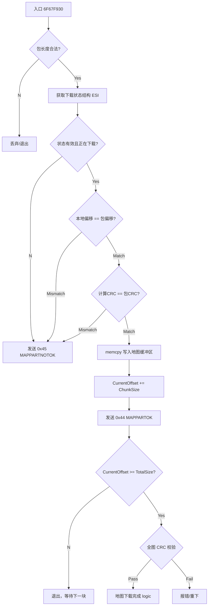

# 魔兽争霸 III (W3GS) 地图分片处理函数逆向文档
**Warcraft III Map Part Handler (0x43) Reverse Engineering**

*   **目标模块**: `Game.dll`
*   **分析基址**: `0x6F000000`
*   **游戏版本**: `v1.26.0.6401`
*   **核心入口**: `Game.dll + 0x67F930` (`0x6F67F930`)
*   **功能描述**: 处理接收到的 `W3GS_MAPPART (0x43)` 数据包，执行校验、写入内存、发送 ACK 以及最终的地图完整性检查。

---



```assembly
6F67F930  | 6A FF                   | push FFFFFFFF                      	|
6F67F932  | 68 C84C846F             | push game.6F844CC8                 	|
6F67F937  | 64:A1 00000000          | mov eax,dword ptr fs:[0]           	|
6F67F93D  | 50                      | push eax                           	|
6F67F93E  | 83EC 44                 | sub esp,44                         	|
6F67F941  | 53                      | push ebx                           	|
6F67F942  | 55                      | push ebp                           	|
6F67F943  | 56                      | push esi                           	|
6F67F944  | 57                      | push edi                           	|
6F67F945  | A1 40E1AA6F             | mov eax,dword ptr ds:[6FAAE140]    	| <--- Stack Guard / Security Cookie
6F67F94A  | 33C4                    | xor eax,esp                        	|
6F67F94C  | 50                      | push eax                           	|
6F67F94D  | 8D4424 58               | lea eax,dword ptr ss:[esp+58]      	|
6F67F951  | 64:A3 00000000          | mov dword ptr fs:[0],eax           	|
6F67F957  | 894C24 14               | mov dword ptr ss:[esp+14],ecx      	|
6F67F95B  | 8B7C24 70               | mov edi,dword ptr ss:[esp+70]      	|
6F67F95F  | 8D6F F2                 | lea ebp,dword ptr ds:[edi-E]       	| <--- [edi-E] = 包长度 - 14 (去掉包头
6F67F962  | 81FD A2050000           | cmp ebp,5A2                        	| <--- 检查数据长度是否过大 (> 1442字节)
6F67F968  | 77 6C                   | ja game.6F67F9D6                   	| <--- 如果包太大，视为非法，跳走
6F67F96A  | 8B7424 6C               | mov esi,dword ptr ss:[esp+6C]      	|
6F67F96E  | 33C0                    | xor eax,eax                        	|
6F67F970  | BB 082C936F             | mov ebx,game.6F932C08              	|
6F67F975  | 895C24 40               | mov dword ptr ss:[esp+40],ebx      	|
6F67F979  | 897424 44               | mov dword ptr ss:[esp+44],esi      	|
6F67F97D  | 894424 48               | mov dword ptr ss:[esp+48],eax      	|
6F67F981  | C74424 4C FFFFFFFF      | mov dword ptr ss:[esp+4C],FFFFFFFF 	|
6F67F989  | 897C24 50               | mov dword ptr ss:[esp+50],edi      	|
6F67F98D  | 894424 54               | mov dword ptr ss:[esp+54],eax      	|
6F67F991  | 8D5424 30               | lea edx,dword ptr ss:[esp+30]      	|
6F67F995  | 8D4C24 40               | lea ecx,dword ptr ss:[esp+40]      	|
6F67F999  | 894424 60               | mov dword ptr ss:[esp+60],eax      	|
6F67F99D  | E8 FE4F0000             | call game.6F6849A0                 	| <--- 基础数据格式检查
6F67F9A2  | 8B4424 54               | mov eax,dword ptr ss:[esp+54]      	|
6F67F9A6  | 3B4424 50               | cmp eax,dword ptr ss:[esp+50]      	|
6F67F9AA  | 895C24 40               | mov dword ptr ss:[esp+40],ebx      	|
6F67F9AE  | 76 30                   | jbe game.6F67F9E0                  	|
6F67F9B0  | 83C8 FF                 | or eax,FFFFFFFF                    	|
6F67F9B3  | 394424 4C               | cmp dword ptr ss:[esp+4C],eax      	|
6F67F9B7  | 894424 60               | mov dword ptr ss:[esp+60],eax      	|
6F67F9BB  | 74 19                   | je game.6F67F9D6                   	|
6F67F9BD  | 8D4C24 4C               | lea ecx,dword ptr ss:[esp+4C]      	|
6F67F9C1  | 51                      | push ecx                           	|
6F67F9C2  | 8D5424 4C               | lea edx,dword ptr ss:[esp+4C]      	|
6F67F9C6  | 52                      | push edx                           	|
6F67F9C7  | 8D4424 4C               | lea eax,dword ptr ss:[esp+4C]      	|
6F67F9CB  | 50                      | push eax                           	|
6F67F9CC  | 8D4C24 4C               | lea ecx,dword ptr ss:[esp+4C]      	|
6F67F9D0  | FF15 0C2C936F           | call dword ptr ds:[6F932C0C]       	|
6F67F9D6  | B8 01000000             | mov eax,1                          	|
6F67F9DB  | E9 69020000             | jmp game.6F67FC49                  	|
6F67F9E0  | 2BF5                    | sub esi,ebp                        	|
6F67F9E2  | 83C8 FF                 | or eax,FFFFFFFF                    	|
6F67F9E5  | 03F7                    | add esi,edi                        	|
6F67F9E7  | 394424 4C               | cmp dword ptr ss:[esp+4C],eax      	|
6F67F9EB  | 897424 6C               | mov dword ptr ss:[esp+6C],esi      	|
6F67F9EF  | 894424 60               | mov dword ptr ss:[esp+60],eax      	|
6F67F9F3  | 74 19                   | je game.6F67FA0E                   	|
6F67F9F5  | 8D4C24 4C               | lea ecx,dword ptr ss:[esp+4C]      	|
6F67F9F9  | 51                      | push ecx                           	|
6F67F9FA  | 8D5424 4C               | lea edx,dword ptr ss:[esp+4C]      	|
6F67F9FE  | 52                      | push edx                           	|
6F67F9FF  | 8D4424 4C               | lea eax,dword ptr ss:[esp+4C]      	|
6F67FA03  | 50                      | push eax                           	|
6F67FA04  | 8D4C24 4C               | lea ecx,dword ptr ss:[esp+4C]      	|
6F67FA08  | FF15 0C2C936F           | call dword ptr ds:[6F932C0C]       	|
6F67FA0E  | 8B5424 68               | mov edx,dword ptr ss:[esp+68]      	| <--- [esp+68] = Target PID
6F67FA12  | 8B42 40                 | mov eax,dword ptr ds:[edx+40]      	|
6F67FA15  | 6A 01                   | push 1                             	|
6F67FA17  | 6A 00                   | push 0                             	|
6F67FA19  | 8D4C24 20               | lea ecx,dword ptr ss:[esp+20]      	|
6F67FA1D  | 51                      | push ecx                           	|
6F67FA1E  | 6A 01                   | push 1                             	|
6F67FA20  | 50                      | push eax                           	|
6F67FA21  | B9 70FFAC6F             | mov ecx,game.6FACFF70              	|
6F67FA26  | C78424 84000000 0000000 | mov dword ptr ss:[esp+84],0        	|
6F67FA31  | E8 4AA1FFFF             | call game.6F679B80                 	| <--- FindConnection (根据 PID 查找连接对象) 
6F67FA36  | 8BF8                    | mov edi,eax                        	|
6F67FA38  | 85FF                    | test edi,edi                       	| <--- EDI = CNetConnection* (或 NULL)
6F67FA3A  | 0F84 05020000           | je game.6F67FC45                   	|
6F67FA40  | 8B5424 32               | mov edx,dword ptr ss:[esp+32]      	|
6F67FA44  | 8BCF                    | mov ecx,edi                        	|
6F67FA46  | C74424 70 02000000      | mov dword ptr ss:[esp+70],2        	|
6F67FA4E  | E8 2DF0FFFF             | call game.6F67EA80                 	| <--- 获取当前下载任务对象
6F67FA53  | 8BF0                    | mov esi,eax                        	|
6F67FA55  | 85F6                    | test esi,esi                       	| <--- ESI = 任务对象
6F67FA57  | 0F84 CC010000           | je game.6F67FC29                   	|
6F67FA5D  | 83BE 40020000 00        | cmp dword ptr ds:[esi+240],0       	| <--- 检查下载状态标志位。如果为 0，直接跳转到结束。
6F67FA64  | 0F84 8F010000           | je game.6F67FBF9                   	|
6F67FA6A  | 8B86 3C020000           | mov eax,dword ptr ds:[esi+23C]     	| <--- [esi+23C] = 当前已下载的字节数 (也就是现在的进度)
6F67FA70  | 8B8E 14020000           | mov ecx,dword ptr ds:[esi+214]     	| <--- [esi+214] = 地图总大小
6F67FA76  | 3BC1                    | cmp eax,ecx                        	|
6F67FA78  | 0F83 7B010000           | jae game.6F67FBF9                  	| <--- 已下载 >= 总大小 -> 异常
6F67FA7E  | 394424 36               | cmp dword ptr ss:[esp+36],eax      	| <--- 比较 包里的偏移量 vs 期望偏移量
6F67FA82  | 0F85 71010000           | jne game.6F67FBF9                  	| <--- 不匹配 (乱序/丢包) -> 发送 Reject
6F67FA88  | 03C5                    | add eax,ebp                        	| <--- 计算 结束偏移 (Current + ChunkLen)
6F67FA8A  | 3BC1                    | cmp eax,ecx                        	|
6F67FA8C  | 0F87 67010000           | ja game.6F67FBF9                   	| <--- 溢出总大小 -> 异常
6F67FA92  | 8B5C24 6C               | mov ebx,dword ptr ss:[esp+6C]      	| <--- [esp+6C] = 数据指针 (Payload Pointer)
6F67FA96  | 8BD5                    | mov edx,ebp                        	| <--- ebp = 数据长度 (Chunk Length)
6F67FA98  | 8BCB                    | mov ecx,ebx                        	|
6F67FA9A  | E8 A140FDFF             | call game.6F653B40                 	| <--- 计算分片校验和
6F67FA9F  | 394424 3A               | cmp dword ptr ss:[esp+3A],eax      	| <--- 比较包内 Checksum vs 计算值
6F67FAA3  | 0F85 50010000           | jne game.6F67FBF9                  	| <--- 校验失败 -> 发送 Reject (0x45)
6F67FAA9  | 8B4C24 31               | mov ecx,dword ptr ss:[esp+31]      	|
6F67FAAD  | 8B5424 68               | mov edx,dword ptr ss:[esp+68]      	|
6F67FAB1  | 51                      | push ecx                           	|
6F67FAB2  | 8BCF                    | mov ecx,edi                        	|
6F67FAB4  | E8 C79DFFFF             | call game.6F679880                 	| <---  获取 NetClient 对象
6F67FAB9  | 85C0                    | test eax,eax                       	|
6F67FABB  | 0F84 2E010000           | je game.6F67FBEF                   	|
6F67FAC1  | 83BF 48010000 00        | cmp dword ptr ds:[edi+148],0       	|
6F67FAC8  | 0F84 21010000           | je game.6F67FBEF                   	|
6F67FACE  | 8B86 3C020000           | mov eax,dword ptr ds:[esi+23C]     	|
6F67FAD4  | 0386 38020000           | add eax,dword ptr ds:[esi+238]     	| <--- [esi+238] = 缓冲区基址 + 当前偏移量 = 写入位置
6F67FADA  | 55                      | push ebp                           	|
6F67FADB  | C786 40020000 03000000  | mov dword ptr ds:[esi+240],3       	| <--- 设置状态 = 3 (Writing)
6F67FAE5  | 8A5424 35               | mov dl,byte ptr ss:[esp+35]        	|
6F67FAE9  | 53                      | push ebx                           	|
6F67FAEA  | 50                      | push eax                           	|
6F67FAEB  | 8896 44020000           | mov byte ptr ds:[esi+244],dl       	|
6F67FAF1  | E8 F61A1600             | call <JMP.&memcpy>                 	| <--- 内存拷贝
6F67FAF6  | 01AE 3C020000           | add dword ptr ds:[esi+23C],ebp     	| <--- 当前偏移量 += 本次写入长度
6F67FAFC  | 0FB64C24 3D             | movzx ecx,byte ptr ss:[esp+3D]     	|
6F67FB01  | 8B97 48010000           | mov edx,dword ptr ds:[edi+148]     	|
6F67FB07  | 8B86 3C020000           | mov eax,dword ptr ds:[esi+23C]     	|
6F67FB0D  | 884C24 30               | mov byte ptr ss:[esp+30],cl        	|
6F67FB11  | 0FB68A B4000000         | movzx ecx,byte ptr ds:[edx+B4]     	|
6F67FB18  | 8B56 08                 | mov edx,dword ptr ds:[esi+8]       	|
6F67FB1B  | 884C24 31               | mov byte ptr ss:[esp+31],cl        	|
6F67FB1F  | 8B4C24 20               | mov ecx,dword ptr ss:[esp+20]      	|
6F67FB23  | 895424 32               | mov dword ptr ss:[esp+32],edx      	|
6F67FB27  | 83C4 0C                 | add esp,C                          	|
6F67FB2A  | 8D5424 24               | lea edx,dword ptr ss:[esp+24]      	|
6F67FB2E  | 894424 2A               | mov dword ptr ss:[esp+2A],eax      	|
6F67FB32  | E8 A9AEFEFF             | call game.6F66A9E0                 	| <--- 发送网络包 0xF744 包（PARTOK）
6F67FB37  | 8B96 14020000           | mov edx,dword ptr ds:[esi+214]     	|
6F67FB3D  | 3996 3C020000           | cmp dword ptr ds:[esi+23C],edx     	| <--- 比较 已下载大小 和 地图总大小
6F67FB43  | 0F82 9B000000           | jb game.6F67FBE4                   	| <--- 如果还没下完，跳去发送ACK
6F67FB49  | 8B8E 38020000           | mov ecx,dword ptr ds:[esi+238]     	|
6F67FB4F  | C786 40020000 01000000  | mov dword ptr ds:[esi+240],1       	| <--- 设置状态 = 1 (Verifying)
6F67FB59  | C686 44020000 00        | mov byte ptr ds:[esi+244],0        	|
6F67FB60  | E8 DB3FFDFF             | call game.6F653B40                 	| <--- 计算整个文件的校验和
6F67FB65  | 3986 1C020000           | cmp dword ptr ds:[esi+21C],eax     	| <--- 比较 计算出的CRC vs 服务端给的CRC
6F67FB6B  | 74 18                   | je game.6F67FB85                   	| <--- 如果校验通过，跳去存盘
6F67FB6D  | 8BD6                    | mov edx,esi                        	|
6F67FB6F  | 8BCF                    | mov ecx,edi                        	|
6F67FB71  | C786 3C020000 00000000  | mov dword ptr ds:[esi+23C],0       	|
6F67FB7B  | E8 B09AFFFF             | call game.6F679630                 	| <--- 发送“下载完成”通知给主机。
6F67FB80  | E9 A4000000             | jmp game.6F67FC29                  	|
6F67FB85  | 8B8E 14020000           | mov ecx,dword ptr ds:[esi+214]     	| <--- 准备文件路径，通常是 .w3x.tmp 或 Maps/Download/xxx)
6F67FB8B  | 8B96 38020000           | mov edx,dword ptr ds:[esi+238]     	|
6F67FB91  | 8B5F 58                 | mov ebx,dword ptr ds:[edi+58]      	|
6F67FB94  | 68 04010000             | push 104                           	|
6F67FB99  | 8DAE 10010000           | lea ebp,dword ptr ds:[esi+110]     	|
6F67FB9F  | 55                      | push ebp                           	|
6F67FBA0  | 51                      | push ecx                           	|
6F67FBA1  | 8D46 0C                 | lea eax,dword ptr ds:[esi+C]       	|
6F67FBA4  | 52                      | push edx                           	|
6F67FBA5  | 50                      | push eax                           	|
6F67FBA6  | 8BCB                    | mov ecx,ebx                        	|
6F67FBA8  | E8 9372FDFF             | call game.6F656E40                 	| <--- 准备文件路径（将 .w3z 或临时文件重命名为 .w3x）。
6F67FBAD  | 8B96 14020000           | mov edx,dword ptr ds:[esi+214]     	|
6F67FBB3  | 8D8E 24020000           | lea ecx,dword ptr ds:[esi+224]     	|
6F67FBB9  | 51                      | push ecx                           	|
6F67FBBA  | 52                      | push edx                           	|
6F67FBBB  | 55                      | push ebp                           	|
6F67FBBC  | 8D4E 0C                 | lea ecx,dword ptr ds:[esi+C]       	|
6F67FBBF  | 51                      | push ecx                           	|
6F67FBC0  | 8B4E 08                 | mov ecx,dword ptr ds:[esi+8]       	|
6F67FBC3  | 51                      | push ecx                           	|
6F67FBC4  | 50                      | push eax                           	|
6F67FBC5  | 8BCB                    | mov ecx,ebx                        	|
6F67FBC7  | 898424 80000000         | mov dword ptr ss:[esp+80],eax      	|
6F67FBCE  | E8 ADB5FDFF             | call game.6F65B180                 	| <--- 将内存数据写入硬盘文件
6F67FBD3  | 837C24 68 01            | cmp dword ptr ss:[esp+68],1        	|
6F67FBD8  | 74 0A                   | je game.6F67FBE4                   	|
6F67FBDA  | C786 40020000 05000000  | mov dword ptr ds:[esi+240],5       	|
6F67FBE4  | 8BD6                    | mov edx,esi                        	|
6F67FBE6  | 8BCF                    | mov ecx,edi                        	|
6F67FBE8  | E8 439AFFFF             | call game.6F679630                 	|
6F67FBED  | EB 3A                   | jmp game.6F67FC29                  	|
6F67FBEF  | C74424 70 00000000      | mov dword ptr ss:[esp+70],0        	|
6F67FBF7  | EB 30                   | jmp game.6F67FC29                  	|
6F67FBF9  | 8BBF 48010000           | mov edi,dword ptr ds:[edi+148]     	|
6F67FBFF  | 85FF                    | test edi,edi                       	|
6F67FC01  | 74 26                   | je game.6F67FC29                   	|
6F67FC03  | 8A5424 31               | mov dl,byte ptr ss:[esp+31]        	|
6F67FC07  | 8B4E 08                 | mov ecx,dword ptr ds:[esi+8]       	|
6F67FC0A  | 885424 1C               | mov byte ptr ss:[esp+1C],dl        	|
6F67FC0E  | 8A87 B4000000           | mov al,byte ptr ds:[edi+B4]        	|
6F67FC14  | 894C24 1E               | mov dword ptr ss:[esp+1E],ecx      	|
6F67FC18  | 8B4C24 14               | mov ecx,dword ptr ss:[esp+14]      	|
6F67FC1C  | 8D5424 1C               | lea edx,dword ptr ss:[esp+1C]      	|
6F67FC20  | 884424 1D               | mov byte ptr ss:[esp+1D],al        	|
6F67FC24  | E8 37AFFEFF             | call game.6F66AB60                 	| <--- 发送网络包 0xF745 包（PARTNOTOK）
6F67FC29  | 8B4424 18               | mov eax,dword ptr ss:[esp+18]      	|
6F67FC2D  | 83F8 FF                 | cmp eax,FFFFFFFF                   	|
6F67FC30  | 74 13                   | je game.6F67FC45                   	|
6F67FC32  | 83F8 01                 | cmp eax,1                          	|
6F67FC35  | 1BD2                    | sbb edx,edx                        	|
6F67FC37  | 83C2 01                 | add edx,1                          	|
6F67FC3A  | 52                      | push edx                           	|
6F67FC3B  | B9 90FFAC6F             | mov ecx,game.6FACFF90              	|
6F67FC40  | E8 0B8D0500             | call game.6F6D8950                 	|
6F67FC45  | 8B4424 70               | mov eax,dword ptr ss:[esp+70]      	|
6F67FC49  | 8B4C24 58               | mov ecx,dword ptr ss:[esp+58]      	|
6F67FC4D  | 64:890D 00000000        | mov dword ptr fs:[0],ecx           	|
6F67FC54  | 59                      | pop ecx                            	|
6F67FC55  | 5F                      | pop edi                            	|
6F67FC56  | 5E                      | pop esi                            	|
6F67FC57  | 5D                      | pop ebp                            	|
6F67FC58  | 5B                      | pop ebx                            	|
6F67FC59  | 83C4 50                 | add esp,50                         	|
6F67FC5C  | C2 0C00                 | ret C                              	|
```

## 1. 核心架构与关键偏移 (Architecture & Offsets)

| 逻辑层级 | 功能描述 | 绝对地址 | **基址偏移 (Offset)** |
| :--- | :--- | :--- | :--- |
| **Handler** | **函数主入口** | `6F67F930` | **`+ 67F930`** |
| **Logic** | **CRC32 校验调用** | `6F67FA9A` | **`+ 67FA9A`** |
| **Logic** | 内存写入 (memcpy) | `6F67FAF1` | **`+ 67FAF1`** |
| **Network** | 发送 ACK (0x44) | `6F67FB32` | **`+ 67FB32`** |
| **Network** | 发送 Reject (0x45) | `6F67FC24` | **`+ 67FC24`** |
| **Struct** | **MapDownloadState (ESI)** | 见下表 | **N/A** |

### 1.1 MapDownloadState 结构体 (ESI 寄存器)
根据反汇编还原的下载状态结构：

| 偏移 (Offset) | 类型 | 描述 | 备注 |
| :--- | :--- | :--- | :--- |
| `+0x214` | `uint32` | **TotalMapSize** | 地图总大小 (字节) |
| `+0x21C` | `uint32` | **ExpectedMapCRC** | 期望的整图 CRC (来自 0x42 包) |
| `+0x238` | `void*` | **MapBuffer** | 地图内存缓冲区基址 |
| `+0x23C` | `uint32` | **CurrentOffset** | 当前已下载的偏移量 |
| `+0x240` | `uint32` | **Status** | 状态机 (1=完成, 3=下载中, 5=写入文件?) |
| `+0x244` | `byte` | **Flags** | 标志位 |

---

## 2. 详细流程分析 (Detailed Analysis)

### 2.1 初始校验 (Validation)
函数首先检查传入的数据包是否合法，并获取关联的玩家/下载状态对象。

*   **长度检查**: `6F67F962` 检查 chunk 大小是否超过 `0x5A2` (1442 字节)。
*   **状态获取**: `6F67FA4E` 获取 `ESI` (下载状态结构)。
*   **偏移一致性检查**:
    ```asm
    6F67FA6A | mov eax, [esi+23C]  ; 服务器期望的偏移 (Server Offset)
    6F67FA7E | cmp [esp+36], eax   ; 比较 包内的偏移 (Packet Offset)
    6F67FA82 | jne game.6F67FBF9   ; 不一致则跳转到错误处理 (发送 0x45)
    ```

### 2.2 CRC32 完整性校验 (Integrity Check)
这是最关键的环节，验证当前分片数据是否损坏。

```asm
; 计算 CRC
6F67FA92 | mov ebx, [esp+6C]     ; EBX = Data Pointer
6F67FA96 | mov edx, ebp          ; EDX = Data Length
6F67FA9A | call game.6F653B40    ; ★ 调用标准 CRC32 算法

; 比对 CRC
6F67FA9F | cmp [esp+3A], eax     ; 比较 包内的 CRC vs 计算出的 CRC
6F67FAA3 | jne game.6F67FBF9     ; ★ 不相等 -> 校验失败 (跳转到 0x45 发送逻辑)
```

### 2.3 数据写入与确认 (Write & ACK)
校验通过后，将数据写入内存并通知发送方。

```asm
; 写入内存
6F67FACE | mov eax, [esi+23C]    ; EAX = 当前偏移
6F67FAD4 | add eax, [esi+238]    ; EAX = 缓冲区基址 + 偏移 = 目标地址
6F67FAF1 | call memcpy           ; 写入数据

; 更新偏移
6F67FAF6 | add [esi+23C], ebp    ; Offset += ChunkSize

; 发送 0x44 (ACK)
6F67FB2E | mov [esp+2A], eax     ; 将新的 Offset 填入 ACK 包
6F67FB32 | call game.6F66A9E0    ; 发送 W3GS_MAPPARTOK
```

### 2.4 完成判定 (Completion Logic)
检查是否已接收完所有数据。

```asm
6F67FB37 | mov edx, [esi+214]    ; TotalSize
6F67FB3D | cmp [esi+23C], edx    ; CurrentOffset vs TotalSize
6F67FB43 | jb game.6F67FBE4      ; 如果 Current < Total，跳转离开 (等待下一块)

; --- 以下是下载完成后的逻辑 (Fallthrough) ---
6F67FB4F | mov [esi+240], 1      ; 设置状态 = Completed
6F67FB60 | call game.6F653B40    ; 可能计算全图 CRC 或最终校验
6F67FB65 | cmp [esi+21C], eax    ; 与 0x42 包中宣告的 MapCRC 进行比对
```

### 2.5 错误处理 (Error Handling)
当 CRC 校验失败或偏移量错乱时，进入此分支。

```asm
6F67FBF9 | ...                   ; 准备数据
6F67FC24 | call game.6F66AB60    ; 发送 W3GS_MAPPARTNOTOK (0x45)
                                 ; 客户端将请求服务器重传此块
```

---

## 3. 协议格式还原 (Protocol Spec)

根据栈偏移分析，`W3GS_MAPPART (0x43)` 的接收包结构如下：

**S -> C (0x43 MAPPART)**

| 偏移 | 大小 | 字段 | 描述 |
| :--- | :--- | :--- | :--- |
| 0 | 1 | Header | 0xF7 (W3GS Header) |
| 1 | 1 | ID | **0x43** (MAPPART) |
| 2 | 2 | Length | 包总长度 |
| 4 | 4 | ToPID | 目标玩家 ID (对应 `[esp+68]`) |
| 8 | 4 | FromPID | 源玩家 ID (对应 `[esp+31]` 处处理) |
| 12 | 4 | Unknown | 可能是 HostCounter 或 0 |
| 16 | 4 | **Offset** | 对应 `[esp+36]`。当前分片在文件中的偏移。 |
| 20 | 4 | **CRC32** | 对应 `[esp+3A]`。仅针对当前分片数据的校验码。 |
| 24 | N | **Data** | 地图数据内容。长度 = `TotalLen - 24` (此处反汇编是减14，可能是从偏移10开始算的)。 |

*(注：反汇编中的 `[esp+xx]` 是相对于栈顶的，具体协议头长度可能因版本略有差异，但 Offset、CRC、Data 的顺序已确定)*

## 4. C++ 伪代码还原 (Decompiled Logic)

```cpp
int __stdcall Handle_MapChunk(void* rawPacket, int packetLen)
{
    // 1. 基础检查
    int payloadLen = packetLen - 14; 
    if (payloadLen > 1442) return 0; // MTU 限制

    // 2. 查找连接
    CNetConnection* peer = FindConnection(GetPacketSourceID(rawPacket));
    if (!peer) return 0;

    // 3. 获取下载会话
    MapDownloadSession* session = peer->GetMapDownloadSession();
    if (!session) return 0;

    // 4. 状态与偏移检查 (防乱序)
    if (session->State == 0 || session->CurrentOffset != GetPacketOffset(rawPacket)) {
        SendPacket(peer, W3GS_MAPPARTNOTOK); // 发送 0x45
        return 1;
    }

    // 5. 数据 CRC 校验
    uint32_t packetCRC = GetPacketCRC(rawPacket);
    uint32_t calcCRC = CalculateCRC32(GetPacketData(rawPacket), payloadLen);
    
    if (packetCRC != calcCRC) {
        SendPacket(peer, W3GS_MAPPARTNOTOK); // 校验失败，请求重发
        return 1;
    }

    // 6. 写入内存
    byte* destAddr = session->MapBuffer + session->CurrentOffset;
    session->State = 3; // Receiving
    memcpy(destAddr, GetPacketData(rawPacket), payloadLen);
    session->CurrentOffset += payloadLen;

    // 7. 发送 ACK (确认收到)
    SendMapPartACK(peer, session->CurrentOffset); // 发送 0x44

    // 8. 检查下载是否完成
    if (session->CurrentOffset >= session->TotalMapSize) {
        session->State = 1; // Verifying
        
        // 全图校验
        uint32_t fullCRC = CalculateCRC32(session->MapBuffer, session->TotalMapSize);
        if (fullCRC == session->ExpectedMapCRC) {
            WriteMapToDisk(session);
            session->State = 5; // Completed
            SendMapDownloadFinished(peer); // 通知主机
        } else {
            // 致命错误：全图校验失败
            ResetDownload(session);
            SendPacket(peer, W3GS_MAPPARTNOTOK);
        }
    }

    return 1;
}
```