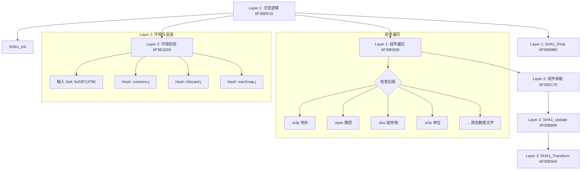

# 魔兽争霸 III (v1.26.0.6401) 地图校验算法逆向核心文档
**Warcraft III Map Checksum Algorithm Reverse Engineering**

*   **目标模块**: `Game.dll` (v1.26.0.6401)
*   **分析基址**: `0x6F000000`
*   **核心入口**: `Game.dll + 0x39EE10` (`0x6F39EE10`)

---


	

## 1. 核心架构与偏移概览 (Architecture & Offsets)

为了方便调试器（如 OllyDbg / x64dbg）快速跳转，请参考以下核心偏移表：

| 逻辑层级 | 功能描述 | 绝对地址 | **基址偏移 (Offset)** |
| :--- | :--- | :--- | :--- |
| **Control** | **算法主入口 (Main)** | `6F39EE10` | **`+ 39EE10`** |
| **Control** | 组件遍历循环 (Loop) | `6F39ED00` | **`+ 39ED00`** |
| **Business**| **环境与加盐 (Env & Salt)**| `6F3B1D00` | **`+ 3B1D00`** |
| **Business**| 单组件处理 (Process) | `6F39EC70` | **`+ 39EC70`** |
| **Kernel** | SHA1_Init | `6F00B850` | **`+ 00B850`** |
| **Kernel** | SHA1_Update | `6F00B890` | **`+ 00B890`** |
| **Kernel** | SHA1_Final | `6F00B9B0` | **`+ 00B9B0`** |
| **Kernel** | SHA1_Transform | `6F00B3A0` | **`+ 00B3A0`** |
| **Data** | **Salt (盐值 0x03F1379E)** | `6F3B1DBB` | **`+ 3B1DBB`** |

---

## 2. 第一层：控制层 (The Controller)

### 2.1 主函数 `CalculateMapSHA1`
*   **Location**: `Game.dll + 0x39EE10`
*   **功能**: 算法总控，负责初始化 SHA1 Context，调用环境加载，并启动组件遍历。

```asm
; 函数头部：栈帧建立与 SHA1 初始化
6F39EE10 | 81EC 68010000    | sub esp, 168              ; [Offset +39EE10] 开辟栈空间
6F39EE16 | A1 40E1AA6F      | mov eax, [6FAAE140]       ; [Offset +AAE140] 获取 Security Cookie
...
6F39EE2E | E8 1DCAC6FF      | call game.6F00B850        ; [Offset +00B850] CALL SHA1_Init(&ctx)

; 路径处理
6F39EE33 | 68 04010000      | push 104                  ; Push 260 (MAX_PATH)
6F39EE3E | E8 2D2FC7FF      | call game.6F011D70        ; [Offset +011D70] PathNormalize()
6F39EE43 | 85C0             | test eax, eax             ; 检查路径是否有效
6F39EE45 | 74 4A            | je game.6F39EE91          ; [Offset +39EE91] 无效则退出

; 版本标志位处理 (Legacy Flag)
6F39EE52 | BE AB170000      | mov esi, 17AB             ; ESI = 6059 (v1.21b Build Number)
6F39EE57 | 8B8424 74010000  | mov eax, [esp+174]        ; 读取参数
...

; [关键调用 1] 进入业务层：加载环境、盐值和脚本
6F39EE69 | E8 F22F0100      | call game.6F3B1E60        ; [Offset +3B1E60] -> 跳转至 EnvLoader
                                                        ; 注意：此函数内部会调用 +3B1D00

; [关键调用 2] 进入控制层：遍历地图组件 (.w3e, .w3u 等)
6F39EE79 | 8D4C24 08        | lea ecx, [esp+8]          ; ECX = Context 指针
6F39EE7D | E8 7EFEFFFF      | call game.6F39ED00        ; [Offset +39ED00] CALL ComponentLoop

; 结算输出
6F39EE87 | E8 24CBC6FF      | call game.6F00B9B0        ; [Offset +00B9B0] CALL SHA1_Final
```

### 2.2 组件遍历循环 `ComponentLoop`
*   **Location**: `Game.dll + 0x39ED00`
*   **功能**: 按硬编码顺序检查文件扩展名。

```asm
6F39ED00 | 56               | push esi                  ; [Offset +39ED00] 函数入口
6F39ED08 | B9 2C6A876F      | mov ecx, game.6F876A2C    ; [Offset +876A2C] String: ".w3e" (地形)
6F39ED0D | E8 5EFFFFFF      | call game.6F39EC70        ; [Offset +39EC70] ProcessComponent()

6F39ED14 | B9 246A876F      | mov ecx, game.6F876A24    ; [Offset +876A24] String: ".wpm" (路径)
6F39ED19 | E8 52FFFFFF      | call game.6F39EC70        ; [Offset +39EC70] ProcessComponent()

6F39ED20 | B9 2819946F      | mov ecx, game.6F941928    ; [Offset +941928] String: ".doo" (装饰物)
6F39ED25 | E8 46FFFFFF      | call game.6F39EC70

; ... 后续依次为 .w3u (单位), .w3b (可破坏), .w3d (定义), .w3a (技能), .w3q (科技)
```

---

## 3. 第二层：业务逻辑层 (The Business Logic)

### 3.1 环境与加盐 `EnvLoader`
*   **Location**: `Game.dll + 0x3B1D00` (由 `+3B1E60` 内部调用)
*   **功能**: **反作弊核心**。注入环境文件和魔数盐值。

```asm
; 加载 common.j
6F3B1D4E | BE 1831936F      | mov esi, game.6F933118    ; [Offset +933118] String: "common.j"
6F3B1D53 | E8 18FCFFFF      | call game.6F3B1970        ; [Offset +3B1970] ScriptLoader
6F3B1D73 | E8 189BC5FF      | call game.6F00B890        ; [Offset +00B890] SHA1_Update(common.j)

; 加载 blizzard.j
6F3B1D82 | BE C825946F      | mov esi, game.6F9425C8    ; [Offset +9425C8] String: "blizzard.j"
6F3B1D8F | E8 DCFBFFFF      | call game.6F3B1970        ; [Offset +3B1970] ScriptLoader
6F3B1DAD | E8 DE9AC5FF      | call game.6F00B890        ; [Offset +00B890] SHA1_Update(blizzard.j)

; [核心] 注入 Salt (盐值)
; 这里的 3F1379E 是立即数，硬编码在指令中
6F3B1DBB | C74424 18 9E37F103 | mov [esp+18], 3F1379E   ; [Offset +3B1DBB] Value: 0x03F1379E
6F3B1DC3 | E8 C89AC5FF        | call game.6F00B890      ; [Offset +00B890] SHA1_Update(&Salt, 4)

; 加载 war3map.j (地图核心脚本)
6F3B1DEF | E8 9C9AC5FF      | call game.6F00B890        ; [Offset +00B890] SHA1_Update(war3map.j)
```

### 3.2 单组件处理 `ProcessComponent`
*   **Location**: `Game.dll + 0x39EC70`
*   **功能**: 拼接文件名 -> MPQ查找 -> 读取 -> Hash。

```asm
6F39EC86 | 68 CC50876F      | push game.6F8750CC        ; [Offset +8750CC] String: "war3map"
6F39EC8B | 68 F0C6926F      | push game.6F92C6F0        ; [Offset +92C6F0] String: "%s%s"
...
6F39ECBB | E8 90281200      | call game.6F4C1550        ; [Offset +4C1550] MPQ_OpenFile
6F39ECD0 | E8 BBCBC6FF      | call game.6F00B890        ; [Offset +00B890] SHA1_Update
```

---

## 4. 第三层：内核与IO层 (Kernel & IO)

### 4.1 SHA-1 核心变换 `SHA1_Transform`
*   **Location**: `Game.dll + 0x00B3A0`
*   **功能**: 标准 FIPS 180-1 压缩函数。

**关键常数验证 (Magic Constants Verification)**:
*   `+00B4CC`: `0x5A827999` (K0)
*   `+00B592`: `0x6ED9EBA1` (K1)
*   `+00B668`: `0x8F1BBCDC` (K2) - 汇编中显示为 `-70E44324`
*   `+00B75F`: `0xCA62C1D6` (K3) - 汇编中显示为 `-359D3E2A`

### 4.2 MPQ 接口 `MPQ_Interface`
*   **Location**: `Game.dll + 0x4C1550`
*   **功能**: 封装了 Storm.dll 的调用，包含内存缓存 (`FileCache`)。

```asm
6F4C157F | E8 4CDBFFFF      | call game.6F4BF0D0        ; [Offset +4BF0D0] CheckFileCache
...
6F4C1658 | E8 AF9F2200      | call <JMP.&Ordinal#279>   ; Storm.SFileOpenFileEx
6F4C15F3 | E8 BA9F2200      | call <JMP.&Ordinal#401>   ; Storm.SMemAlloc
```

---

## 5. 逻辑还原 (Detailed Reconstruction)

基于上述基址偏移的详细分析，我们可以构建出精确的逻辑模型：

这是我准备的两个版本的代码实现。

这两个版本都实现了完全相同的逻辑：**魔兽争霸 v1.26.0.6401 逆向校验算法 (Game.dll 0x6F39EE10)**。

---

### 前置依赖说明 (Dependencies)
1.  **StormLib**: 用于读取 `.w3x` (MPQ) 档案 (两个版本都需要)。
2.  **OpenSSL** (仅纯 C++ 版本): 用于 SHA-1 计算。
3.  **Qt Core** (仅 Qt 版本): 用于 `QCryptographicHash` 和文件操作。

---

## 版本一：纯 C++ 实现 (Pure C++ Implementation)

适用于底层服务、无 GUI 的控制台程序或不依赖 Qt 的环境。

```cpp
#include <iostream>
#include <vector>
#include <string>
#include <cstdint>
#include <fstream>

// 依赖库
#include <openssl/sha.h> // OpenSSL crypto library
#include "StormLib.h"    // StormLib MPQ library

// ---------------------------------------------------------
// 常量定义 (Derived from Game.dll Reverse Engineering)
// ---------------------------------------------------------
static const uint32_t MAP_CHECKSUM_SALT = 0x03F1379E; // Offset: 0x3B1DBB

// ---------------------------------------------------------
// 辅助工具
// ---------------------------------------------------------

// 读取本地文件到 buffer
std::vector<uint8_t> ReadLocalFile(const std::string& path) {
    std::ifstream file(path, std::ios::binary | std::ios::ate);
    if (!file.is_open()) return {};
    
    std::streamsize size = file.tellg();
    file.seekg(0, std::ios::beg);
    
    std::vector<uint8_t> buffer(size);
    if (file.read(reinterpret_cast<char*>(buffer.data()), size)) {
        return buffer;
    }
    return {};
}

// 从 MPQ 读取文件到 buffer
std::vector<uint8_t> ReadMpqFile(HANDLE hMpq, const std::string& filename) {
    HANDLE hFile = NULL;
    if (!SFileOpenFileEx(hMpq, filename.c_str(), 0, &hFile)) {
        return {};
    }

    DWORD fileSize = SFileGetFileSize(hFile, NULL);
    if (fileSize == INVALID_FILE_SIZE) {
        SFileCloseFile(hFile);
        return {};
    }

    std::vector<uint8_t> buffer(fileSize);
    DWORD bytesRead = 0;
    SFileReadFile(hFile, buffer.data(), fileSize, &bytesRead, NULL);
    SFileCloseFile(hFile);

    if (bytesRead != fileSize) return {};
    return buffer;
}

// 将 uint32 转换为小端序字节数组 (SHA1 Update 需要)
void SHA1_Update_Int32(SHA_CTX* ctx, uint32_t value) {
    uint8_t bytes[4];
    bytes[0] = value & 0xFF;
    bytes[1] = (value >> 8) & 0xFF;
    bytes[2] = (value >> 16) & 0xFF;
    bytes[3] = (value >> 24) & 0xFF;
    SHA1_Update(ctx, bytes, 4);
}

// ---------------------------------------------------------
// 核心算法实现
// ---------------------------------------------------------
bool CalculateMapSHA1_Cpp(const std::string& mapPath, uint8_t outputHash[20]) {
    // 1. 准备本地环境文件
    auto dataCommon = ReadLocalFile("war3files/common.j");
    auto dataBlizzard = ReadLocalFile("war3files/blizzard.j");

    if (dataCommon.empty() || dataBlizzard.empty()) {
        std::cerr << "[Error] Missing common.j or blizzard.j" << std::endl;
        return false;
    }

    // 2. 打开 MPQ
    HANDLE hMpq = NULL;
    // StormLib 需要宽字符或根据系统编码，这里假设简单的 ASCII 路径
    if (!SFileOpenArchive(mapPath.c_str(), 0, MPQ_OPEN_READ_ONLY, &hMpq)) {
        std::cerr << "[Error] Failed to open map MPQ" << std::endl;
        return false;
    }

    // 3. 读取地图脚本
    // Game.dll 逻辑：优先读 war3map.j，失败读 scripts\war3map.j
    auto dataScript = ReadMpqFile(hMpq, "war3map.j");
    if (dataScript.empty()) dataScript = ReadMpqFile(hMpq, "scripts\\war3map.j");
    
    if (dataScript.empty()) {
        SFileCloseArchive(hMpq);
        return false;
    }

    // =========================================================
    // 算法开始 (Algorithm Start)
    // =========================================================
    SHA_CTX ctx;
    SHA1_Init(&ctx);

    // Step 1: 注入环境 (Environment Injection)
    SHA1_Update(&ctx, dataCommon.data(), dataCommon.size());
    SHA1_Update(&ctx, dataBlizzard.data(), dataBlizzard.size());

    // Step 2: 注入盐值 (Salt Injection)
    // 关键点：反作弊盐值 0x03F1379E
    SHA1_Update_Int32(&ctx, MAP_CHECKSUM_SALT);

    // Step 3: 注入地图脚本 (Map Script)
    SHA1_Update(&ctx, dataScript.data(), dataScript.size());

    // Step 4: 遍历组件 (Component Loop)
    // 顺序必须严格一致：Offset 0x39ED00
    const char* components[] = {
        "war3map.w3e", "war3map.wpm", "war3map.doo", "war3map.w3u",
        "war3map.w3b", "war3map.w3d", "war3map.w3a", "war3map.w3q"
    };

    for (const char* compName : components) {
        auto compData = ReadMpqFile(hMpq, compName);
        if (!compData.empty()) {
            SHA1_Update(&ctx, compData.data(), compData.size());
            std::cout << "[Info] Added component: " << compName << std::endl;
        }
    }

    // =========================================================
    // 结算 (Finalize)
    // =========================================================
    SHA1_Final(outputHash, &ctx);

    SFileCloseArchive(hMpq);
    return true;
}
```

---

## 版本二：Qt C++ 实现 (Qt Implementation)

适用于基于 Qt 的对战平台客户端或地图管理器，代码更简洁，利用了 Qt 的便捷类。

```cpp
#include <QFile>
#include <QByteArray>
#include <QCryptographicHash>
#include <QtEndian>
#include <QDebug>
#include <QDir>

// 依赖库
#include "StormLib.h"

// ---------------------------------------------------------
// 常量定义
// ---------------------------------------------------------
static const quint32 MAP_CHECKSUM_SALT = 0x03F1379E; // Game.dll + 0x3B1DBB

// ---------------------------------------------------------
// 核心算法实现
// ---------------------------------------------------------
QByteArray CalculateMapSHA1_Qt(const QString &mapPath) 
{
    // 1. 辅助 Lambda：读取 MPQ 文件
    HANDLE hMpq = NULL;
    // 路径处理 (Windows 兼容)
    QString nativePath = QDir::toNativeSeparators(mapPath);
#ifdef UNICODE
    const wchar_t *pathStr = (const wchar_t*)nativePath.utf16();
#else
    const char *pathStr = nativePath.toLocal8Bit().constData();
#endif

    if (!SFileOpenArchive(pathStr, 0, MPQ_OPEN_READ_ONLY, &hMpq)) {
        qCritical() << "[Error] Cannot open MPQ:" << mapPath;
        return QByteArray();
    }

    auto readMpqFile = [&](const QString &fileName) -> QByteArray {
        HANDLE hFile = NULL;
        QByteArray buffer;
        if (SFileOpenFileEx(hMpq, fileName.toLocal8Bit().constData(), 0, &hFile)) {
            DWORD s = SFileGetFileSize(hFile, NULL);
            if (s > 0 && s != INVALID_FILE_SIZE) {
                buffer.resize(s);
                DWORD read = 0;
                SFileReadFile(hFile, buffer.data(), s, &read, NULL);
            }
            SFileCloseFile(hFile);
        }
        return buffer;
    };

    auto readLocalFile = [](const QString &path) -> QByteArray {
        QFile f(path);
        if (f.open(QIODevice::ReadOnly)) return f.readAll();
        return QByteArray();
    };

    // 2. 准备数据
    // 警告：common.j/blizzard.j 必须从平台本地读取，不能从地图内读取！
    QByteArray dataCommon = readLocalFile("war3files/common.j");
    QByteArray dataBlizzard = readLocalFile("war3files/blizzard.j");
    
    // 读取地图脚本 (容错处理)
    QByteArray dataScript = readMpqFile("war3map.j");
    if (dataScript.isEmpty()) dataScript = readMpqFile("scripts\\war3map.j");

    if (dataCommon.isEmpty() || dataBlizzard.isEmpty() || dataScript.isEmpty()) {
        qCritical() << "[Error] Missing environment files or map script.";
        SFileCloseArchive(hMpq);
        return QByteArray();
    }

    // =========================================================
    // 算法开始 (Algorithm Start)
    // =========================================================
    QCryptographicHash sha1(QCryptographicHash::Sha1);

    // Step 1: 注入环境 (Environment)
    sha1.addData(dataCommon);
    sha1.addData(dataBlizzard);

    // Step 2: 注入盐值 (Salt)
    // 必须确保是 Little-Endian 写入
    quint32 saltLE = qToLittleEndian(MAP_CHECKSUM_SALT);
    sha1.addData((const char*)&saltLE, 4);

    // Step 3: 注入地图脚本 (Map Script)
    sha1.addData(dataScript);

    // Step 4: 遍历组件 (Component Loop)
    // 严格顺序：Game.dll 0x39ED00
    const QStringList components = {
        "war3map.w3e", "war3map.wpm", "war3map.doo", "war3map.w3u",
        "war3map.w3b", "war3map.w3d", "war3map.w3a", "war3map.w3q"
    };

    for (const QString &ext : components) {
        QByteArray compData = readMpqFile(ext);
        if (!compData.isEmpty()) {
            sha1.addData(compData);
            // qDebug() << "Added component:" << ext << "Size:" << compData.size();
        }
    }

    // =========================================================
    // 结算 (Finalize)
    // =========================================================
    SFileCloseArchive(hMpq);
    
    // 返回 20 字节的哈希
    return sha1.result();
}
```

### 文档提示
*   **关于路径**: 代码中假定了 `war3files/` 目录存放 `common.j` 和 `blizzard.j`。在文档中请注明，这需要用户从魔兽客户端的 `War3Patch.mpq` 或 `War3x.mpq` 
中提取这两个文件，并放在指定目录。
*   **关于 StormLib**: 需要在项目中链接 `StormLib.lib` (Windows) 或 `libstorm.a` (Linux)。
*   **关于结果**: 返回的 20 字节二进制数据即为 `StatString` 协议中所需的 `Map SHA1`。

## 6. 总结 (Conclusion)

通过将基址锁定在 `0x6F000000`，您可以直接在调试器中使用 `Ctrl+G` 跳转到上述 **Offset** 指向的位置。

*   **调试建议**:
    *   在 `6F3B1DBB` (`+3B1DBB`) 下断点，可以观察到 Salt 被推入栈的瞬间。
    *   在 `6F39ED00` (`+39ED00`) 下断点，可以单步跟踪它如何跳过不存在的文件（例如只修改了贴图的地图，此循环流程将完全一致）。