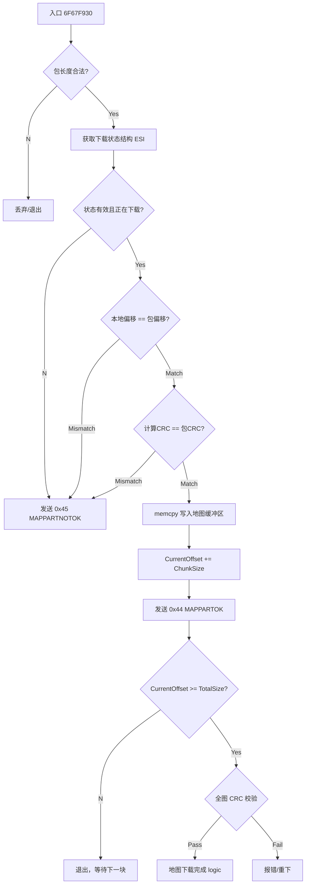

# 魔兽争霸 III (W3GS) 地图分片处理函数逆向文档
**Warcraft III Map Part Handler (0x43) Reverse Engineering**

*   **目标模块**: `Game.dll`
*   **分析基址**: `0x6F000000`
*   **核心入口**: `Game.dll + 0x67F930` (`0x6F67F930`)
*   **功能描述**: 处理接收到的 `W3GS_MAPPART (0x43)` 数据包，执行校验、写入内存、发送 ACK 以及最终的地图完整性检查。

---



## 1. 核心架构与关键偏移 (Architecture & Offsets)

| 逻辑层级 | 功能描述 | 绝对地址 | **基址偏移 (Offset)** |
| :--- | :--- | :--- | :--- |
| **Handler** | **函数主入口** | `6F67F930` | **`+ 67F930`** |
| **Logic** | **CRC32 校验调用** | `6F67FA9A` | **`+ 67FA9A`** |
| **Logic** | 内存写入 (memcpy) | `6F67FAF1` | **`+ 67FAF1`** |
| **Network** | 发送 ACK (0x44) | `6F67FB32` | **`+ 67FB32`** |
| **Network** | 发送 Reject (0x45) | `6F67FC24` | **`+ 67FC24`** |
| **Struct** | **MapDownloadState (ESI)** | 见下表 | **N/A** |

### 1.1 MapDownloadState 结构体 (ESI 寄存器)
根据反汇编还原的下载状态结构：

| 偏移 (Offset) | 类型 | 描述 | 备注 |
| :--- | :--- | :--- | :--- |
| `+0x214` | `uint32` | **TotalMapSize** | 地图总大小 (字节) |
| `+0x21C` | `uint32` | **ExpectedMapCRC** | 期望的整图 CRC (来自 0x42 包) |
| `+0x238` | `void*` | **MapBuffer** | 地图内存缓冲区基址 |
| `+0x23C` | `uint32` | **CurrentOffset** | 当前已下载的偏移量 |
| `+0x240` | `uint32` | **Status** | 状态机 (1=完成, 3=下载中, 5=写入文件?) |
| `+0x244` | `byte` | **Flags** | 标志位 |

---

## 2. 详细流程分析 (Detailed Analysis)

### 2.1 初始校验 (Validation)
函数首先检查传入的数据包是否合法，并获取关联的玩家/下载状态对象。

*   **长度检查**: `6F67F962` 检查 chunk 大小是否超过 `0x5A2` (1442 字节)。
*   **状态获取**: `6F67FA4E` 获取 `ESI` (下载状态结构)。
*   **偏移一致性检查**:
    ```asm
    6F67FA6A | mov eax, [esi+23C]  ; 服务器期望的偏移 (Server Offset)
    6F67FA7E | cmp [esp+36], eax   ; 比较 包内的偏移 (Packet Offset)
    6F67FA82 | jne game.6F67FBF9   ; 不一致则跳转到错误处理 (发送 0x45)
    ```

### 2.2 CRC32 完整性校验 (Integrity Check)
这是最关键的环节，验证当前分片数据是否损坏。

```asm
; 计算 CRC
6F67FA92 | mov ebx, [esp+6C]     ; EBX = Data Pointer
6F67FA96 | mov edx, ebp          ; EDX = Data Length
6F67FA9A | call game.6F653B40    ; ★ 调用标准 CRC32 算法

; 比对 CRC
6F67FA9F | cmp [esp+3A], eax     ; 比较 包内的 CRC vs 计算出的 CRC
6F67FAA3 | jne game.6F67FBF9     ; ★ 不相等 -> 校验失败 (跳转到 0x45 发送逻辑)
```

### 2.3 数据写入与确认 (Write & ACK)
校验通过后，将数据写入内存并通知发送方。

```asm
; 写入内存
6F67FACE | mov eax, [esi+23C]    ; EAX = 当前偏移
6F67FAD4 | add eax, [esi+238]    ; EAX = 缓冲区基址 + 偏移 = 目标地址
6F67FAF1 | call memcpy           ; 写入数据

; 更新偏移
6F67FAF6 | add [esi+23C], ebp    ; Offset += ChunkSize

; 发送 0x44 (ACK)
6F67FB2E | mov [esp+2A], eax     ; 将新的 Offset 填入 ACK 包
6F67FB32 | call game.6F66A9E0    ; 发送 W3GS_MAPPARTOK
```

### 2.4 完成判定 (Completion Logic)
检查是否已接收完所有数据。

```asm
6F67FB37 | mov edx, [esi+214]    ; TotalSize
6F67FB3D | cmp [esi+23C], edx    ; CurrentOffset vs TotalSize
6F67FB43 | jb game.6F67FBE4      ; 如果 Current < Total，跳转离开 (等待下一块)

; --- 以下是下载完成后的逻辑 (Fallthrough) ---
6F67FB4F | mov [esi+240], 1      ; 设置状态 = Completed
6F67FB60 | call game.6F653B40    ; 可能计算全图 CRC 或最终校验
6F67FB65 | cmp [esi+21C], eax    ; 与 0x42 包中宣告的 MapCRC 进行比对
```

### 2.5 错误处理 (Error Handling)
当 CRC 校验失败或偏移量错乱时，进入此分支。

```asm
6F67FBF9 | ...                   ; 准备数据
6F67FC24 | call game.6F66AB60    ; 发送 W3GS_MAPPARTNOTOK (0x45)
                                 ; 客户端将请求服务器重传此块
```

---

## 3. 协议结构验证 (Packet Structure Verification)

根据反汇编中 `ESP` 的偏移访问，可以反推出 `W3GS_MAPPART (0x43)` 的接收包结构（栈布局）：

| 栈偏移 (Approx) | 字段 | 你的代码匹配情况 |
| :--- | :--- | :--- |
| `[esp+31]` | **From PID** | 匹配 |
| `[esp+68]` | **To PID** | 匹配 |
| `[esp+36]` | **Offset** | 匹配 (BNETDocs 结构) |
| `[esp+3A]` | **CRC32** | 匹配 (BNETDocs 结构) |
| `[esp+6C]` | **Data Pointer** | 匹配 |

**结论**: 反汇编逻辑证实了 **CRC32 字段位于 Offset 字段之后，Data 字段之前**。且代码逻辑**并未**解析 `DataLen` 字段，而是直接根据包总长度计算出 Data 的长度 (`ebp` 寄存器在 `6F67F9E0` 处通过减法计算得出)。

这再次印证了 `DataLen` 字段在标准协议中是不存在的，长度由 TCP 包长度推导。