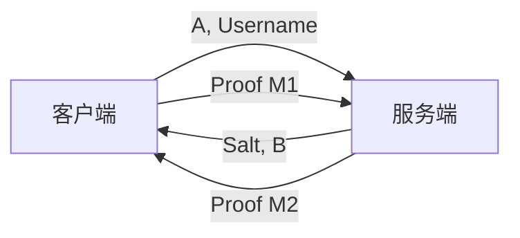

# Battle.net SRP3 登录流程详解

**协议 ID**: `Protocol 0x53` (SRP NLS)
**核心机制**: 零知识证明 (Zero-Knowledge Proof)，即客户端向服务端证明它知道密码，而无需在网络上发送密码本身。

## 0. 核心常量定义

所有大数计算均在模 $N$ 下进行。

*   **N (Modulus)**: 32字节 (256位) 的大素数。
    ```text
    F8 FF 1A 8B 61 99 18 03 21 86 B6 8C A0 92 B5 55
    7E 97 6C 78 C7 32 12 D9 12 16 F6 65 85 23 C7 87
    ```
*   **g (Generator)**: 生成元，值为 `0x2F` (十进制 47)。
*   **I (Initial Hash)**: 预计算常量，$I = H(g) \oplus H(N)$。

---

## 第一阶段：初始化与公钥交换

### 1. 客户端：发起请求 (Client Hello)
客户端生成临时密钥对，并向服务端表明身份。

1.  **生成私钥 $a$**:
    *   生成一个随机的 32 字节大数。
    *   计算 $a = \text{random()} \mod N$。
2.  **计算公钥 $A$**:
    *   $A = g^a \mod N$。
3.  **发送包 `SID_AUTH_ACCOUNTLOGON` (0x53)**:
    *   `A` (32字节, Little Endian)
    *   `Username` (字符串)

### 2. 服务端：下发挑战 (Server Challenge)
服务端查找用户记录，生成服务端临时公钥。

1.  **查找用户**:
    *   获取存储的 **Salt ($s$)**。
    *   获取存储的 **Verifier ($v$)** (其中 $v = g^x \mod N$)。
2.  **生成私钥 $b$**:
    *   生成一个随机的 32 字节大数。
3.  **计算公钥 $B$**:
    *   $B = (v + g^b) \mod N$。
4.  **发送包 `SID_AUTH_ACCOUNTLOGON` (0x53) 响应**:
    *   `Status` (0 = 成功)
    *   `Salt` ($s$, 32字节, Little Endian)
    *   `Server Key` ($B$, 32字节, Little Endian)

---

## 第二阶段：计算会话密钥 (The Hard Part)

此阶段完全在客户端内部进行，不发送网络包。

### 3. 客户端：核心计算

客户端收到 $s$ 和 $B$ 后，执行以下步骤：

#### 3.1 计算扰码 $u$
*   对服务端公钥 $B$ 的**原始字节流** (Little Endian) 进行 SHA1 哈希。
*   取哈希结果的前 4 个字节，转换为整数。
*   **公式**: $u = \text{SHA1}(B)[0..3]$

#### 3.2 计算私钥 $x$ (关键步骤)
这是最容易出错的地方，涉及字节序转换。
1.  计算用户名密码哈希: $H_P = \text{SHA1}(\text{"USER:PASS"})$。
2.  拼接数据: `Buffer = Salt (LE) + H_P (LE)`。
3.  计算最终哈希: $H_{final} = \text{SHA1}(\text{Buffer})$。
4.  **转换**: 将 $H_{final}$ (通常 SHA1 是 Big Endian) 视为数值 $x$。
    *   *注：PvPGN 服务端逻辑中，这里会将 SHA1 的结果进行字节翻转后，再视为 Little Endian 数值加载。*

#### 3.3 计算预主密钥 $S$ (Pre-Master Secret)
*   **公式**: $S = (B - g^x)^{(a + u \cdot x)} \mod N$
*   *注意*: 如果 $B < g^x$，需处理负数，即 $S = (N + B - g^x) \cdots$。

#### 3.4 计算会话密钥 $K$ (Session Key)
SRP3 使用一种奇偶交错哈希法生成 $K$。
1.  将 $S$ 转换为 32 字节数组 (Little Endian)。
2.  拆分数组:
    *   `Odd`: 取第 0, 2, 4... 字节。
    *   `Even`: 取第 1, 3, 5... 字节。
3.  哈希:
    *   $H_{odd} = \text{SHA1}(Odd)$
    *   $H_{even} = \text{SHA1}(Even)$
4.  合并: 交错拼接 $H_{odd}$ 和 $H_{even}$ 的字节生成 40 字节的 $K$。
    *   $K = [O_0, E_0, O_1, E_1, \dots, O_{19}, E_{19}]$

---

## 第三阶段：生成并验证证明 (Proof)

### 4. 客户端：生成 M1 并发送
客户端生成证据 $M1$ 证明自己计算出了正确的 $K$。

1.  **准备数据 (顺序拼接)**:
    *   `I` (20 bytes)
    *   `H(Username)` (20 bytes)
    *   `Salt` (32 bytes)
    *   `A` (32 bytes)
    *   `B` (32 bytes)
    *   `K` (40 bytes)
2.  **计算 M1**:
    *   $M1 = \text{SHA1}(\text{Data})$。
3.  **发送包 `SID_AUTH_ACCOUNTLOGONPROOF` (0x54)**:
    *   `M1` (20字节)

### 5. 服务端：验证并回复 M2
服务端使用同样的逻辑计算 $u, S, K$ 和 $M1_{expected}$。

1.  **验证**:
    *   比较客户端发的 $M1$ 与 服务端算的 $M1_{expected}$。
    *   如果不一致 -> **登录失败** (错误码 0x02)。
2.  **生成 M2 (如果成功)**:
    *   准备数据: `A + M1 + K`。
    *   $M2 = \text{SHA1}(A + M1 + K)$。
3.  **发送包 `SID_AUTH_ACCOUNTLOGONPROOF` (0x54) 响应**:
    *   `Status` (0 = 成功)
    *   `M2` (20字节)

### 6. 客户端：验证服务端 (可选)
客户端计算本地的 $M2$ 并与服务端发来的进行比对。如果一致，说明服务端也是合法的（防止中间人攻击）。

---

## 总结：数据流向图



**最常见的错误点**:
1.  **$x$ 的计算**: SHA1 结果的字节序翻转问题。
2.  **$S$ 的计算**: 没有处理 $(B - g^x)$ 结果为负数的情况。
3.  **字节序**: 网络传输几乎全用 Little Endian，但内存中 BigInt 运算需要正确加载。

# Salt  是使用服务端发过来的，然后又传回去对么？还是自己生成？

这是一个非常关键的概念问题。

**在“登录”流程中：**
1.  **Salt 是由服务端发给你的。**
2.  **你不需要把 Salt 传回去。**
3.  **你绝对不能自己生成 Salt。**

---

### 正确的 Salt 传递流程（登录时）

1.  **步骤 1 (Client -> Server):**
    *   你告诉服务器：“我是 `admin`，我想登录”。
    *   你发送你的公钥 $A$。

2.  **步骤 2 (Server -> Client):**
    *   服务器去数据库查：“哦，`admin` 的账号里存的 Salt 是 `37c0...`”。
    *   服务器把这个 **Salt ($s$)** 和服务端公钥 ($B$) 发送给你。

3.  **步骤 3 (Client 内部计算):**
    *   **你收到 Salt 后，必须用它替换掉你本地 SRP 对象里那个随机生成的 Salt。**
    *   公式：$x = H(s, H(U:P))$
    *   因为私钥 $x$ 的计算依赖 Salt，所以你必须用服务器给的这个 Salt，才能算出和服务器一致的 $x$，进而算出一致的 $K$ 和 $M1$。

4.  **步骤 4 (Client -> Server):**
    *   你计算出证明 $M1$。
    *   **你只把 $M1$ 发回去**。不需要发 Salt。服务器自己手里有 Salt，它只等着验证你的 $M1$ 是否正确。

---

### 你之前代码的问题所在

在你的代码 `BnetBot::sendLoginRequest` 中：

```cpp
// 这里初始化的时候，SRP 内部会自动生成一个随机 Salt (比如 Salt_A)
m_srp = new BnetSRP3(m_user, m_pass); 
```

然后服务器在 `handleSRPLoginResponse` 给你发回了正确的 **Salt_B**。

接着你调用了：
```cpp
m_srp->setSalt(saltVal); // 试图把 Salt_A 替换成 Salt_B
```

**但是！** 由于前面提到的 `blockSize=4` 的字节序问题，`Salt_B` 在转换过程中**损坏了**（变成了 `Salt_C`）。

所以：
*   服务端用的是 **Salt_B**。
*   你实际上用的是 **Salt_C** (损坏的) 或者 **Salt_A** (如果set失败)。
*   结果：双方算出的 $M1$ 不一样 -> **登录失败**。

### 总结

*   **注册时**：**你**生成随机 Salt，发给服务器存起来。（或者发空 Salt，让服务器生成）。
*   **登录时**：**服务器**把存好的 Salt 发给你，你拿来做数学题，算出答案 ($M1$) 交卷。

**只要你把 `blockSize` 改为 `1`，你的 `setSalt` 就能正确地把服务器发来的 Salt 塞进 SRP 对象里，登录就能成功了。**

在 SRP6 登录协议中，为了让 `_client_logonproofreq` 中的验证成功，客户端和服务端必须在以下每一个环节计算出**完全相同**的数值。

一旦任何一个环节差一个字节（甚至差一个比特），后续的所有计算都会错误，导致最终的 `M1` 对不上。

请按顺序核对以下数值：

### 1. 静态常量 (必须硬编码一致)
这两个值写在代码里，永远不变。
*   **N (模数)**: 32字节大素数。
*   **g (生成元)**: 通常是 `0x2F` (47)。
*   **I (预计算值)**: `H(g) ^ H(N)`。

### 2. 基础输入 (格式必须一致)
*   **用户名 (Username)**:
    *   必须全部**大写** (例如 `"ADMIN"`)。
    *   不能有前后空格。
*   **密码 (Password)**:
    *   必须全部**大写** (例如 `"WXC123"`)。
    *   **注意**：计算 `H(U:P)` 时，格式必须是 `"USERNAME:PASSWORD"` (中间冒号，全大写)。

### 3. 握手数据 (必须忠实传输)
这部分数据通过网络传输，客户端必须“原封不动”地使用服务端发来的，不能篡改字节序。
*   **Salt (盐值 $s$)**:
    *   服务端从数据库取出 (32字节)。
    *   客户端必须以 **Little Endian (小端序)** 存储和使用。
    *   **核对点**: `[登录调试] 收到服务端 Salt (原始数据/Raw)` vs `[LOGIN DEBUG] Sent Salt to Client`.
*   **B (服务端公钥)**:
    *   服务端计算得出。
    *   客户端接收。
    *   **核对点**: `[登录调试] 收到服务端 B (原始数据/Raw)` vs `[LOGIN DEBUG] Calculated Server B`.

### 4. 关键中间计算值 (数学逻辑必须一致)
这是最容易出错的地方，尤其是 BigInt 和 Hash 的转换。

#### A. 私钥 $x$ (仅客户端计算 vs 服务端数据库 Verifier)
客户端计算出的 $x$ 必须能生成与服务端数据库中 `Verifier` ($v = g^x \% N$) 数学对应的关系。
*   **逻辑**: `x = H(s, H("USERNAME:PASSWORD"))`
*   **要求**: `s` 必须是 Little Endian 字节流。

#### B. 扰码 $u$ (Scrambler)
*   **逻辑**: `u = SHA1(B)` 的前 4 个字节。
*   **字节序**: 取前4字节作为 **Little Endian** 整数 (即 `u = (b[3] << 24) | (b[2] << 16) | (b[1] << 8) | b[0]`)。
*   **核对点**: `[SRP 内部] 计算出的扰码 u`。

#### C. 预主密钥 $S$ (Pre-Master Secret)
这是 SRP 协议的核心，双方通过不同的公式算同一个数。
*   **客户端公式**: $S = (B - g^x)^{(a + ux)} \% N$
*   **服务端公式**: $S = (A \cdot v^u)^b \% N$
*   **核对点**: `[SRP 内部] 计算出的预主密钥 S`。
    *   *如果这里对不上，说明 a, b, u, x, A, B, v 中至少有一个错了。*

#### D. 会话密钥 $K$ (Session Key)
*   **逻辑**: 将 $S$ 导出为 32 字节 (Little Endian)，然后进行奇偶位分离 Hash (Interleave SHA1)。
*   **核对点**: `[SRP 内部] 计算出的会话密钥 K`。
    *   *如果 S 对了但 K 错了，说明 hashSecret 函数里的字节序处理有问题。*

### 5. 最终验证值
#### M1 (客户端证明)
*   **逻辑**: `M1 = H( I, H(U), s, A, B, K )`
*   这是所有数据的哈希汇总。
*   **核对点**:
    *   客户端: `[登录调试] 计算出的证明 M1`
    *   服务端: `[LOGIN DEBUG] Expected Proof M1`

---

### 总结：排查优先级
如果你遇到了登录失败，请按以下优先级对比日志：

1.  **Salt (Raw Hex)**: 必须完全一致。
2.  **u (Scrambler)**: 必须完全一致 (如果不一致，说明 B 传错了或者 u 的取值逻辑错了)。
3.  **K (Session Key)**: 必须完全一致 (如果不一致，说明 S 算错了，或者 x 算错了)。
4.  **M1**: 必须完全一致。

**最常见的错误原因：**
1.  **Salt 字节序反了** (你之前遇到的问题)。
2.  **用户名/密码没转大写**。
3.  **Scrambler ($u$)** 是取整个 Hash 还是取前4字节整数？(PvPGN 是取前4字节整数)。
4.  **BigInt 导出字节流时**，是否处理了前导零或符号位 (必须是 Unsigned, Little Endian, 固定长度)。